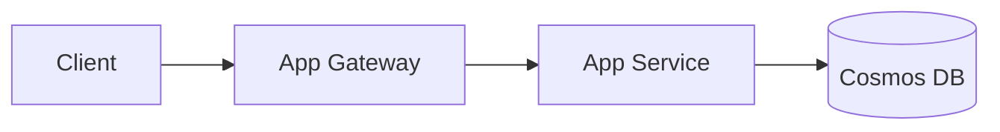
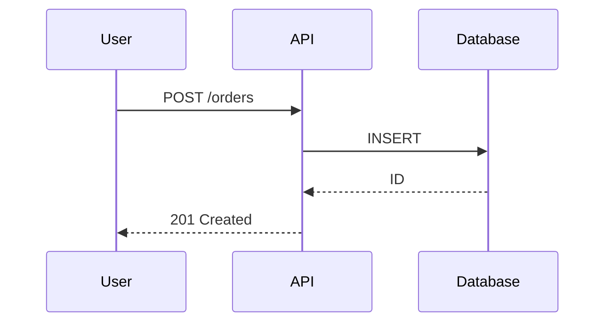

> **Versión:** v3 | **Módulo:** 8 | **Sub:** 8.1 | **Slides:** 30 | **Fecha:** 2026-04-22 | **Estado:** ✅ Versión actual
> **Archivo:** `M08-S8.1-azure-devops-repos-boards-v3.md`
> **Presentación Gamma:** [Azure DevOps — Repos y Boards](https://gamma.app/docs/M08-S81-azure-devops-repos-boards-v3-0y5b16e5eb3xlak)

# Submódulo 8.1 — Azure DevOps: Repos, Boards y Artifacts

## Slide 1 — Portada
**Módulo 8 · Submódulo 8.1**
Azure DevOps: la plataforma de desarrollo del equipo
Repos, Boards, Artifacts y cómo conectan con el ciclo de vida de vuestro código

---

## Slide 2 — Contexto: vuestro equipo ya usa Azure DevOps
Tenéis Azure DevOps con repos y algo de Boards. Pero hay un gap entre "lo usamos" y "lo aprovechamos". Este módulo cierra ese gap: desde la organización de repos hasta pipelines YAML completos con IaC.

Azure DevOps tiene 5 servicios:

```
Azure DevOps Organization
├── Boards    → Gestión de trabajo (sprints, user stories, bugs)
├── Repos     → Código fuente (Git)
├── Pipelines → CI/CD (build, test, deploy)
├── Artifacts → Paquetes NuGet, npm (feed privado)
└── Test Plans → Testing manual y automatizado
```

Este submódulo cubre Repos, Boards y Artifacts. Pipelines tiene su propio submódulo (8.2).

---

## Slide 3 — Repos: estructura recomendada

**Monorepo vs Multi-repo:**

| | Monorepo | Multi-repo |
|---|:---:|:---:|
| Todos los proyectos en un repo | ✓ | |
| Un repo por servicio/componente | | ✓ |
| Simplicidad de setup | ✓ | |
| Independencia de equipos | | ✓ |
| CI/CD más simple | | ✓ (pipeline por repo) |
| Compartir código fácil | ✓ | Necesita NuGet/npm packages |

**Para vuestro equipo (6-10 personas):** Multi-repo por servicio es lo más limpio:
```
repos/
├── ventas-api        → App Service (backend API)
├── ventas-web        → Blazor (frontend)
├── ventas-functions  → Azure Functions
├── ventas-desktop    → WPF + MSIX
├── ventas-infra      → Bicep templates (IaC)
└── ventas-shared     → Librerías compartidas (NuGet package)
```

---

## Slide 4 — Branching strategy: trunk-based development

```
main (producción) ─────●─────●─────●─────●─────●─────→
                       ↑     ↑     ↑     ↑     ↑
                    merge  merge  merge  merge  merge
                       │     │     │     │     │
feature/login ─●─●─●──┘     │     │     │     │
                             │     │     │     │
feature/pedidos ──●─●────────┘     │     │     │
                                   │     │     │
bugfix/null-ref ──●────────────────┘     │     │
                                         │     │
feature/msix ──●─●─●─●──────────────────┘     │
                                               │
hotfix/security ──●────────────────────────────┘
```

**Reglas:**
1. `main` es SIEMPRE desplegable (green build)
2. Feature branches cortas (2-5 días máximo)
3. Pull Request obligatorio para mergear a main
4. Al menos 1 reviewer aprueba
5. CI pipeline pasa (build + tests) antes de merge
6. Squash merge para historial limpio

**No uséis Git Flow** (develop, release branches) para equipos pequeños. Trunk-based con feature branches es más simple y más rápido.

---

## Slide 5 — Branch Policies: proteger main

```bash
# Configurar via CLI (o en portal: Project Settings → Repos → Policies)

# Requiere pull request (no se puede push directo a main)
az repos policy create --branch main --repository-id <repo-id> \
  --type requiredReviewers --minimum-approver-count 1 --blocking true

# Requiere build exitoso
az repos policy create --branch main --repository-id <repo-id> \
  --type build --build-definition-id <pipeline-id> --blocking true

# Requiere resolución de comentarios
az repos policy create --branch main --repository-id <repo-id> \
  --type commentRequirements --blocking true
```

**Branch Policies garantizan que nadie pueda:**
- Push código directamente a main sin review
- Mergear con tests fallidos
- Mergear con comentarios de review sin resolver
- Mergear sin aprobación de al menos 1 persona

---

## Slide 6 — Pull Requests: flujo de trabajo

```
1. Desarrollador crea feature branch:
   git checkout -b feature/nueva-funcionalidad

2. Desarrolla y hace commits:
   git add . && git commit -m "feat: implementar búsqueda de pedidos"
   git push origin feature/nueva-funcionalidad

3. Crea Pull Request en Azure DevOps:
   - Título descriptivo
   - Descripción con qué cambia y por qué
   - Asigna reviewers
   - Vincula work item (si hay)

4. CI Pipeline se ejecuta automáticamente:
   - Build ✓
   - Tests ✓
   - Linting ✓

5. Reviewers revisan:
   - Comentarios en líneas específicas
   - Approve / Request changes

6. Merge (squash) → main → CD Pipeline despliega automáticamente
```

---

## Slide 7 — Conventional Commits: mensajes de commit estandarizados

```
feat: implementar búsqueda de pedidos por fecha
fix: corregir null reference en GetPedido cuando clienteId es vacío
docs: actualizar README con instrucciones de despliegue
refactor: extraer lógica de validación a PedidoValidator
test: añadir tests para el endpoint de búsqueda
chore: actualizar Azure Functions SDK a v4.5
perf: optimizar query de Cosmos DB con partition key
ci: añadir step de code coverage al pipeline
```

**Formato:** `tipo: descripción breve`

**Tipos:** feat, fix, docs, refactor, test, chore, perf, ci, build, style

**Ventaja:** Historial limpio y legible. Podéis generar changelogs automáticos. Los PRs de squash merge usan el título del PR como commit message.

---

## Slide 8 — Git LFS: archivos grandes

Si tenéis archivos binarios grandes en el repo (PDFs, imágenes, datasets):

```bash
# Instalar Git LFS
git lfs install

# Trackear archivos grandes
git lfs track "*.pdf"
git lfs track "*.psd"
git lfs track "*.zip"
git lfs track "*.msix"

# .gitattributes (se commitea)
*.pdf filter=lfs diff=lfs merge=lfs -text
*.psd filter=lfs diff=lfs merge=lfs -text
*.zip filter=lfs diff=lfs merge=lfs -text
```

Git LFS almacena los binarios en Azure DevOps storage (no en el repo Git). El repo solo tiene punteros. Reduce el tamaño del clone.

**Azure DevOps incluye 1 GB de LFS gratis** por proyecto. Suficiente para la mayoría de equipos.

---

## Slide 9 — Boards: gestión de trabajo

**Work Item Types:**
- **Epic:** Objetivo grande (trimestral). Ej: "Migrar a MSIX"
- **Feature:** Funcionalidad (sprint/mes). Ej: "Auto-update con AppInstaller"
- **User Story:** Historia de usuario (días). Ej: "Como usuario, quiero recibir notificación de actualización"
- **Task:** Tarea técnica (horas). Ej: "Configurar AppInstaller XML"
- **Bug:** Defecto. Ej: "La app no detecta actualización cuando está offline"

```
Epic: Migrar a MSIX
├── Feature: Empaquetado MSIX
│   ├── Story: Crear packaging project
│   │   ├── Task: Configurar manifest
│   │   └── Task: Generar iconos
│   └── Story: Pipeline de build MSIX
│       ├── Task: Configurar MSBuild en pipeline
│       └── Task: Firmar con Key Vault
└── Feature: Auto-update
    ├── Story: Configurar AppInstaller
    └── Story: Distribuir a grupo piloto
```

---

## Slide 10 — Boards: configurar sprints

```
Sprint 1 (2 semanas):
├── Story: Crear packaging project MSIX [5 pts]
├── Story: Configurar certificado de firma [3 pts]
├── Bug: Fix login timeout en VPN [2 pts]
└── Task: Actualizar dependencias NuGet [1 pt]
Capacidad del sprint: 11 puntos

Sprint 2 (2 semanas):
├── Story: Pipeline CI/CD para MSIX [8 pts]
├── Story: AppInstaller con auto-update [5 pts]
└── Bug: Memory leak en DataGrid [3 pts]
Capacidad: 16 puntos
```

**Velocity:** Después de 3-4 sprints, sabréis cuántos puntos podéis completar por sprint. Esa es vuestra velocidad. Usadla para planificar.

---

## Slide 11 — Boards: queries y dashboards

```
# Query: Bugs abiertos por prioridad
Work Items → New Query:
  Type = Bug
  AND State = Active
  AND Priority <= 2
  ORDER BY Priority, Created Date

# Query: Work items sin asignar
  State = New OR State = Active
  AND Assigned To = @Me  (o = "" para no asignados)
```

**Dashboard widgets útiles:**
- Burndown chart (progreso del sprint)
- Velocity chart (puntos completados por sprint)
- Bug trend (bugs abiertos vs cerrados)
- Build health (último estado de CI)
- Release pipeline status
- Code coverage trend

---

## Slide 12 — Boards: vincular work items con commits y PRs

```bash
# En el commit message, referenciar el work item:
git commit -m "feat: implementar búsqueda #1234"
# El #1234 vincula automáticamente al work item 1234

# En el PR, vincular al cerrar:
# "Fixes #1234" → cuando el PR se mergea, el work item pasa a "Closed"
```

**En el pipeline YAML:**
```yaml
# Vincular work items con el deploy
- task: AzureAppServiceManage@0
  inputs:
    Action: Swap Slots
    # Azure DevOps vincula automáticamente los work items
    # que están en los commits incluidos en este deploy
```

**Resultado:** En el work item veis: commits relacionados, PRs, builds, y deploys. Trazabilidad completa de "qué cambió y por qué".

---

## Slide 13 — Artifacts: feed NuGet privado

Si tenéis librerías compartidas entre proyectos:

```bash
# Crear feed
az artifacts universal publish --organization https://dev.azure.com/mi-org \
  --feed ventas-packages --name mi-libreria --version 1.0.0 --path ./publish

# En nuget.config del proyecto consumidor:
```

```xml
<!-- nuget.config -->
<configuration>
  <packageSources>
    <add key="nuget.org" value="https://api.nuget.org/v3/index.json" />
    <add key="ventas-internal" value="https://pkgs.dev.azure.com/mi-org/_packaging/ventas-packages/nuget/v3/index.json" />
  </packageSources>
</configuration>
```

```bash
# Publicar paquete NuGet al feed privado
dotnet nuget push MiLibreria.1.0.0.nupkg --source ventas-internal --api-key az
```

**Casos de uso:** Librerías de utilidades compartidas, DTOs/contracts entre servicios, SDK internos. Sin publicar en nuget.org — solo accesible dentro de vuestra organización.

---

## Slide 14 — Artifacts: versionado de paquetes

```xml
<!-- En el .csproj de la librería -->
<PropertyGroup>
  <PackageId>MiEmpresa.Ventas.Shared</PackageId>
  <Version>1.2.$(BuildId)</Version>  <!-- Auto-incrementa con cada build -->
  <Description>Modelos y utilities compartidos del proyecto Ventas</Description>
</PropertyGroup>
```

```yaml
# En el pipeline: publicar al feed en cada merge a main
- task: DotNetCoreCLI@2
  inputs:
    command: 'pack'
    packagesToPack: 'src/Shared/MiEmpresa.Ventas.Shared.csproj'
    versioningScheme: byBuildNumber

- task: NuGetCommand@2
  inputs:
    command: 'push'
    packagesToPush: '$(Build.ArtifactStagingDirectory)/*.nupkg'
    nuGetFeedType: 'internal'
    publishVstsFeed: 'ventas-packages'
```

---

## Slide 15 — Seguridad en Azure DevOps

**Permisos por nivel:**
- **Organization:** Global Admins, billing
- **Project:** Project Admins, Contributors, Readers
- **Repo:** Per-repo permissions (quién puede push, crear branches, etc.)
- **Pipeline:** Quién puede ejecutar, aprobar, editar pipelines
- **Board:** Quién puede gestionar work items, sprints, queries

**Service Connections:** Conexiones a Azure (para pipelines). Limitad quién puede crear y usar service connections — son llaves de acceso a vuestra suscripción.

```
Project Settings → Service connections → Security:
  - Solo Project Admins pueden crear
  - Los pipelines necesitan aprobación para usar
```

---

## Slide 16 — Integración: ADO + Teams + Slack

```bash
# Notificaciones de PR en Teams
# Project Settings → Service hooks → Teams → Pull Request Created

# Notificaciones de build en Slack
# Project Settings → Service hooks → Slack → Build Completed

# Bot de Azure DevOps en Teams:
# @azure devops create bug "Login falla en VPN"
# @azure devops create story "Implementar dark mode"
```

**Azure Boards app para Teams:** Ver y actualizar work items directamente desde Teams. Recibir notificaciones de cambios en los items que seguís.

---

## Slide 17 — Wikis: documentación del proyecto

Azure DevOps incluye wikis integrados:

```
Wiki: Ventas (Project Wiki)
├── Arquitectura
│   ├── Diagrama de componentes
│   ├── Decisiones de diseño (ADR)
│   └── Estándares de código
├── Runbooks
│   ├── Despliegue a producción
│   ├── Rollback
│   └── Incidentes
├── Onboarding
│   ├── Setup de entorno local
│   ├── Acceso a Azure
│   └── Guía de contribución
└── API
    └── Documentación de endpoints
```

**O "Publish code as wiki":** Un repo Git se publica como wiki. La documentación vive en el repo, con PRs y versionado.

---

## Slide 18 — Plantillas de proyecto: estandarizar

```
Project template:
├── .azuredevops/
│   └── pull_request_template.md    ← Template de PR
├── .github/
│   └── CODEOWNERS                  ← Quién revisa qué
├── docs/
│   └── ADR/                        ← Architecture Decision Records
├── src/
├── tests/
├── infrastructure/
│   └── bicep/                      ← IaC
├── .gitignore
├── .editorconfig                   ← Estilo de código
├── Directory.Build.props           ← Configuración .NET global
└── README.md
```

**PR Template (`pull_request_template.md`):**
```markdown
## Qué cambia
<!-- Descripción breve del cambio -->

## Por qué
<!-- Contexto y motivación -->

## Cómo probar
<!-- Pasos para verificar -->

## Checklist
- [ ] Tests añadidos/actualizados
- [ ] Documentación actualizada
- [ ] Sin warnings de build
```

---

## Slide 19 — CLI de Azure DevOps

```bash
# Instalar extensión
az extension add --name azure-devops

# Login
az devops configure --defaults organization=https://dev.azure.com/mi-org project=Ventas

# Listar repos
az repos list --output table

# Crear PR desde CLI
az repos pr create --repository ventas-api \
  --source-branch feature/busqueda \
  --target-branch main \
  --title "feat: implementar búsqueda de pedidos" \
  --description "Añade endpoint GET /api/pedidos/search con filtros"

# Listar PRs abiertos
az repos pr list --status active --output table

# Listar work items asignados a mí
az boards work-item query --wiql "SELECT [System.Id], [System.Title], [System.State] FROM WorkItems WHERE [System.AssignedTo] = @Me AND [System.State] <> 'Closed'"
```

---

## Slide 20 — Branch Protection Rules avanzadas (2026)

Las branch policies en ADO han evolucionado mucho. Configuración production-grade:

```yaml
# ADO Branch Policy completa para main
Required:
├── Minimum 2 reviewers (no creator)
├── Reset code reviewer votes when source branch changes
├── Allow requestors to approve own changes: ❌
├── Allow completion even if some reviewers vote "Wait" or "Reject": ❌
├── When new changes are pushed: Require N votes
└── Require minimum approvals from each group:
    ├── @senior-engineers: 1 minimum
    └── @security-team: 1 minimum (si touch ciertos paths)

Required builds:
├── Build pipeline: PR-validation
├── Auto-trigger: ✅
├── Build expiration: 12 hours
└── Required: ✅ (no merge si build falla)

Required status checks:
├── SonarQube quality gate: passed
├── Security scan: 0 critical/high
├── Code coverage: >= 80% on changes
└── License compliance: passed

Path-based requirements:
├── /infrastructure/* → @platform-team mandatory reviewer
├── /security/* → @security-team mandatory reviewer
├── /database/migrations/* → @data-team approval
└── /docs/api/* → @documentation-team

Linked work items:
├── Require associated work item: ✅
└── Block merge if no linked item

Comment resolution:
├── All comments must be resolved before merge: ✅
└── Threads marked "Wait" block merge

File path filters:
├── Exclude PR triggers from: /docs/**, *.md, README*
└── Useful para evitar PR triggers de doc-only changes
```

**Bypass reviewers (para emergencias):**
```bash
# Solo specific roles tienen "Bypass policies"
# Use sparingly, audit log captures every use

az repos policy update \
  --repository <repo-id> \
  --branch refs/heads/main \
  --policy-id <approval-policy-id> \
  --bypass-allowed-permission allow

# Audit usage
az rest --method get \
  --uri "https://dev.azure.com/<org>/<project>/_apis/audit/auditlog" \
  --query "decoratedAuditLogEntries[?actionId=='PullRequest.BypassPolicy']"
```

**Auto-completion (auto-merge cuando policies pass):**
```yaml
# Set auto-complete en PR
- Enable: ✅
- Squash merge: ✅ (cleaner history)
- Delete source branch after merge: ✅
- Customize merge commit message: 
    "{title}\n\n{description}\n\nWork items: {items}"
```

**Status checks via REST API (custom external):**
```csharp
// Tu sistema externo puede publicar status check
var client = new HttpClient();
client.DefaultRequestHeaders.Authorization = new AuthenticationHeaderValue(
    "Bearer", await GetAdoTokenAsync());

await client.PostAsJsonAsync(
    $"https://dev.azure.com/{org}/{project}/_apis/git/repositories/{repoId}/pullRequests/{prId}/statuses?api-version=7.1-preview.1",
    new
    {
        state = "succeeded",  // o failed, pending
        description = "External quality check passed",
        context = new 
        {
            name = "MyExternalCheck",
            genre = "compliance"
        },
        targetUrl = "https://my-system.com/checks/123"
    });
```

**Branch policy automation con Bicep/ARM:**
```json
// branch-policies.json (deployable via REST)
{
  "type": "0609b952-1397-4640-95ec-e00a01b2c241", // Min reviewers
  "isEnabled": true,
  "isBlocking": true,
  "settings": {
    "minimumApproverCount": 2,
    "creatorVoteCounts": false,
    "scope": [{
      "repositoryId": "<repo-id>",
      "refName": "refs/heads/main",
      "matchKind": "Exact"
    }]
  }
}

// Deploy via ADO REST API
// POST /policies/configurations
```

**Anti-patterns:**
- ❌ "Require 1 reviewer" + creator can approve → effectively no review
- ❌ Bypass permissions to too many users (audit nightmare)
- ❌ Build expiration too short (constantly rebuilds)
- ❌ Path filters excluding security-critical files

---

## Slide 21 — Code Search avanzado: encontrar lo que busques

Code search en ADO permite queries muy poderosos:

```
ADO Code Search query syntax:

Basic:
├── "exact phrase"  → exact match
├── word1 word2     → all words (AND)
├── word1 OR word2  → either
└── -excluded       → not contains

By type:
├── ext:cs          → only C# files
├── ext:bicep       → only Bicep
├── path:tests/     → only in tests folder
├── repo:my-repo    → only in this repo
└── proj:Backend    → only in this project

By git history:
├── author:pedro    → commits by pedro
├── modified:>2024-01-01
├── created:<2024-12-31
└── deleted:true    → search deleted files

Code-specific:
├── func:GetUser      → function/method name
├── class:UserService → class name
├── arg:userId        → method arguments
└── decl:IUserRepo    → declarations

Combined:
"connection string" ext:cs -path:tests/ author:pedro
└── Find connection string references in C# 
    excluding test files written by pedro
```

**Casos de uso reales:**
```
1. Security audit:
   "Bearer " ext:cs OR ext:json
   → Find hardcoded tokens (red flag)

2. Deprecated API usage:
   class:HttpClient -path:abstractions/
   → Find direct HttpClient (should use IHttpClientFactory)

3. Migration impact:
   import:System.Web.Mvc
   → Find legacy ASP.NET MVC usage to migrate

4. Compliance check:
   func:LogException ext:cs path:src/
   → Verify all exceptions are logged

5. Dead code:
   class:OldFeatureService -comment
   → Find references to deprecated class
```

**REST API para automatizar searches:**
```csharp
// Automated security scanning script
public async Task<List<CodeMatch>> FindHardcodedSecretsAsync()
{
    var patterns = new[]
    {
        "password=",
        "apikey:",
        "bearer ",
        "AccountKey=",
        "ConnectionString="
    };
    
    var matches = new List<CodeMatch>();
    
    foreach (var pattern in patterns)
    {
        var response = await _client.PostAsJsonAsync(
            $"https://almsearch.dev.azure.com/{org}/{project}/_apis/search/codesearchresults?api-version=7.1-preview.1",
            new
            {
                searchText = pattern,
                $filters = new
                {
                    Project = new[] { project },
                    Path = new[] { "/" },
                    Branch = new[] { "main" }
                }
            });
        
        var results = await response.Content.ReadFromJsonAsync<SearchResults>();
        matches.AddRange(results.Results);
    }
    
    // Alert security team
    if (matches.Any())
    {
        await _alertService.NotifyAsync(matches);
    }
    
    return matches;
}
```

**Code Search performance tips:**
- Index puede tardar horas en repos grandes initially
- Use repo: filter para repos grandes
- ext: filters speed up significantly
- Path-based filters más rápidos que content searches

**Limitaciones:**
- ❌ No regex search (use LIKE patterns)
- ❌ No búsqueda en branches no-default
- ❌ No búsqueda de history content (solo current state)
- ❌ Files > 16MB no indexed

**Para casos avanzados — Sourcegraph integration:**
```
Sourcegraph (separate product) for ADO:
├── Regex support
├── Cross-repo search
├── Code intelligence (jump to definition)
├── Search history of changes
└── Coste: $50/user/mes (enterprise)
```

---

## Slide 22 — IP allowlists y conditional access para ADO

Para enterprises, restringir acceso a ADO desde IPs específicas:

```
Default ADO access:
└── Cualquiera con creds puede acceder desde cualquier IP
    └── Riesgo: stolen credentials usable globally

Con IP allowlists:
└── Solo IPs aprobadas pueden access
    └── Office IPs, VPN, specific countries
```

**Setup via ADO Conditional Access:**
```bash
# Requires Microsoft Entra ID P1 minimum
# CA policies apply to ADO when ADO uses Entra ID auth

# Crear named location
az ad conditional-access named-location create \
  --display-name "Office HQ Madrid" \
  --location-type ipNamed \
  --ip-ranges "203.0.113.0/24" "203.0.114.0/24" \
  --is-trusted true

# Conditional Access policy
az ad conditional-access policy create \
  --display-name "ADO access from trusted IPs only" \
  --conditions '{
    "applications": {
      "includeApplications": ["499b84ac-1321-427f-aa17-267ca6975798"]  
    },
    "users": {
      "includeUsers": ["All"],
      "excludeGroups": ["BreakGlassAccounts"]
    },
    "locations": {
      "includeLocations": ["All"],
      "excludeLocations": ["<office-named-location-id>"]
    }
  }' \
  --grant-controls '{
    "operator": "OR",
    "builtInControls": ["block"]
  }'

# 499b84ac-1321-427f-aa17-267ca6975798 = ADO app ID
```

**ADO-native IP allowlist (fallback):**
```
Portal: ADO → Organization Settings → 
        Policies → Conditional Access

Add IP ranges:
├── 203.0.113.0/24 (Office Madrid)
├── 203.0.114.0/24 (Office Barcelona)  
├── 198.51.100.0/24 (VPN)
└── Specific IPs of trusted partners

Apply to:
├── ☐ All users
└── ☑ Specific groups (recommended start)
```

**For CI/CD agents - Allow GitHub/Azure ranges:**
```bash
# Get current GitHub Actions IPs
curl https://api.github.com/meta | jq '.actions'

# Add to allowlist (nightly job)
GITHUB_IPS=$(curl -s https://api.github.com/meta | jq -r '.actions[]')
for ip in $GITHUB_IPS; do
  az ad conditional-access named-location update \
    --location-id <github-location-id> \
    --add-ip-range $ip
done
```

**PAT (Personal Access Token) restrictions:**
```bash
# PATs bypass CA policies por defecto
# Force PATs through CA:

az ad conditional-access policy create \
  --display-name "PAT requires same restrictions" \
  --conditions '{
    "clientAppTypes": ["other"],
    "applications": {
      "includeApplications": ["499b84ac-1321-427f-aa17-267ca6975798"]
    }
  }' \
  --grant-controls '{
    "operator": "AND",
    "builtInControls": ["mfa", "compliantDevice"]
  }'
```

**Microsoft-hosted agents handling:**
```
Problema: Microsoft-hosted agents tienen IPs dinámicas
         (no puedes allowlist específicamente)

Soluciones:
├── 1. Use self-hosted agents en redes conocidas
├── 2. Allowlist Azure DevOps service IP ranges (publicly listed)
├── 3. Use Azure Pipeline Service Connection con MI (no PAT)
└── 4. Federated identity (OIDC) — no IPs needed
```

**Audit IP-based access:**
```kusto
// Microsoft Sentinel - acceso desde IPs no esperadas
SigninLogs
| where AppDisplayName == "Azure DevOps"
| where TimeGenerated > ago(24h)
| extend Country = tostring(LocationDetails.countryOrRegion)
| where Country !in ("ES", "FR", "PT")  // expected countries
| project TimeGenerated, UserPrincipalName, IPAddress, Country, ConditionalAccessStatus
| order by TimeGenerated desc
```

---

## Slide 23 — Work item hierarchies y queries avanzadas

ADO work items soportan jerarquías complejas para roadmaps grandes:

```
Hierarchy típica enterprise:

Epic (3-6 meses)
└── Feature (2-6 sprints)
    └── User Story (1-2 sprints)
        └── Task (horas-días)
            └── Sub-task (opcional)

Bug (cualquier nivel)
Issue (impediment)
Test Case (linked to story)
```

**Custom hierarchies:**
```
Portal → Project Settings → Process → Work item types

Crear custom types:
├── "Initiative" (above Epic)
├── "Quarterly Goal" (parallel to Epic)
├── "Tech Debt" (special tracking)
└── "Security Vulnerability" (with severity)

Custom states workflow:
New → Refined → Ready → Active → Code Review → 
QA → UAT → Done → Archived
```

**WIQL (Work Item Query Language):**
```sql
-- Active bugs assigned to my team in last sprint
SELECT [System.Id], [System.Title], [System.AssignedTo], 
       [Microsoft.VSTS.Common.Severity]
FROM WorkItems
WHERE [System.WorkItemType] = 'Bug'
  AND [System.State] IN ('New', 'Active')
  AND [System.AssignedTo] IN GROUP 'My Team'
  AND [System.IterationPath] UNDER 'Project\Sprint 25'
ORDER BY [Microsoft.VSTS.Common.Severity] ASC

-- Stories without acceptance criteria
SELECT [System.Id], [System.Title]
FROM WorkItems
WHERE [System.WorkItemType] = 'User Story'
  AND [Microsoft.VSTS.Common.AcceptanceCriteria] = ''
  AND [System.State] = 'Active'

-- Overdue items
SELECT [System.Id], [System.Title], [Microsoft.VSTS.Scheduling.DueDate]
FROM WorkItems
WHERE [Microsoft.VSTS.Scheduling.DueDate] < @Today
  AND [System.State] NOT IN ('Done', 'Closed', 'Removed')

-- Tree query: Epic → all descendants
SELECT [System.Id], [System.Title], [System.WorkItemType]
FROM WorkItemLinks
WHERE [Source].[System.Id] = 12345  -- Epic ID
  AND [System.Links.LinkType] = 'System.LinkTypes.Hierarchy-Forward'
MODE (Recursive)
```

**Useful queries para retrospectives:**
```sql
-- Velocity per sprint (last 6 sprints)
SELECT [System.Id], [Microsoft.VSTS.Scheduling.StoryPoints]
FROM WorkItems
WHERE [System.WorkItemType] = 'User Story'
  AND [System.State] = 'Done'
  AND [System.IterationPath] UNDER 'Project'
  AND [Microsoft.VSTS.Common.ClosedDate] >= @Today - 84  -- 12 weeks
ORDER BY [System.IterationPath]

-- Bugs created vs fixed (trend)
SELECT [System.CreatedDate], [System.ClosedDate], [System.State]
FROM WorkItems
WHERE [System.WorkItemType] = 'Bug'
  AND [System.CreatedDate] >= @Today - 90

-- Cycle time analysis
SELECT [System.Id], [System.Title],
       [System.CreatedDate], [System.ChangedDate]
FROM WorkItems
WHERE [System.State] = 'Done'
  AND [Microsoft.VSTS.Common.ClosedDate] >= @StartOfMonth
```

**Programmatic queries (REST API):**
```csharp
public class WorkItemAnalytics
{
    private readonly WorkItemTrackingHttpClient _client;
    
    public async Task<List<WorkItem>> GetVelocityDataAsync(string projectName)
    {
        var query = new Wiql
        {
            Query = @"
                SELECT [System.Id], [Microsoft.VSTS.Scheduling.StoryPoints]
                FROM WorkItems
                WHERE [System.WorkItemType] = 'User Story'
                  AND [System.State] = 'Done'
                  AND [System.TeamProject] = @project
                  AND [Microsoft.VSTS.Common.ClosedDate] >= @StartOfQuarter
            "
        };
        
        var queryResult = await _client.QueryByWiqlAsync(
            query, projectName);
        
        if (!queryResult.WorkItems.Any())
            return new List<WorkItem>();
        
        var ids = queryResult.WorkItems.Select(w => w.Id).ToArray();
        return await _client.GetWorkItemsAsync(ids, expand: WorkItemExpand.All);
    }
    
    public async Task<Dictionary<string, double>> CalculateCycleTimeAsync()
    {
        // Average cycle time per work item type
        var query = new Wiql
        {
            Query = "SELECT [System.Id] FROM WorkItems WHERE [System.State] = 'Done'"
        };
        
        var result = await _client.QueryByWiqlAsync(query);
        var items = await _client.GetWorkItemsAsync(
            result.WorkItems.Select(w => w.Id).ToArray());
        
        return items.GroupBy(i => i.Fields["System.WorkItemType"].ToString())
            .ToDictionary(
                g => g.Key,
                g => g.Average(i =>
                {
                    var created = (DateTime)i.Fields["System.CreatedDate"];
                    var closed = (DateTime)i.Fields["Microsoft.VSTS.Common.ClosedDate"];
                    return (closed - created).TotalDays;
                }));
    }
}
```

**Boards Analytics views:**
```
Portal → Boards → Analytics views
├── "Stories - Last 12 months" (pre-built)
├── Custom view: "My team velocity"
└── Export to Power BI for executive reports
```

---

## Slide 24 — Pull Request templates y automation

PR templates standardize quality y reduce review time:

```markdown
<!-- .azuredevops/pull_request_template.md -->
## What does this PR do?
<!-- Brief description -->

## Why is this needed?
<!-- Business/technical justification -->

## How was this tested?
- [ ] Unit tests added/updated
- [ ] Integration tests added/updated
- [ ] Manual testing completed
- [ ] Tested in staging

## Checklist
- [ ] Code follows team style guide
- [ ] Self-review completed
- [ ] Comments added to complex code
- [ ] Documentation updated (if needed)
- [ ] No new warnings or errors
- [ ] Breaking changes documented

## Related work items
<!-- Link work items: AB#1234 -->
Fixes AB#1234

## Screenshots (if UI changes)
<!-- Add before/after screenshots -->

## Deployment notes
<!-- Any special deployment steps? -->
- [ ] Database migration required
- [ ] Config changes required
- [ ] Cache flush required
- [ ] Coordinated deploy with: ___
```

**Multiple templates por tipo:**
```
.azuredevops/
├── pull_request_template.md (default)
├── PULL_REQUEST_TEMPLATE/
│   ├── feature.md
│   ├── bugfix.md
│   ├── hotfix.md
│   └── refactor.md
```

**Selección via URL:**
```
https://dev.azure.com/{org}/{project}/_git/{repo}/pullrequestcreate?
sourceRef=feature/x&targetRef=main&template=hotfix.md
```

**PR labels automation:**
```yaml
# Auto-label PRs based on path
# Use Azure Pipeline trigger on PR

trigger: none

pr:
  branches:
    include: ['main']

steps:
  - task: PowerShell@2
    inputs:
      targetType: inline
      script: |
        $changedFiles = git diff --name-only origin/main...HEAD
        $labels = @()
        
        if ($changedFiles -match '^src/') { $labels += 'code' }
        if ($changedFiles -match '^tests/') { $labels += 'tests' }
        if ($changedFiles -match '^docs/') { $labels += 'documentation' }
        if ($changedFiles -match '\.bicep$') { $labels += 'infrastructure' }
        if ($changedFiles -match '^\.github/') { $labels += 'ci-cd' }
        
        # Apply labels via REST API
        $headers = @{
          'Authorization' = "Bearer $(System.AccessToken)"
        }
        
        foreach ($label in $labels) {
          $body = @{ name = $label } | ConvertTo-Json
          Invoke-RestMethod `
            -Uri "$(System.CollectionUri)$(System.TeamProject)/_apis/git/repositories/$(Build.Repository.ID)/pullRequests/$(System.PullRequest.PullRequestId)/labels?api-version=7.1-preview.1" `
            -Method POST `
            -Headers $headers `
            -ContentType 'application/json' `
            -Body $body
        }
```

**Auto-assign reviewers based on CODEOWNERS:**
```
.azuredevops/CODEOWNERS

# Frontend
/src/web/* @frontend-team
/src/mobile/* @mobile-team

# Backend
/src/api/* @backend-team
/src/database/* @backend-team @data-team

# Infrastructure
/infrastructure/* @platform-team
/infrastructure/security/* @platform-team @security-team

# Critical paths
/src/payment/* @senior-engineers @security-team
/src/auth/* @senior-engineers @security-team

# Documentation
/docs/* @docs-team
*.md @docs-team
```

**Auto-merge after approvals + checks:**
```
Portal → PR → ⋯ menu → Set auto-complete
├── Squash commits: ✅
├── Customize merge message
├── Delete source branch: ✅
└── Override branch policies: ❌

Auto-completes when:
├── All required reviewers approved
├── All branch policies satisfied
├── No active comments
└── Build succeeds (if required)
```

**PR analytics queries:**
```kusto
// PR cycle time distribution
PullRequest_CL
| where TimeCreated > ago(30d)
| extend CycleTime = TimeCompleted - TimeCreated
| summarize 
    p50 = percentile(CycleTime, 50),
    p75 = percentile(CycleTime, 75),
    p95 = percentile(CycleTime, 95),
    Count = count()
  by Repository

// Top reviewers (workload distribution)
PullRequestReview_CL
| where TimeReviewed > ago(30d)
| summarize ReviewCount = count() by Reviewer
| order by ReviewCount desc
| top 20

// Bottleneck detection: PRs waiting > 5 days
PullRequest_CL
| where Status == "Active"
| where DateTimeFromCreated >= 5d
| project Title, Created, Author, ReviewersAssigned, DaysWaiting
```

---

## Slide 25 — ADO Marketplace extensions imprescindibles

ADO Marketplace tiene 1000+ extensions. Las top 15 para producción:

```
┌────────────────────────────────────────────────────────────────┐
│ SECURITY                                                        │
├────────────────────────────────────────────────────────────────┤
│ 1. SonarCloud / SonarQube                                       │
│    └── Static analysis + quality gates                          │
│    └── Free for OSS, ~€10/dev/mes                               │
│                                                                 │
│ 2. Snyk Security                                                │
│    └── Vulnerability scanning (OSS deps + IaC)                  │
│    └── Free tier disponible                                     │
│                                                                 │
│ 3. Microsoft Security DevOps (MSDO)                             │
│    └── Defender for DevOps integration                          │
│    └── Free                                                     │
│                                                                 │
│ 4. WhiteSource Bolt (now Mend)                                  │
│    └── License compliance + vulns                               │
│    └── Free for ADO                                             │
└────────────────────────────────────────────────────────────────┘

┌────────────────────────────────────────────────────────────────┐
│ TESTING                                                         │
├────────────────────────────────────────────────────────────────┤
│ 5. Test & Feedback                                              │
│    └── Browser extension for exploratory testing                │
│    └── Free                                                     │
│                                                                 │
│ 6. Build Quality Checks                                         │
│    └── Pipeline gate on build metrics                           │
│    └── Free                                                     │
│                                                                 │
│ 7. ReportGenerator                                              │
│    └── Code coverage HTML reports                               │
│    └── Free                                                     │
└────────────────────────────────────────────────────────────────┘

┌────────────────────────────────────────────────────────────────┐
│ NOTIFICATIONS / INTEGRATIONS                                    │
├────────────────────────────────────────────────────────────────┤
│ 8. Slack / Teams Integration                                    │
│    └── Pipeline status to chat                                  │
│    └── Free                                                     │
│                                                                 │
│ 9. ServiceNow Change Management                                 │
│    └── Auto-create change tickets                               │
│    └── Free (requires ServiceNow license)                       │
│                                                                 │
│ 10. Jira Integration                                            │
│     └── Si trabajan team con Jira                               │
│     └── ~$10/user/mes                                           │
└────────────────────────────────────────────────────────────────┘

┌────────────────────────────────────────────────────────────────┐
│ DEPLOYMENT                                                      │
├────────────────────────────────────────────────────────────────┤
│ 11. Replace Tokens                                              │
│     └── Variable substitution en files                          │
│     └── Free                                                    │
│                                                                 │
│ 12. Azure Key Vault                                             │
│     └── Secrets en pipelines (built-in)                         │
│     └── Free                                                    │
│                                                                 │
│ 13. Tag Build or Release                                        │
│     └── Auto-tag pipelines based on rules                       │
│     └── Free                                                    │
└────────────────────────────────────────────────────────────────┘

┌────────────────────────────────────────────────────────────────┐
│ PRODUCTIVITY                                                    │
├────────────────────────────────────────────────────────────────┤
│ 14. Power Tools (CodeLens)                                      │
│     └── Inline insights en code                                 │
│     └── Free                                                    │
│                                                                 │
│ 15. Octopus Deploy                                              │
│     └── Advanced deployment orchestration                       │
│     └── ~$700+/mes                                              │
└────────────────────────────────────────────────────────────────┘
```

**Install extension via CLI:**
```bash
# List available
az devops extension search --search-query "sonar"

# Install
az devops extension install \
  --extension-id sonarsource-sonarcloud \
  --publisher-id sonarsource

# List installed
az devops extension list
```

**Extension de governance — restrict installs:**
```
Portal → Organization Settings → Extensions
├── Request management:
│   └── Users request → admins approve
└── Pre-approved list: maintained by IT
```

**Build custom extensions:**
```typescript
// Custom task extension
// vss-extension.json
{
  "manifestVersion": 1,
  "id": "my-custom-task",
  "name": "My Custom Task",
  "version": "1.0.0",
  "publisher": "MyOrg",
  "categories": ["Azure Pipelines"],
  "files": [{ "path": "tasks/MyTask" }],
  "contributions": [{
    "id": "my-task",
    "type": "ms.vss-distributed-task.task",
    "targets": ["ms.vss-distributed-task.tasks"],
    "properties": {
      "name": "tasks/MyTask"
    }
  }]
}

// Implementation
import * as tl from 'azure-pipelines-task-lib/task';

async function run() {
    try {
        const inputString = tl.getInput('inputString', true);
        // Custom logic
        tl.setResult(tl.TaskResult.Succeeded, "Done!");
    } catch (err) {
        tl.setResult(tl.TaskResult.Failed, err.message);
    }
}

run();

// Package & publish
// tfx extension create --manifest-globs vss-extension.json
// tfx extension publish --token $PAT
```

**Recommended starter set para nuevo team:**
1. SonarCloud (quality)
2. Snyk (security)
3. ReportGenerator (coverage)
4. Replace Tokens (config)
5. Teams Integration (notifications)

Coste mensual: ~€10-50 dependiendo del team size.

---

## Slide 26 — Wiki Pages como código + ADO REST API

Wiki avanzada con contenido versionado y automation:

```
ADO Wiki types:
├── Project Wiki
│   └── Auto-managed, simpler
└── Code Wiki
    └── Markdown files en repo
    └── Versioned with code
    └── Better for complex docs
```

**Convertir repo en Code Wiki:**
```bash
# 1. Crear estructura en repo
mkdir -p wiki
cd wiki

# 2. Order file (define orden de páginas)
cat > .order << EOF
Home
Architecture
API-Reference
Deployment
Troubleshooting
EOF

# 3. Markdown files
cat > Home.md << 'EOF'
# Project Home

Welcome to the team wiki!

## Quick links
- [Architecture](/Architecture)
- [API Reference](/API-Reference)
- [Deployment](/Deployment)
EOF

cat > Architecture.md << 'EOF'
# Architecture


EOF

# 4. Subpages folder
mkdir Architecture
cat > Architecture/.order << EOF
Components
Data-Flow
Security
EOF

# 5. Commit
git add .
git commit -m "Initial wiki"
git push

# 6. Publish wiki en ADO
az devops wiki create \
  --name "TeamWiki" \
  --type codewiki \
  --version main \
  --mapped-path /wiki
```

**Mermaid diagrams nativos:**
````markdown

````

**ADO REST API: automatización avanzada**

```csharp
// Programmatically create wiki pages from code
public class WikiAutomation
{
    private readonly HttpClient _client;
    private readonly string _project;
    private readonly string _wikiId;
    
    public async Task SyncApiDocsAsync()
    {
        // Generate markdown from OpenAPI spec
        var openApi = await LoadOpenApiSpecAsync("api/openapi.json");
        var markdown = GenerateMarkdownFromOpenApi(openApi);
        
        // Create or update wiki page
        var path = "/API-Reference/Endpoints";
        var url = $"https://dev.azure.com/{org}/{_project}/_apis/wiki/wikis/{_wikiId}/pages?path={path}&api-version=7.1-preview.1";
        
        var response = await _client.PutAsJsonAsync(url, new
        {
            content = markdown
        });
    }
    
    public async Task PublishReleaseNotesAsync(string version, string changes)
    {
        var path = $"/Releases/{version}";
        var content = $@"# Release {version}

**Date:** {DateTime.UtcNow:yyyy-MM-dd}

## Changes

{changes}

## Deployment

- Pipeline: [Build {version}](https://dev.azure.com/...)
- Status: ✅ Deployed
";
        
        await CreateOrUpdatePageAsync(path, content);
    }
}
```

**Search en Wikis:**
```bash
# REST API search
curl -X POST \
  -H "Authorization: Bearer $PAT" \
  -H "Content-Type: application/json" \
  "https://almsearch.dev.azure.com/{org}/{project}/_apis/search/wikisearchresults?api-version=7.1-preview.1" \
  -d '{
    "searchText": "deployment process",
    "$filters": {
      "Project": ["{project}"]
    }
  }'
```

**Wiki analytics:**
```kusto
// Most viewed pages
WikiPageView_CL
| where TimeGenerated > ago(30d)
| summarize Views = count() by PagePath
| top 10 by Views

// Pages with no views (candidates for deletion)
let activePages = WikiPageView_CL
| distinct PagePath;
//
WikiPage_CL
| where PagePath !in (activePages)
| project PagePath, LastModified
```

**Wiki best practices:**
- ✅ Code Wiki para docs versionados con código
- ✅ Project Wiki para meeting notes, brainstorms
- ✅ .order file para control de navigation
- ✅ Mermaid diagrams en lugar de imágenes
- ✅ Templates para consistency
- ❌ NO subir docs sensibles a Wiki (use SharePoint con encryption)
- ❌ NO duplicar content entre Wiki y README.md

---

## Slide 27 — ADO + Microsoft Entra ID integration profunda

Integration entre ADO y Entra ID para enterprise security:

```
Default ADO setup:
├── Users created en ADO directamente
├── PATs sin expiración corta
├── Sin SSO consistency con corp
└── Audit fragmented

ADO + Entra ID full integration:
├── Users sourced from Entra ID
├── SSO con Conditional Access
├── PATs short-lived + scoped
├── Group-based permissions
├── Centralized audit log
└── Compliance friendly
```

**Configurar Entra ID como Identity Provider:**
```
Portal → Organization Settings → Microsoft Entra
├── Connect to: <tu-tenant>
├── Enable scoped users:
│   └── Restrict access a un specific group
├── Inherit policies from Entra ID:
│   ├── MFA: ✅
│   ├── Conditional Access: ✅
│   └── Identity Protection: ✅
└── Default roles per group
```

**Group-based permissions en ADO:**
```bash
# Create Entra ID groups
az ad group create --display-name "ADO-Project-Admins" \
  --mail-nickname ado-project-admins
az ad group create --display-name "ADO-Developers" \
  --mail-nickname ado-developers
az ad group create --display-name "ADO-ReadOnly" \
  --mail-nickname ado-readonly

# Map to ADO groups
az devops security group create \
  --name "ProjectAdmins" \
  --description "Synced from Entra ID"

az devops security group membership add \
  --group-id <ado-group-id> \
  --member-id $(az ad group show --group "ADO-Project-Admins" --query id -o tsv)
```

**PAT lifecycle management:**
```bash
# Old way: PATs without expiration (security nightmare)
# New way: PATs limited + auditable

# Create PAT con scope mínimo + 30 day expiration
az devops invoke \
  --area tokenadmin --resource personalAccessTokens \
  --route-parameters subjectDescriptor=$(az devops user show --user me --query 'subjectDescriptor' -o tsv) \
  --http-method POST \
  --in-file token-config.json

# token-config.json:
{
  "displayName": "CI/CD Token",
  "scope": "vso.build_execute vso.code",
  "validTo": "2026-05-22T00:00:00Z"
}

# Audit existing PATs
az devops invoke \
  --area tokenadmin --resource personalAccessTokens \
  --route-parameters subjectDescriptor=$(az devops user show --user me --query 'subjectDescriptor' -o tsv) \
  --http-method GET
```

**Migrate from PATs to Service Connections con MI:**
```yaml
# OLD: PAT-based service connection
serviceConnection: ado-service-connection-pat

# NEW: Workload Identity Federation
- task: AzureCLI@2
  inputs:
    azureSubscription: 'service-connection-with-wif'
    scriptType: 'bash'
    scriptLocation: 'inlineScript'
    inlineScript: |
      # Inherits identity from federated credential
      # No PAT, no secret needed
      az group list
```

**Setup Workload Identity Federation:**
```bash
# Crear App Registration (será nuestra "service connection identity")
az ad app create --display-name "ADO-WIF-Service-Connection"

APP_ID=$(az ad app list --display-name "ADO-WIF-Service-Connection" --query [0].appId -o tsv)
SP_ID=$(az ad sp create --id $APP_ID --query id -o tsv)

# Federated credential desde ADO
az ad app federated-credential create \
  --id $APP_ID \
  --parameters '{
    "name": "ado-pipeline-federation",
    "issuer": "https://vstoken.dev.azure.com/<org-id>",
    "subject": "sc://<org>/<project>/<service-connection-name>",
    "audiences": ["api://AzureADTokenExchange"]
  }'

# Asignar roles
az role assignment create \
  --role Contributor \
  --assignee $SP_ID \
  --scope /subscriptions/<sub-id>

# En ADO: crear service connection "Workload Identity federation"
# - Subscription: <sub-id>
# - Service principal: $APP_ID
# - Tenant: <tenant-id>
```

**Audit centralizado con Sentinel:**
```kusto
// All ADO sign-ins
SigninLogs
| where AppDisplayName == "Azure DevOps"
| where TimeGenerated > ago(7d)
| project TimeGenerated, UserPrincipalName, IPAddress, 
          ResultType, ConditionalAccessStatus

// PAT usage outside expected hours
AuditLogs
| where TimeGenerated > ago(7d)
| where ActivityDisplayName contains "Token"
| extend Hour = datetime_part("Hour", TimeGenerated)
| where Hour < 8 or Hour > 19
```

**Compliance benefits:**
```
With ADO + Entra ID full integration:
├── ✅ MFA enforced
├── ✅ Conditional Access policies apply
├── ✅ Centralized audit (SOC 2, ISO 27001)
├── ✅ Risk-based authentication (Identity Protection)
├── ✅ Just-in-time access (PIM)
├── ✅ Regular access reviews
└── ✅ Auto-provisioning/deprovisioning
```

---

## Slide 28 — Disaster Recovery: backup ADO

ADO data NO está backed up por Microsoft (más allá de service-level continuity):

```
Microsoft responsibilities:
├── Service uptime (SLA 99.9%)
├── Infrastructure redundancy
└── Geo-replication (paid orgs)

YOUR responsibilities:
├── Backup user data
├── Repository archives
├── Pipeline definitions
├── Work item history
└── Configuration restore
```

**What to backup:**
```bash
#!/bin/bash
# backup-ado.sh — Daily backup script

ORG="my-organization"
PROJECT="my-project"
BACKUP_DIR="/backups/ado/$(date +%Y%m%d)"
mkdir -p $BACKUP_DIR

# 1. All Git repositories
echo "Backing up Git repos..."
REPOS=$(az repos list --project $PROJECT --query "[].name" -o tsv)
for repo in $REPOS; do
  git clone --mirror "https://dev.azure.com/$ORG/$PROJECT/_git/$repo" \
    "$BACKUP_DIR/repos/$repo.git"
  
  # Compress
  tar -czf "$BACKUP_DIR/repos/$repo.tar.gz" -C "$BACKUP_DIR/repos" "$repo.git"
  rm -rf "$BACKUP_DIR/repos/$repo.git"
done

# 2. Pipelines (YAML files se backup with repo, but classic pipelines NO)
echo "Backing up classic pipelines..."
az pipelines list --project $PROJECT --query "[?type=='build']" -o json > \
  "$BACKUP_DIR/pipelines-classic.json"

# Get YAML pipelines metadata
az pipelines list --project $PROJECT -o json > \
  "$BACKUP_DIR/pipelines-yaml.json"

# 3. Work items export
echo "Backing up work items..."
az boards query --project $PROJECT \
  --wiql "SELECT * FROM WorkItems WHERE [System.TeamProject] = '$PROJECT'" \
  -o json > "$BACKUP_DIR/workitems.json"

# 4. Service connections (sin secrets)
echo "Backing up service connections..."
az devops service-endpoint list --project $PROJECT -o json > \
  "$BACKUP_DIR/service-connections.json"

# 5. Variable groups
echo "Backing up variable groups..."
az pipelines variable-group list --project $PROJECT -o json > \
  "$BACKUP_DIR/variable-groups.json"

# 6. Test plans
echo "Backing up test plans..."
az test plan list --project $PROJECT -o json > \
  "$BACKUP_DIR/test-plans.json"

# 7. Artifacts feeds
echo "Backing up artifacts metadata..."
az artifacts universal download \
  --feed <feed-name> \
  --name <package> \
  --version "*" \
  --path "$BACKUP_DIR/artifacts/"

# 8. Wiki content (if Code Wiki, ya está en repos)
# Project Wiki:
az devops invoke \
  --area wiki --resource wikis \
  --route-parameters project=$PROJECT \
  --query-parameters wikiVersionDescriptor.version=wikiMaster \
  --http-method GET > "$BACKUP_DIR/wiki.json"

# 9. Compress entire backup
tar -czf "/backups/ado-$(date +%Y%m%d).tar.gz" -C /backups ado/$(date +%Y%m%d)

# 10. Upload to long-term storage
az storage blob upload \
  --account-name stbackups \
  --container-name ado-backups \
  --file "/backups/ado-$(date +%Y%m%d).tar.gz" \
  --name "ado-$(date +%Y%m%d).tar.gz" \
  --overwrite

# 11. Cleanup local
rm -rf /backups/ado/$(date +%Y%m%d)
rm /backups/ado-$(date +%Y%m%d).tar.gz

echo "✅ Backup complete: ado-$(date +%Y%m%d).tar.gz"
```

**Schedule daily via cron / Azure Automation:**
```bash
# Crontab entry (3am daily)
0 3 * * * /scripts/backup-ado.sh >> /var/log/ado-backup.log 2>&1

# Or use Azure Automation Account con runbook
```

**Restore scenarios:**

```
Scenario 1: Repository corruption
└── Restore desde git mirror
    git clone --mirror backup.git restored/
    cd restored
    git push --mirror https://dev.azure.com/.../new-repo

Scenario 2: Accidental project deletion
└── Microsoft Support puede restore (within 28 days)
    Fastest: contact MS Premier support
    Backup: usable for partial restore via API

Scenario 3: Org migration
└── Use ADO Migration Tool (free):
    https://github.com/microsoft/azure-devops-migration-tools
    Migrates: repos, work items, pipelines, etc.

Scenario 4: Cross-cloud move (ADO → GitHub)
└── Use GitHub Enterprise Importer
    Repos + history preserved
    Work items → Issues conversion (lossy)
```

**Test restores quarterly:**
```bash
# Quarterly DR test
# 1. Pick a random backup file
# 2. Spin up test ADO project
# 3. Restore git repo
# 4. Verify integrity:
git clone restored-repo
cd restored-repo
git log --all --graph
# Compare commit count, latest hash with backup metadata
```

**Cost considerations:**
```
Backup storage:
├── 100 GB git repos
├── 5 years retention (compliance)
├── Storage cost: ~€5-10/mes (Cool tier)
└── Total: ~€60-120/year

Tooling:
├── Custom scripts: free
├── Microsoft DevOps Migration Tool: free
├── Third-party (RepoCop, Backrightup): €100-500/mo
└── For mission-critical: invest in tooling
```

---

## Slide 29 — Métricas DORA: medir madurez DevOps

DORA metrics son el estándar para medir DevOps performance:

```
4 KEY METRICS (DORA framework):

1. Deployment Frequency
   └── How often deploys to production?
   ├── Elite: Multiple per day
   ├── High: Daily-weekly
   ├── Medium: Weekly-monthly
   └── Low: Monthly+

2. Lead Time for Changes
   └── Time from commit to production
   ├── Elite: < 1 hour
   ├── High: < 1 day
   ├── Medium: 1 day - 1 week
   └── Low: > 1 month

3. Change Failure Rate
   └── % of deploys causing incidents
   ├── Elite: 0-15%
   ├── High: 15-30%
   ├── Medium: 30-45%
   └── Low: 45-60%

4. Time to Restore Service (MTTR)
   └── Time to recover from incident
   ├── Elite: < 1 hour
   ├── High: < 1 day
   ├── Medium: 1 day - 1 week
   └── Low: 1 week+
```

**Calcular en tu org (KQL):**
```kusto
// 1. Deployment Frequency
let timeRange = 30d;
let deploys = AzureDevOpsAuditing
| where TimeGenerated > ago(timeRange)
| where ActionId == "Deployment.Completed"
| where Data has "Production";
//
deploys
| summarize Count = count() by bin(TimeGenerated, 1d)
| extend Avg = avg(Count)
| project DeployFrequency = Avg

// 2. Lead Time for Changes
let timeRange = 30d;
let commits = GitCommitMaster_CL
| where TimeGenerated > ago(timeRange);
let deploys = AzureDevOpsAuditing
| where TimeGenerated > ago(timeRange)
| where ActionId == "Deployment.Completed"
| where Data has "Production";
//
commits
| join kind=inner deploys on $left.CommitHash == $right.CommitHash
| extend LeadTime = TimeGenerated1 - TimeGenerated
| summarize 
    p50 = percentile(LeadTime, 50),
    p95 = percentile(LeadTime, 95)

// 3. Change Failure Rate
let timeRange = 30d;
let totalDeploys = toscalar(
    AzureDevOpsAuditing
    | where TimeGenerated > ago(timeRange)
    | where ActionId == "Deployment.Completed"
    | count
);
let failedDeploys = toscalar(
    Incidents_CL
    | where TimeGenerated > ago(timeRange)
    | where IncidentCause == "Deployment"
    | count
);
//
print ChangeFailureRate = (failedDeploys * 100.0) / totalDeploys

// 4. MTTR
Incidents_CL
| where TimeGenerated > ago(30d)
| extend RestoreTime = ResolvedTime - CreatedTime
| summarize MTTR = avg(RestoreTime)
```

**Dashboard executive (Workbook):**
```
┌─────────────────────────────────────────────────────────────────┐
│  DORA METRICS DASHBOARD - Q2 2026                                │
├─────────────────────────────────────────────────────────────────┤
│                                                                  │
│  📊 DEPLOYMENT FREQUENCY                                         │
│     Current: 4.2 deploys/day  [ELITE ✅]                         │
│     Trend: ↗ +15% vs last quarter                                │
│                                                                  │
│  ⏱️  LEAD TIME FOR CHANGES                                        │
│     Current: 47 minutes (p50), 3.2 hours (p95)                   │
│     Status: ELITE ✅                                              │
│     Bottleneck: Code review (avg 28 min)                         │
│                                                                  │
│  ❌ CHANGE FAILURE RATE                                           │
│     Current: 12% [ELITE ✅]                                       │
│     Top causes:                                                  │
│     ├── Database migrations (40% of failures)                    │
│     ├── Config changes (30%)                                     │
│     └── Code defects (30%)                                       │
│                                                                  │
│  🔥 MTTR                                                          │
│     Current: 23 minutes [ELITE ✅]                                │
│     P0 incidents: avg 12 min                                     │
│     P1 incidents: avg 45 min                                     │
│                                                                  │
└─────────────────────────────────────────────────────────────────┘
```

**Improvement strategies por métrica:**

```
Mejorar Deployment Frequency:
├── ✅ Trunk-based development
├── ✅ Feature flags (deploy ≠ release)
├── ✅ Smaller PRs
├── ✅ Automated testing comprehensive
└── ✅ Eliminate manual gates

Mejorar Lead Time:
├── ✅ PR review SLA (< 4 hours)
├── ✅ Parallel test execution
├── ✅ Caching en builds
├── ✅ Environment provisioning automation
└── ✅ Reduce wait times

Mejorar Change Failure Rate:
├── ✅ Better test coverage (especially integration)
├── ✅ Canary deployments
├── ✅ Feature flags (kill-switch)
├── ✅ Pre-prod environments idénticos
└── ✅ Chaos engineering

Mejorar MTTR:
├── ✅ Automated rollback
├── ✅ Runbook automation
├── ✅ Better monitoring/alerting
├── ✅ Incident response training
└── ✅ Post-mortems sin culpa
```

**State of DevOps Report 2025/2026:**
- Elite performers: 11% of teams (creciendo)
- Improvement requires investment in: tooling, culture, training
- Average ROI: 200-400% over 2 years for DevOps transformation

---

## Slide 30 — Cierre del submódulo
Azure DevOps es más que un repo Git: es la plataforma que conecta código, trabajo, testing y despliegue. Branch policies para proteger main, Boards para gestionar sprints, Artifacts para compartir paquetes internos, y wikis para documentación.

Lo esencial: trunk-based development con feature branches cortas, PRs obligatorios con review, work items vinculados a commits, y dashboards para visibilidad del equipo.

Siguiente: Pipelines CI/CD YAML — el submódulo más denso del módulo.
