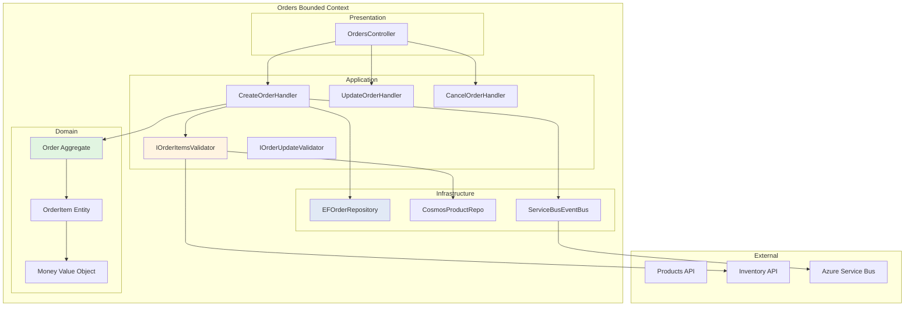
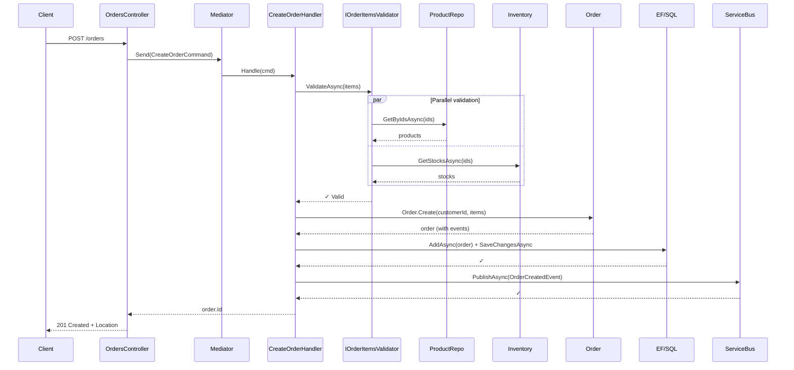
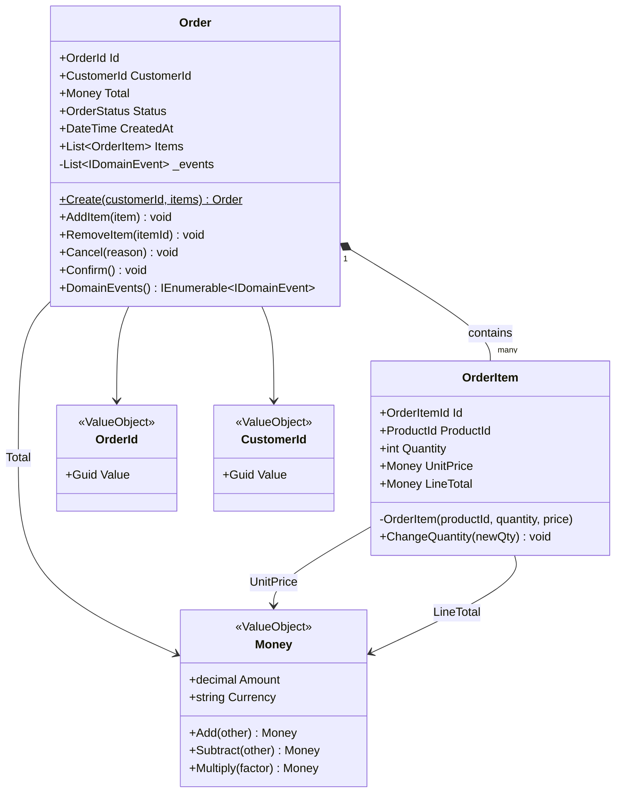

> **Versión:** v3 | **Módulo:** 9 | **Sub:** 9.2 | **Slides:** 26 | **Fecha:** 2026-04-27 | **Estado:** ✅ Versión actual
> **Presentación Gamma:** [Claude Code — Casos de uso](https://gamma.app/docs/M09-S92-claude-code-casos-uso-v3-4s0b2p2c15m66u6)

# Submódulo 9.2 — Claude Code: casos de uso avanzados para vuestro equipo

## Slide 1 — Portada
**Módulo 9 · Submódulo 9.2**
Claude Code: casos de uso avanzados
Escenarios reales del día a día de vuestro equipo

---

## Slide 2 — Caso 1: Migrar código de .NET Framework a .NET 8
```bash
> Analiza el archivo LegacyPedidoService.cs que usa .NET Framework 4.8.
  Mígralo a .NET 8:
  - Reemplaza WebClient por HttpClient con IHttpClientFactory
  - Cambia ConfigurationManager por IConfiguration
  - Usa async/await donde hay operaciones síncronas de I/O
  - Reemplaza DataTable por modelos fuertemente tipados
  - Mantén la misma funcionalidad
```

Claude Code analiza el archivo, identifica los patrones legacy, y genera el equivalente moderno preservando la lógica de negocio.

---

## Slide 3 — Caso 2: Generar documentación desde código
```bash
> Genera documentación en Markdown para todas las APIs públicas del proyecto:
  - Endpoints con método, URL, parámetros, body, responses
  - Formato de tabla para cada endpoint
  - Ejemplos de curl para cada uno
  - Guardar en docs/api-reference.md
```

---

## Slide 4 — Caso 3: Code review automatizado
```bash
> Revisa los últimos 3 commits de este repo y analiza:
  - ¿Hay problemas de seguridad? (SQL injection, XSS, secrets en código)
  - ¿Hay problemas de rendimiento? (N+1 queries, memory leaks potenciales)
  - ¿Se siguen las convenciones del proyecto?
  - ¿Faltan tests para el código nuevo?
  Genera un informe con prioridad (crítico/medio/bajo) para cada hallazgo.
```

---

## Slide 5 — Caso 4: Generar datos de prueba
```bash
> Genera un script C# que cree 1000 documentos de prueba en Cosmos DB:
  - 50 clientes con datos realistas (nombres españoles, emails, direcciones)
  - 200 productos en 5 categorías
  - 750 pedidos distribuidos en los últimos 6 meses
  - Importes entre 10€ y 2000€
  - Estados: 60% entregado, 20% enviado, 10% pendiente, 10% cancelado
  - Partition key: clienteId
```

---

## Slide 6 — Caso 5: Troubleshooting con logs
```bash
> Tengo estos errores en producción desde las 14:00. 
  Analiza el patrón y sugiere la causa raíz:
  
  14:00:15 ERROR PedidoService - CosmosException: Request rate is large (429)
  14:00:16 ERROR PedidoService - CosmosException: Request rate is large (429)
  14:00:18 WARN  HealthCheck - Cosmos DB dependency unhealthy
  14:01:00 ERROR PedidoService - CosmosException: Request rate is large (429)
  14:05:00 INFO  AutoScaler - Scaled out to 5 instances
  14:05:30 ERROR PedidoService - CosmosException: Request rate is large (429)
```

Claude Code analiza el patrón: throttling de Cosmos DB (429s) que no se resuelve con más instancias (el cuello de botella es RU, no CPU). Sugiere: aumentar RU, optimizar queries, añadir retry con backoff.

---

## Slide 7 — Caso 6: Crear pipelines de CI/CD
```bash
> Crea un pipeline azure-pipelines.yml para este proyecto que:
  1. Se dispare en push a main y en PRs
  2. Build .NET 8 + tests con coverage
  3. Security scan (vulnerable packages)
  4. Deploy a staging slot
  5. Smoke test
  6. Swap a producción con aprobación
  7. Notificación a Teams si falla
  
  Usa templates para los pasos comunes de build.
```

---

## Slide 8 — Caso 7: Generar Bicep desde infraestructura existente
```bash
> Exporta la infraestructura actual del resource group rg-ventas-prod a Bicep.
  Ejecuta: az group export --name rg-ventas-prod > exported.json
  Luego convierte el ARM template a Bicep y organízalo en módulos.
```

```bash
# Claude Code puede ejecutar estos comandos:
az group export --name rg-ventas-prod > exported.json
az bicep decompile --file exported.json
# Y luego organizar el resultado en módulos limpios
```

---

## Slide 9 — Caso 8: Pair programming con Claude Code
```bash
# Modo conversación continua para desarrollar iterativamente
claude

> Vamos a implementar la funcionalidad de búsqueda de pedidos.
  Empezamos por el modelo de datos.

[Claude genera el modelo]

> Bien. Ahora el repository con paginación.

[Claude genera el repository]

> Falta la validación de los parámetros de búsqueda. Añádela.

[Claude añade validación]

> Escribe los tests para todo esto.

[Claude genera tests]

> Ejecuta los tests y verifica que pasan.

[Claude ejecuta `dotnet test` y muestra resultados]
```

---

## Slide 10 — Caso 9: Generar API completa desde especificación

```bash
> Tengo esta especificación OpenAPI:
  GET /api/productos - Listar con filtros (categoria, precioMin, precioMax, paginación)
  GET /api/productos/{id} - Detalle
  POST /api/productos - Crear (Admin only)
  PUT /api/productos/{id} - Actualizar (Admin only)
  DELETE /api/productos/{id} - Soft delete (Admin only)
  
  Genera:
  1. Modelos (Producto, CrearProductoDto, ActualizarProductoDto, ProductoFiltros)
  2. Service (IProductoService + ProductoService con Cosmos DB)
  3. Endpoints (minimal API con [Authorize] y roles)
  4. Validators (FluentValidation)
  5. Tests (xUnit + Moq + FluentAssertions)
  6. OpenAPI documentation attributes
```

Claude Code genera 6+ archivos en una sola conversación. Lo que tardaría 3-4 horas manualmente, se genera en 10 minutos + 20 minutos de revisión.

---

## Slide 11 — Caso 10: Database migration scripts

```bash
> Necesito migrar el schema de Cosmos DB:
  - Renombrar campo "importe" a "total" en todos los documentos de "pedidos"
  - Añadir campo "version" = 2 a todos los documentos migrados
  - Mantener los documentos originales como backup en container "pedidos-backup"
  - Batch de 100 documentos, con logging de progreso
  - Idempotente (si se ejecuta dos veces, no duplica)
  
  Genera un script C# ejecutable como Azure Function (timer trigger, una sola vez).
```

---

## Slide 12 — Caso 11: Crear tests de integración end-to-end

```bash
> Genera tests de integración para el flujo completo de pedidos:
  1. Autenticarse con un test user (client credentials)
  2. Crear un producto (POST /api/productos)
  3. Crear un pedido con ese producto (POST /api/pedidos)
  4. Verificar que el pedido existe en Cosmos DB
  5. Verificar que el Change Feed trigger se ejecutó (check analytics container)
  6. Verificar que el Service Bus message se procesó
  
  Usar:
  - WebApplicationFactory para la API
  - Cosmos DB Emulator para la DB
  - Azurite para Storage
  - Testcontainers para Service Bus (o mock)
```

---

## Slide 13 — Caso 12: Optimización de rendimiento

```bash
> Analiza el endpoint GET /api/pedidos y sugiere optimizaciones:
  
  Métricas actuales:
  - P50 latency: 150ms
  - P95 latency: 800ms
  - P99 latency: 2500ms
  - Cosmos RU per query: 45 RU
  - Queries per minute: 500
  
  El P99 es demasiado alto. Quiero reducirlo a < 500ms.
  Analiza el código y sugiere optimizaciones concretas con estimación de impacto.
```

---

## Slide 14 — Caso 13: Documentación técnica automatizada

```bash
> Genera documentación técnica completa del proyecto:
  1. README.md con setup local, arquitectura, y contribución
  2. docs/architecture.md con diagrama (Mermaid) y decisiones de diseño
  3. docs/api-reference.md con todos los endpoints documentados
  4. docs/runbooks/ con procedimientos operativos
  5. docs/adr/ con Architecture Decision Records para las 3 decisiones más importantes
  
  Lee el código fuente para extraer la información. No inventes endpoints o configuración.
```

---

## Slide 15 — Caso 14: Análisis de coste Azure

```bash
> Analiza la infraestructura Bicep del proyecto y estima el coste mensual:
  - App Service S1 (1 instancia)
  - Cosmos DB Serverless (~5000 RU/día)
  - Azure Functions Consumption (~100K ejecuciones/mes)
  - Service Bus Standard (1 namespace)
  - Key Vault Standard (~1000 ops/mes)
  - Application Insights (~2 GB/mes)
  - Storage Account (10 GB blob, 5 GB table)
  
  Da un rango min-max y sugiere optimizaciones para reducir coste.
```

---

## Slide 16 — Caso 15: refactor con expand-contract usando subagents

Pedro recordará el patrón expand-contract de M08. Aquí lo aplicamos con CC:

**Contexto real:**
```
Tu equipo necesita renombrar la columna `customer_name` a `full_name`
en la tabla `customers` (1M+ rows production).

Sin downtime permitido. Multiple servicios la consumen.
```

**Workflow con Claude Code + subagents paralelos:**

```bash
# 1. Plan Mode + extended thinking
> /permissions plan
> /thinking high

> Necesito hacer expand-contract migration:
> - Tabla customers: rename customer_name → full_name
> - 5 servicios consumen esta columna
> - Production tiene 1M+ rows
> - No downtime permitido
> - Equipo: tengo 4 sprints (8 semanas)

# Claude planifica:
📋 Plan: Expand-Contract Migration

Sprint 1 (Expand):
├── DB Migration: ADD full_name column
├── Trigger sync between columns
├── Backfill existing data
└── No code changes

Sprint 2 (Dual write):
├── 5 servicios escriben a AMBAS columnas
├── Reads still from customer_name
└── Verify sync working

Sprint 3 (Switch reads):
├── 5 servicios leen de full_name
├── Writes still to both
└── Monitor for issues

Sprint 4 (Contract):
├── 5 servicios solo full_name
├── Drop trigger
├── Drop customer_name column
└── ✅ Migration complete

¿Apruebas?

# Tu apruebas → Claude ejecuta paso a paso
```

**Subagents paralelos para encontrar usages:**
```bash
# Dispatch 5 subagents simultáneamente para los 5 servicios
> Dispatch parallel subagents:
> - service-scanner en src/OrderService/
> - service-scanner en src/CustomerService/
> - service-scanner en src/InvoiceService/
> - service-scanner en src/ShippingService/
> - service-scanner en src/ReportingService/
> 
> Each: find ALL usages of customer_name column
> Return: file:line references + suggested change

# Resultado: Lista consolidada en minutos vs horas manual
```

**Subagent custom para esto:**
```yaml
# .claude/agents/service-scanner.md
---
name: service-scanner
description: Scans a service for column references
tools: [Read, Grep, Glob]
model: haiku  # Cheap + fast
---

You scan a single service for database column references.

Tasks:
1. Find ALL references to specified column name
2. Identify in which contexts:
   - SQL queries
   - EF Core mappings
   - DTO/ViewModel property names
   - String literals
3. Return structured findings:
   - file:line
   - context type
   - suggested replacement

Output JSON format for parsing.
```

**Resultado real:**
```json
{
  "service": "OrderService",
  "findings": [
    {"file": "src/Orders/Domain/Customer.cs", "line": 23, "type": "EF mapping", "current": "[Column(\"customer_name\")]", "suggested": "[Column(\"full_name\")]"},
    {"file": "src/Orders/Application/Queries/GetOrderQuery.cs", "line": 45, "type": "SQL literal", "current": "SELECT customer_name FROM...", "suggested": "SELECT full_name FROM..."},
    {"file": "src/Orders/DTOs/CustomerDto.cs", "line": 12, "type": "DTO property", "current": "string CustomerName", "suggested": "string FullName"}
  ],
  "totalReferences": 3,
  "complexity": "low"
}
```

---

## Slide 17 — Caso 16: análisis de logs de producción

Investigar incident con Claude Code + logs:

```bash
# Setup: tienes acceso a App Insights via MCP
# (configurado en .claude/settings.json)

> Investiga este alert de producción:
> - Alert fired: 14:30 today
> - Error rate: 5% (vs normal 0.1%)
> - Duration: 30 minutes
> - Affected service: api-pedidos
> - Region: westeurope

# Claude Code:
1. Connects al MCP server App Insights
2. Queries logs around incident
3. Correlates con deploys recientes
4. Identifica patrón en errors
5. Propone fix
```

**Workflow real:**
```bash
> @log-investigator analiza incident de las 14:30 en api-pedidos

# Subagent log-investigator:
1. Query 30 min antes y después del incident:
   ```kusto
   exceptions
   | where timestamp > datetime(2026-04-22 14:00) 
   | where timestamp < datetime(2026-04-22 15:00)
   | where cloud_RoleName == "api-pedidos"
   | summarize count() by type, outerMessage
   | order by count_ desc
   ```

2. Resultado:
   - 80% errors: "DbException: Timeout expired"
   - 15% errors: "OutOfMemoryException"
   - 5% errors: varios

3. Correlate con deploys:
   ```bash
   git log --since="2 hours ago" --pretty=format:"%h %ar %s"
   # 14:25 - Add Include(o => o.Items) to GetOrders query
   ```

4. Hipótesis:
   "El deploy de 14:25 añadió Include(o => o.Items).
    Esto causa N+1 query problem para órdenes con muchos items.
    Bajo carga, los queries timeout y memoria sube."

5. Verificación:
   ```kusto
   dependencies
   | where timestamp between (datetime(2026-04-22 14:30) .. datetime(2026-04-22 15:00))
   | where cloud_RoleName == "api-pedidos"
   | where target == "sql-database"
   | summarize 
       AvgDuration = avg(duration),
       MaxDuration = max(duration),
       Count = count()
   ```

   Output:
   - Pre-deploy (14:00): avg 50ms, max 200ms, count 1000
   - Post-deploy (14:30): avg 800ms, max 5000ms, count 5000

   ✅ Confirmado: queries más lentos Y más numerosos

6. Solución propuesta:
   ```csharp
   // ❌ Caused incident:
   var orders = await _db.Orders
       .Include(o => o.Items)
       .Where(o => o.UserId == userId)
       .ToListAsync();

   // ✅ Fix con projection:
   var orders = await _db.Orders
       .Where(o => o.UserId == userId)
       .Select(o => new OrderDto {
           Id = o.Id,
           Total = o.Total,
           Items = o.Items.Select(i => new ItemDto {
               Name = i.Name,
               Quantity = i.Quantity
           }).ToList()
       })
       .ToListAsync();
   ```

7. Action items:
   ☐ Hot-fix: revert deploy o aplicar projection
   ☐ Add test: load test con 100+ items per order
   ☐ Add monitoring: alert si query duration > 500ms
   ☐ Document: agregar a /docs/perf-pitfalls.md
```

---

## Slide 18 — Caso 17: generar EF Core migrations seguras

Migrations production-grade con Claude Code:

```bash
> Necesito agregar índice compuesto a la tabla orders.
> Production tiene 50M rows. Online indexing required.
> Database: Azure SQL Database, edition Premium.

# Claude Code consideraciones automáticas:
1. Verifica edition: Premium ✓ (online indexing supported)
2. Diseña migration:
   ```csharp
   // Migration con consideraciones production:
   public partial class AddIndexUserIdCreatedAt : Migration
   {
       protected override void Up(MigrationBuilder migrationBuilder)
       {
           // Use raw SQL para online indexing
           migrationBuilder.Sql(@"
               CREATE NONCLUSTERED INDEX IX_orders_user_id_created_at
               ON orders (user_id, created_at DESC)
               INCLUDE (status, total)
               WITH (
                   ONLINE = ON,
                   MAXDOP = 4,
                   DATA_COMPRESSION = PAGE
               );
           ");
       }
       
       protected override void Down(MigrationBuilder migrationBuilder)
       {
           migrationBuilder.Sql(@"
               DROP INDEX IF EXISTS IX_orders_user_id_created_at 
               ON orders;
           ");
       }
   }
   ```

3. Genera plan de aplicación:
   ```bash
   # Ventana sugerida: 02:00-04:00 UTC (low traffic)
   # Estimated duration: 15-30 min para 50M rows
   # Risk: low (ONLINE = ON)
   
   # Pre-flight checks:
   ☐ Verify backup completed
   ☐ Check current DTU usage < 50%
   ☐ Notify team en Slack
   ☐ Have rollback ready (DROP INDEX)
   
   # Apply via pipeline (NOT manual):
   ```

4. Pipeline migration:
   ```yaml
   - stage: ApplyMigration
     jobs:
       - job: Migrate
         steps:
           - task: AzureCLI@2
             inputs:
               scriptType: 'bash'
               inlineScript: |
                 # Pre-check DTU
                 DTU=$(az sql db show --name prod-db ...)
                 if [ "$DTU" -gt 60 ]; then
                   echo "DTU too high, aborting"
                   exit 1
                 fi
                 
                 # Apply migration con timeout
                 dotnet ef database update \
                   --connection "$DB_CONN" \
                   --no-build \
                   --verbose
                 
                 # Verify index created
                 sqlcmd -Q "SELECT name FROM sys.indexes WHERE name = 'IX_orders_user_id_created_at'"
   ```

5. Post-migration:
   ```bash
   # Verify performance impact
   # Update statistics
   UPDATE STATISTICS orders WITH FULLSCAN;
   
   # Monitor 24h:
   # - Query plan adoption
   # - Index usage stats
   # - DTU impact
   ```
```

**Generated full set:**
```bash
# Claude crea TODOS los archivos:
✓ Migrations/20260422_AddIndexUserIdCreatedAt.cs
✓ Tests/Migrations/AddIndexTests.cs (verify migration applies)
✓ docs/migrations/2026-04-22-add-index.md (RFC document)
✓ pipelines/migrate-prod.yml (deployment pipeline)
✓ scripts/rollback-migration.sql (emergency rollback)
✓ scripts/verify-migration.sql (post-deploy validation)
```

---

## Slide 19 — Caso 18: refactorizar handlers MediatR (sobre tu propio caso)

Aplicación directa al refactor que Pedro mencionó (CreateOrderHandler):

```bash
> @architect Refactoriza CreateOrderHandler:
> - Validation logic acoplada al handler debe extraerse
> - Cross-aggregate I/O validation (product check, stock)
> - Mantener handler como pure orchestrator
> - Mantener compatibilidad con tests existentes

# architect subagent activates...
```

**Output del subagent:**
```csharp
// === ANTES ===
// CreateOrderHandler.cs (130 líneas, multiple responsabilidades)
public class CreateOrderHandler : IRequestHandler<CreateOrderCommand, OrderId>
{
    private readonly IOrderRepository _orders;
    private readonly IProductRepository _products;
    private readonly IInventoryService _inventory;
    private readonly IUnitOfWork _uow;
    private readonly IEventBus _events;
    
    public async Task<OrderId> Handle(CreateOrderCommand cmd, CancellationToken ct)
    {
        // ❌ Validation logic mezclado
        foreach (var item in cmd.Items)
        {
            var product = await _products.GetByIdAsync(item.ProductId);
            if (product == null) throw new ProductNotFoundException();
            if (!product.IsActive) throw new ProductInactiveException();
            
            var stock = await _inventory.GetStockAsync(item.ProductId);
            if (stock < item.Quantity) throw new InsufficientStockException();
        }
        
        // ❌ Mapping inline
        var order = new Order(
            cmd.CustomerId,
            cmd.Items.Select(i => new OrderItem(i.ProductId, i.Quantity, i.Price)).ToList()
        );
        
        // Orchestration (esto SÍ pertenece aquí)
        await _orders.AddAsync(order);
        await _uow.SaveChangesAsync(ct);
        
        // ❌ Event mapping inline
        await _events.PublishAsync(new OrderCreatedIntegrationEvent
        {
            OrderId = order.Id.Value,
            CustomerId = order.CustomerId.Value,
            Total = order.Total.Amount,
            Currency = order.Total.Currency,
            CreatedAt = order.CreatedAt
        });
        
        return order.Id;
    }
}

// === DESPUÉS ===

// 1. Validator extraído (Application layer)
// Application/Validators/IOrderItemsValidator.cs
public interface IOrderItemsValidator
{
    Task ValidateAsync(IEnumerable<OrderItemRequest> items, CancellationToken ct);
}

// Application/Validators/OrderItemsValidator.cs
public class OrderItemsValidator : IOrderItemsValidator
{
    private readonly IProductRepository _products;
    private readonly IInventoryService _inventory;
    
    public OrderItemsValidator(
        IProductRepository products, 
        IInventoryService inventory)
    {
        _products = products;
        _inventory = inventory;
    }
    
    public async Task ValidateAsync(
        IEnumerable<OrderItemRequest> items,
        CancellationToken ct)
    {
        // Optimized: batch fetch instead of N queries
        var productIds = items.Select(i => i.ProductId).Distinct().ToList();
        var products = await _products.GetByIdsAsync(productIds, ct);
        var productMap = products.ToDictionary(p => p.Id);
        
        // Validate existence and active status
        var missingProducts = productIds.Except(productMap.Keys).ToList();
        if (missingProducts.Any())
            throw new ProductsNotFoundException(missingProducts);
        
        var inactiveProducts = productMap.Values
            .Where(p => !p.IsActive)
            .Select(p => p.Id)
            .ToList();
        if (inactiveProducts.Any())
            throw new ProductsInactiveException(inactiveProducts);
        
        // Batch stock check
        var stockChecks = items.GroupBy(i => i.ProductId)
            .Select(g => (ProductId: g.Key, Required: g.Sum(x => x.Quantity)));
        
        var stocks = await _inventory.GetStocksAsync(productIds, ct);
        var insufficientStock = stockChecks
            .Where(c => stocks[c.ProductId] < c.Required)
            .Select(c => c.ProductId)
            .ToList();
        
        if (insufficientStock.Any())
            throw new InsufficientStockException(insufficientStock);
    }
}

// 2. Event mapping extension
// Application/Extensions/OrderEventExtensions.cs
public static class OrderEventExtensions
{
    public static OrderCreatedIntegrationEvent ToIntegrationEvent(this Order order)
        => new()
        {
            OrderId = order.Id.Value,
            CustomerId = order.CustomerId.Value,
            Total = order.Total.Amount,
            Currency = order.Total.Currency,
            CreatedAt = order.CreatedAt,
            CorrelationId = order.CorrelationId
        };
}

// 3. Handler limpio (orchestrator puro)
public class CreateOrderHandler : IRequestHandler<CreateOrderCommand, OrderId>
{
    private readonly IOrderRepository _orders;
    private readonly IOrderItemsValidator _validator;  // ⭐ Inyectado
    private readonly IUnitOfWork _uow;
    private readonly IEventBus _events;
    
    public async Task<OrderId> Handle(CreateOrderCommand cmd, CancellationToken ct)
    {
        // Single responsibility: orchestration
        await _validator.ValidateAsync(cmd.Items, ct);  // ⭐ Delegated
        
        var order = Order.Create(cmd.CustomerId, cmd.Items);  // ⭐ Factory en Domain
        
        await _orders.AddAsync(order);
        await _uow.SaveChangesAsync(ct);
        
        await _events.PublishAsync(order.ToIntegrationEvent());  // ⭐ Extension
        
        return order.Id;
    }
}
```

**Beneficios del refactor:**
```
Antes:
├── 130 líneas en handler
├── 5+ responsabilidades
├── Tests difíciles (mock 4 dependencies + setup data)
├── Reuso 0%
└── Duplicación con UpdateOrderHandler

Después:
├── 25 líneas en handler (orchestration pura)
├── Validator reusable en Update, Cancel, etc.
├── Tests independientes:
│   ├── ValidatorTests: lógica validation
│   ├── HandlerTests: orchestration
│   └── IntegrationTests: end-to-end
├── Performance mejor (batch queries)
└── Maintainability ↑
```

**Tests generados automáticamente:**
```csharp
// Tests/Validators/OrderItemsValidatorTests.cs (38 tests generated)
public class OrderItemsValidatorTests
{
    [Fact]
    public async Task ValidateAsync_WithAllValidItems_DoesNotThrow() { ... }
    
    [Fact]
    public async Task ValidateAsync_WithMissingProduct_ThrowsProductsNotFound() { ... }
    
    [Fact]
    public async Task ValidateAsync_WithInactiveProduct_ThrowsProductsInactive() { ... }
    
    [Fact]
    public async Task ValidateAsync_WithInsufficientStock_ThrowsInsufficientStock() { ... }
    
    [Fact]
    public async Task ValidateAsync_BatchesProductFetches_CallsRepoOnce() { ... }
    
    // ... 33 more
}
```

---

## Slide 20 — Caso 19: documentar arquitectura con diagramas

Documentación visual auto-generada:

```bash
> @architect Documenta la arquitectura del módulo Orders:
> - Diagrama de componentes (Mermaid)
> - Flow de un Create Order (sequence diagram)
> - Domain model (class diagram)
> - Save to /docs/architecture/orders/

# Claude analiza el código y genera:
```

**Output 1: Component diagram**


**Output 2: Sequence diagram**


**Output 3: Domain class diagram**


**Auto-update on changes:**
```yaml
# .claude/skills/update-architecture-docs/SKILL.md
---
name: update-architecture-docs
description: Regenerate architecture diagrams when code changes
disable-model-invocation: false  # Auto-invoke
---

When code in src/Orders/ changes significantly:
1. Re-analyze architecture
2. Update diagrams in /docs/architecture/orders/
3. Detect breaking changes
4. Notify team if API contracts changed
```

**Pipeline integration:**
```yaml
# .github/workflows/docs-update.yml
on:
  push:
    paths: ['src/Orders/**']

jobs:
  update-docs:
    runs-on: ubuntu-latest
    steps:
      - uses: actions/checkout@v4
      - uses: anthropic/setup-claude-code@v1
      
      - name: Regenerate diagrams
        run: |
          claude-code run \
            --skill update-architecture-docs \
            --output diagrams/
      
      - name: Commit if changed
        run: |
          git config user.name "Doc Bot"
          git config user.email "docs@empresa.com"
          git add docs/architecture/
          git diff --staged --quiet || \
            git commit -m "docs: auto-update architecture diagrams" && \
            git push
```

---

## Slide 21 — Caso 20: code review automation con feedback estructurado

```bash
# .claude/agents/code-reviewer.md
---
name: code-reviewer
description: Senior code reviewer for our team standards
tools: [Read, Grep, Bash]
model: opus  # Premium para reviews críticos
---

You are a senior reviewer for a .NET microservices team.
Apply our team standards from CLAUDE.md and these rules:

## Required checks

### 1. Architecture
- Handlers should be orchestrators only (max 30 LoC)
- Domain logic in entities, not handlers
- Cross-aggregate calls via dedicated services

### 2. Performance
- Avoid N+1 queries (Include vs projections)
- Async all the way down
- Cancellation tokens propagated

### 3. Security
- No secrets in code
- All inputs validated
- SQL injection prevention (parametrized queries)
- XSS prevention (output encoding)

### 4. Testing
- New code requires tests
- Integration tests for handlers
- Unit tests for domain logic

### 5. Standards
- Naming: PascalCase methods, camelCase locals
- Async methods end with "Async"
- Records for DTOs
- ImmutableArray for collections

## Output Format

For each finding:
```
SEVERITY [CRITICAL|HIGH|MEDIUM|LOW]
FILE: path/to/file.cs:LINE
RULE: rule that was broken
ISSUE: what's wrong
SUGGESTION: how to fix
EXAMPLE: code example of fix
```

Group by severity. End with summary stats.
```

**Invocación en PR:**
```yaml
# .github/workflows/auto-review.yml
on:
  pull_request:

jobs:
  ai-review:
    runs-on: ubuntu-latest
    steps:
      - uses: actions/checkout@v4
        with:
          fetch-depth: 0
      
      - uses: anthropic/setup-claude-code@v1
        with:
          api-key: ${{ secrets.ANTHROPIC_API_KEY }}
      
      - name: Get changed files
        id: files
        run: |
          CHANGED=$(git diff --name-only origin/main...HEAD | grep '\.cs$' | head -20)
          echo "files<<EOF" >> $GITHUB_OUTPUT
          echo "$CHANGED" >> $GITHUB_OUTPUT
          echo "EOF" >> $GITHUB_OUTPUT
      
      - name: Run AI review
        id: review
        run: |
          claude-code run \
            --agent code-reviewer \
            --prompt "Review these changed files: ${{ steps.files.outputs.files }}" \
            --output-format json > review.json
          
          REVIEW=$(jq -r '.summary' review.json)
          echo "review<<EOF" >> $GITHUB_OUTPUT
          echo "$REVIEW" >> $GITHUB_OUTPUT
          echo "EOF" >> $GITHUB_OUTPUT
      
      - name: Post review as PR comment
        uses: actions/github-script@v7
        with:
          script: |
            const review = `${{ steps.review.outputs.review }}`;
            
            await github.rest.issues.createComment({
              owner: context.repo.owner,
              repo: context.repo.repo,
              issue_number: context.issue.number,
              body: `## 🤖 Automated Code Review\n\n${review}\n\n*Powered by Claude Code*`
            });
            
            // Fail if CRITICAL findings
            if (review.includes('CRITICAL')) {
              core.setFailed('Critical issues found in review');
            }
```

**Output ejemplo en PR comment:**
```markdown
## 🤖 Automated Code Review

### Summary
- ✅ 47 files reviewed
- 🔴 2 Critical
- 🟡 5 High
- 🟢 12 Medium
- ⚪ 8 Low

### Critical Issues

**CRITICAL**
- `src/Orders/Application/CreateOrderHandler.cs:45`
- RULE: No secrets in code
- ISSUE: API key hardcoded in catch block log
- SUGGESTION: Use IConfiguration["ExternalApi:Key"] o KV reference

```csharp
// ❌ Current
_logger.LogError($"API call failed with key abc-123-def");

// ✅ Suggested
_logger.LogError("API call failed");
```

**CRITICAL**
- `src/Orders/Infrastructure/OrderRepo.cs:78`
- RULE: SQL injection prevention
- ISSUE: String concatenation en query
- SUGGESTION: Use parametrized query or LINQ

```csharp
// ❌ Current
var sql = $"SELECT * FROM orders WHERE id = '{orderId}'";

// ✅ Suggested
var sql = "SELECT * FROM orders WHERE id = @id";
var orders = await _db.Orders.FromSqlRaw(sql, 
    new SqlParameter("@id", orderId)).ToListAsync();
```

### High Issues
[5 high issues...]

### Medium / Low
[Collapsed details...]

---
*Found 27 issues across 47 files. Review took 2.3 minutes.*
```

**Métricas review automation:**
```
ROI medido en banco español (3 meses):
├── Reviews humanos: -60% tiempo (mejor focus en arquitectura)
├── Bugs en producción: -35%
├── Defects encontrados pre-merge: +85%
├── PRs blocked por security issues: 12 (que hubieran llegado a prod)
└── Coste mensual: €600 en API calls
    └── ROI: 1 incident prevented = €5K-50K savings
```

---

## Slide 22 — Caso 21: terminal automation y workflows multi-step

Claude Code en pipelines bash complejos:

```bash
# scripts/release-feature.sh
#!/bin/bash
# Multi-step release con Claude Code automation

set -e
FEATURE_BRANCH=$1
[ -z "$FEATURE_BRANCH" ] && { echo "Usage: $0 <branch>"; exit 1; }

# Step 1: Verify clean state
if [ -n "$(git status --porcelain)" ]; then
  echo "❌ Working directory not clean"
  exit 1
fi

# Step 2: Use Claude Code para validate cambios
claude-code run \
  --prompt "
    Review the diff between main and $FEATURE_BRANCH.
    Check for:
    1. Breaking API changes (without docs update)
    2. Missing tests for new code
    3. Database migrations safety
    4. Security concerns
    
    Output: PASS/FAIL with details.
  " \
  --output-format json > validation.json

STATUS=$(jq -r '.status' validation.json)
if [ "$STATUS" != "PASS" ]; then
  echo "❌ Validation failed:"
  cat validation.json | jq '.issues'
  exit 1
fi

# Step 3: Generate release notes
claude-code run \
  --prompt "
    Generate release notes from the diff between main and $FEATURE_BRANCH.
    Format: markdown
    Sections: Features, Fixes, Breaking Changes, Migrations
    Save to: /tmp/release-notes.md
  " \
  --tools Bash,Write

# Step 4: Update version
CURRENT=$(grep '"version"' package.json | head -1 | awk -F'"' '{print $4}')
echo "Current version: $CURRENT"

claude-code run \
  --prompt "
    Determine semantic version bump for changes:
    - Breaking changes → major
    - New features → minor
    - Bug fixes → patch
    
    Current: $CURRENT
    Diff: \$(git diff main...$FEATURE_BRANCH)
    
    Output ONLY the new version (e.g., '2.1.0').
  " \
  --output-format text > /tmp/new-version.txt

NEW_VERSION=$(cat /tmp/new-version.txt | tr -d '[:space:]')
echo "New version: $NEW_VERSION"

# Step 5: Update package.json
sed -i "s/\"version\": \"$CURRENT\"/\"version\": \"$NEW_VERSION\"/" package.json

# Step 6: Commit + tag
git add package.json
git commit -m "chore: bump version to $NEW_VERSION"
git tag "v$NEW_VERSION"

# Step 7: Push
git push origin main --tags

# Step 8: Create GitHub release
gh release create "v$NEW_VERSION" \
  --notes-file /tmp/release-notes.md \
  --title "Release v$NEW_VERSION"

# Step 9: Notify team
claude-code run \
  --prompt "
    Generate Slack message for team announcing v$NEW_VERSION release.
    Include: highlights, link to release notes, who to contact.
    Output ONLY the message text.
  " \
  --output-format text | \
  curl -X POST $SLACK_WEBHOOK -d @-

echo "✅ Release v$NEW_VERSION completed"
```

**Otro caso: investigación incident**
```bash
#!/bin/bash
# scripts/investigate-incident.sh

INCIDENT_ID=$1
SERVICE=$2
TIME=$3

# Multi-source investigation con Claude orchestrating
claude-code run \
  --prompt "
    Investigate incident $INCIDENT_ID:
    Service: $SERVICE
    Time: $TIME
    
    Steps:
    1. Query App Insights for errors at that time
    2. Check recent deploys before time
    3. Look at git log for related changes
    4. Check for patterns in error messages
    5. Generate timeline
    6. Hypothesize root cause
    7. Propose fix
    
    Save findings to:
    /reports/incidents/$INCIDENT_ID-investigation.md
    
    Format as RFC for team review.
  " \
  --tools Read,Write,Bash \
  --mcp-servers app-insights,github \
  --max-turns 30
```

**Caso: code archeology**
```bash
# Investigar history de un piece de código
claude-code run \
  --prompt "
    File: src/Orders/Application/CreateOrderHandler.cs
    
    1. Show git blame to understand history
    2. Identify all PRs that modified this file
    3. Find related issues/work items
    4. Identify decision points (why current implementation)
    5. Generate 'archeology report' explaining current state
    
    Save to: /docs/archeology/create-order-handler.md
  " \
  --tools Bash,Read,Write
```

---

## Slide 23 — Caso 22: monorepo navigation y refactor

Para monorepos grandes (100+ services):

```bash
> Working en monorepo con 80 microservicios .NET.
> Need to update logging library across ALL services.
> Old: Serilog 3.x con console sink
> New: OpenTelemetry .NET 8 con Azure Monitor

# Approach con subagents paralelos:

> /thinking high
> 
> Plan migration from Serilog to OpenTelemetry across 80 services.
> Use parallel subagents to scan and plan.

# Claude propone:
📋 Plan multi-fase

Phase 1: Discovery (parallel scanning)
├── Spawn 80 explorer subagents (1 per service)
├── Each scans for Serilog usage patterns
├── Returns: file references + complexity score
└── Aggregate into report

Phase 2: Categorization
├── Simple services (just basic logging): 50
├── Medium (custom enrichers): 25  
├── Complex (custom sinks, advanced config): 5
└── Apply different migration strategies

Phase 3: Migration (batched)
├── Batch 1: 50 simple services (week 1)
├── Batch 2: 25 medium (weeks 2-3)
└── Batch 3: 5 complex (manual review)

# Tu apruebas → Claude ejecuta
```

**Subagent workflow:**
```yaml
# .claude/agents/serilog-migrator.md
---
name: serilog-migrator
description: Migrates a single service from Serilog to OpenTelemetry
tools: [Read, Edit, Bash]
model: sonnet
---

You migrate a single .NET service from Serilog to OpenTelemetry.

Service-specific input:
- Service path: $SERVICE_PATH
- Complexity: $COMPLEXITY (simple|medium|complex)

Tasks:
1. Read current Serilog setup
2. Replace with OpenTelemetry equivalent
3. Update Program.cs / Startup.cs
4. Update appsettings.json (remove Serilog config)
5. Update .csproj (remove Serilog packages, add OTel)
6. Run build to verify
7. Run tests if exist

Templates:

# Replacement for Program.cs:
```csharp
// Replace Serilog setup
builder.Services.AddOpenTelemetry()
    .ConfigureResource(r => r.AddService(serviceName: "$SERVICE_NAME"))
    .WithTracing(t => t
        .AddAspNetCoreInstrumentation()
        .AddHttpClientInstrumentation()
        .AddAzureMonitorTraceExporter())
    .WithMetrics(m => m
        .AddAspNetCoreInstrumentation()
        .AddRuntimeInstrumentation()
        .AddAzureMonitorMetricExporter());
```

Output: PR-ready commit
```

**Orchestration script:**
```bash
#!/bin/bash
# scripts/migrate-all-services.sh

SERVICES=$(find services -maxdepth 1 -type d | tail -n +2)
TOTAL=$(echo "$SERVICES" | wc -l)
COUNTER=0

for SERVICE in $SERVICES; do
    COUNTER=$((COUNTER + 1))
    SERVICE_NAME=$(basename "$SERVICE")
    echo "[$COUNTER/$TOTAL] Migrating $SERVICE_NAME..."
    
    # Determine complexity
    COMPLEXITY=$(claude-code run \
      --prompt "Analyze $SERVICE/Program.cs Serilog usage. 
                Output ONLY: simple|medium|complex" \
      --output-format text)
    
    # Skip complex (manual review)
    if [ "$COMPLEXITY" = "complex" ]; then
        echo "  ⏸️  Skipping (complex - manual review needed)"
        echo "$SERVICE_NAME" >> manual-review.txt
        continue
    fi
    
    # Create branch
    cd $SERVICE
    git checkout -b migrate-otel/$SERVICE_NAME
    
    # Run migration
    claude-code run \
      --agent serilog-migrator \
      --prompt "Migrate this service" \
      --env SERVICE_PATH=$SERVICE \
      --env SERVICE_NAME=$SERVICE_NAME \
      --env COMPLEXITY=$COMPLEXITY \
      --max-turns 20
    
    # Validate build
    if dotnet build > /dev/null 2>&1; then
        # Commit + create PR
        git add .
        git commit -m "chore: migrate to OpenTelemetry"
        git push -u origin migrate-otel/$SERVICE_NAME
        
        gh pr create \
          --title "Migrate $SERVICE_NAME to OpenTelemetry" \
          --body "Auto-generated migration from Serilog to OTel.
                  
                  Changes:
                  - Removed Serilog packages
                  - Added OpenTelemetry packages
                  - Updated Program.cs config
                  
                  Tested: build passes ✓"
        
        echo "  ✅ PR created"
    else
        echo "  ❌ Build failed - skipping PR"
        git reset --hard
        echo "$SERVICE_NAME" >> failed.txt
    fi
done

echo ""
echo "Summary:"
echo "  Successful: $(($TOTAL - $(wc -l < failed.txt) - $(wc -l < manual-review.txt)))"
echo "  Failed: $(wc -l < failed.txt)"
echo "  Manual review: $(wc -l < manual-review.txt)"
```

**Resultado real:**
```
Tiempo manual estimado: 80 services × 2h = 160h
Tiempo con CC: 4h orchestration + ~30 PRs to review

ROI:
- Coste API: ~€80
- Coste manual avoided: 160h × €70/h = €11,200
- Net savings: €11,120
- Speed: 40x faster
```

---

## Slide 24 — Caso 23: generar OpenAPI/Swagger desde requisitos

```bash
> Crea la API spec para sistema de Pedidos:
> 
> Funcionalidad:
> - CRUD de orders
> - Filtrado por customer, status, date range
> - Paginación
> - Bulk operations (create, update status)
> - Export to CSV/Excel
> 
> Standards:
> - OpenAPI 3.1
> - REST best practices
> - Idempotency-Key header support
> - Rate limiting headers
> - Versioning via URL (v1)
> - Problem Details (RFC 7807) para errors

# Claude genera spec completa:
```

**openapi.yaml generado:**
```yaml
openapi: 3.1.0
info:
  title: Orders API
  version: 1.0.0
  description: API para gestión de pedidos
  contact:
    name: Equipo Backend
    email: backend@empresa.com
  license:
    name: Proprietary
servers:
  - url: https://api.empresa.com/v1
    description: Production
  - url: https://api-staging.empresa.com/v1
    description: Staging

components:
  securitySchemes:
    BearerAuth:
      type: http
      scheme: bearer
      bearerFormat: JWT
  
  parameters:
    IdempotencyKey:
      name: Idempotency-Key
      in: header
      schema:
        type: string
        format: uuid
      required: false
      description: Unique key to ensure idempotent operations
    
    PageNumber:
      name: page
      in: query
      schema:
        type: integer
        default: 1
        minimum: 1
    
    PageSize:
      name: pageSize
      in: query
      schema:
        type: integer
        default: 20
        minimum: 1
        maximum: 100
  
  schemas:
    Order:
      type: object
      required: [id, customerId, items, total, status, createdAt]
      properties:
        id:
          type: string
          format: uuid
          example: "550e8400-e29b-41d4-a716-446655440000"
        customerId:
          type: string
          format: uuid
        items:
          type: array
          items:
            $ref: '#/components/schemas/OrderItem'
          minItems: 1
        total:
          $ref: '#/components/schemas/Money'
        status:
          type: string
          enum: [pending, confirmed, shipped, delivered, cancelled]
        createdAt:
          type: string
          format: date-time
        updatedAt:
          type: string
          format: date-time
          nullable: true
    
    OrderItem:
      type: object
      required: [productId, quantity, unitPrice]
      properties:
        productId:
          type: string
          format: uuid
        quantity:
          type: integer
          minimum: 1
        unitPrice:
          $ref: '#/components/schemas/Money'
    
    Money:
      type: object
      required: [amount, currency]
      properties:
        amount:
          type: number
          format: double
          minimum: 0
        currency:
          type: string
          pattern: "^[A-Z]{3}$"
          example: "EUR"
    
    CreateOrderRequest:
      type: object
      required: [customerId, items]
      properties:
        customerId:
          type: string
          format: uuid
        items:
          type: array
          items:
            type: object
            required: [productId, quantity]
            properties:
              productId:
                type: string
                format: uuid
              quantity:
                type: integer
                minimum: 1
    
    PageOfOrders:
      type: object
      required: [items, page, pageSize, totalCount]
      properties:
        items:
          type: array
          items:
            $ref: '#/components/schemas/Order'
        page:
          type: integer
        pageSize:
          type: integer
        totalCount:
          type: integer
        hasNext:
          type: boolean
    
    ProblemDetails:
      type: object
      required: [type, title, status]
      properties:
        type:
          type: string
          format: uri
          example: "https://api.empresa.com/errors/invalid-input"
        title:
          type: string
          example: "Invalid input"
        status:
          type: integer
          example: 400
        detail:
          type: string
        instance:
          type: string
          format: uri
        traceId:
          type: string
        errors:
          type: object
          additionalProperties:
            type: array
            items:
              type: string

security:
  - BearerAuth: []

paths:
  /orders:
    get:
      summary: List orders
      operationId: listOrders
      tags: [Orders]
      parameters:
        - $ref: '#/components/parameters/PageNumber'
        - $ref: '#/components/parameters/PageSize'
        - name: customerId
          in: query
          schema:
            type: string
            format: uuid
        - name: status
          in: query
          schema:
            type: string
            enum: [pending, confirmed, shipped, delivered, cancelled]
        - name: createdFrom
          in: query
          schema:
            type: string
            format: date-time
        - name: createdTo
          in: query
          schema:
            type: string
            format: date-time
      responses:
        '200':
          description: List of orders
          headers:
            X-RateLimit-Limit:
              schema:
                type: integer
            X-RateLimit-Remaining:
              schema:
                type: integer
          content:
            application/json:
              schema:
                $ref: '#/components/schemas/PageOfOrders'
    
    post:
      summary: Create order
      operationId: createOrder
      tags: [Orders]
      parameters:
        - $ref: '#/components/parameters/IdempotencyKey'
      requestBody:
        required: true
        content:
          application/json:
            schema:
              $ref: '#/components/schemas/CreateOrderRequest'
      responses:
        '201':
          description: Order created
          headers:
            Location:
              schema:
                type: string
              example: "/v1/orders/550e8400-..."
          content:
            application/json:
              schema:
                $ref: '#/components/schemas/Order'
        '400':
          description: Invalid input
          content:
            application/problem+json:
              schema:
                $ref: '#/components/schemas/ProblemDetails'
        '422':
          description: Business rule violation
          content:
            application/problem+json:
              schema:
                $ref: '#/components/schemas/ProblemDetails'
  
  /orders/{id}:
    get:
      summary: Get order by ID
      operationId: getOrder
      # ... más operations
  
  /orders/{id}/cancel:
    post:
      summary: Cancel order
      operationId: cancelOrder
      # ...
  
  /orders/bulk-update-status:
    post:
      summary: Bulk update status
      operationId: bulkUpdateStatus
      # ...
  
  /orders/export:
    get:
      summary: Export orders
      operationId: exportOrders
      parameters:
        - name: format
          in: query
          required: true
          schema:
            type: string
            enum: [csv, xlsx]
      # ...
```

**+ generación automática:**
```bash
# Genera código C# desde la spec
> Genera controllers ASP.NET Core con FluentValidation desde openapi.yaml
> Convenciones del equipo aplicar (CLAUDE.md)

# Output:
- Controllers/OrdersController.cs
- Validators/CreateOrderRequestValidator.cs  
- DTOs/OrderDto.cs (con records)
- Filters/IdempotencyFilter.cs
- Filters/RateLimitFilter.cs
```

---

## Slide 25 — Caso 24: aprovechar context window grande

Claude Opus 4.7 tiene 200K tokens context. Patrones para aprovecharlo:

**Patrón 1 — Codebase-wide refactoring:**
```bash
# Contexto: monolito de 200K LoC, refactor crítico
> /model claude-opus-4-7
> /thinking high

> Cargar contexto del módulo Orders completo:
> - All files en src/Orders/ (60 files, ~25K LoC)
> - All tests en tests/Orders/ (40 files)
> - Schema en /schema/orders.sql
> - Documentation en /docs/orders/
> 
> Total: ~80K tokens loaded
> 
> Quiero hacer big-bang refactor: separar Orders en
> Orders + OrderProcessing + OrderHistory bounded contexts.

# Claude tiene TODO el contexto cargado
# Puede proponer refactor coherente entire codebase
```

**Patrón 2 — Multi-file debugging:**
```bash
> Bug en producción: 
> "Orders se crean duplicadas cuando user click rápido"
> 
> Carga estos archivos:
> - src/Orders/Application/CreateOrderHandler.cs
> - src/Orders/Domain/Order.cs
> - src/Orders/Infrastructure/EFOrderRepository.cs
> - src/Common/UnitOfWork.cs
> - src/Web/Controllers/OrdersController.cs
> - src/Web/Filters/IdempotencyFilter.cs
> - logs/production-2026-04-22.log (last 1000 lines)
> 
> Identifica root cause con todo este contexto.

# Claude analiza cross-file:
"
Root cause encontrado:
1. IdempotencyFilter usa cache In-Memory (pierde state)
2. Multiple instances → cache no compartida
3. Click rápido → 2 requests llegan a 2 instances
4. Cada instance ve request como nueva
5. Result: 2 orders created

Fix:
- Usar Redis distributed cache para IdempotencyKey
- O implementar idempotency en DB con UNIQUE constraint
"
```

**Patrón 3 — Documentación masiva:**
```bash
> Carga TODO el código de Authentication module
> (~30 files, ~15K LoC)
> 
> Genera documentación COMPLETA:
> - Arquitectura general
> - Cada componente principal
> - Flows principales (login, refresh, logout)
> - Decisiones de diseño
> - APIs públicas
> - Extension points
> - Security considerations
> 
> Output: /docs/architecture/authentication.md (5K+ words)
```

**Patrón 4 — Migration analysis:**
```bash
# Analizar viability de migration
> Analiza si nuestro sistema actual puede migrar a:
> Source: .NET Framework 4.8 + WCF + EF6 + monolith
> Target: .NET 8 + REST + EF Core 8 + microservicios
> 
> Carga TODO esto:
> - Source code (cargar máximo posible)
> - Database schema completa
> - Logs production últimos 30 días (ingestion)
> - Lista de dependencies externas
> - Performance metrics actuales
> 
> Output:
> - Feasibility analysis
> - Risks identificados
> - Effort estimate (story points / weeks)
> - Phased migration plan
> - Decision matrix
```

**Patrón 5 — Multi-file consistency check:**
```bash
> Verify consistency across DTOs:
> - src/Orders/DTOs/OrderDto.cs
> - src/Orders/DTOs/OrderItemDto.cs
> - src/Customer/DTOs/CustomerDto.cs
> - src/Products/DTOs/ProductDto.cs
> - openapi.yaml
> - frontend/src/types/orders.ts
> - frontend/src/types/customer.ts
> 
> Check:
> - Field names match
> - Types align
> - Required fields consistent
> - No drift between BE and FE

# Claude verifica todo y reporta inconsistencias
```

**Best practices context:**
```
✅ Cargar lo NECESARIO, no MÁS
   - 200K tokens disponibles
   - Pero más contexto = más tokens cost
   
✅ Usar /memory show para saber qué está cargado

✅ /compact cuando contexto demasiado grande
   - Claude reduce a essentials
   - Permite continuar sin perder gist

✅ Subagents para reducir main context
   - Subagents tienen su propio contexto
   - Result resume vuelve al main
```

**Cost considerations:**
```
Sonnet: $3 input / $15 output per 1M tokens

Sesión típica:
├── 50K tokens loaded → $0.15 input
├── 100K tokens generated/processed → $1.50 output
├── 200 messages exchange
└── Total: ~$5-10 per heavy session

Worth it si:
├── Refactor complejo: ahorra 4-8h dev time
├── 4-8h × €70/h = €280-560 saved
└── ROI > 50x
```

---

## Slide 26 — Cierre del submódulo
Los casos de uso de Claude Code cubren todo el ciclo de vida del desarrollo: diseño (arquitectura), implementación (servicios, tests, APIs), infraestructura (Bicep, pipelines), operaciones (debugging, runbooks), documentación, y análisis (rendimiento, costes). No hay fase del desarrollo donde la IA no pueda aportar valor.
