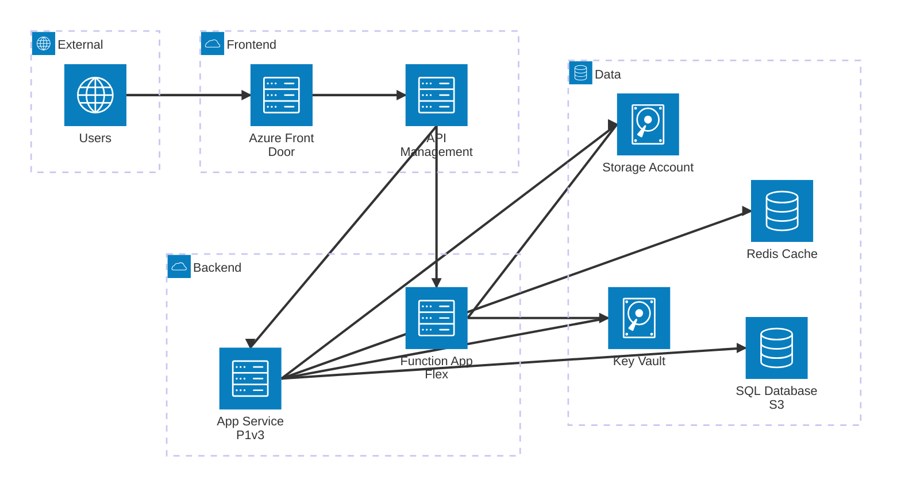
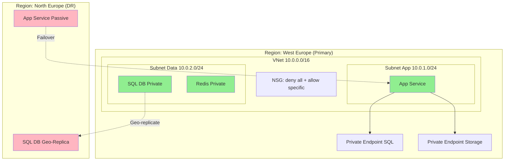

> **Versión:** v3 | **Módulo:** 9 | **Sub:** 9.3 | **Slides:** 25 | **Fecha:** 2026-04-27 | **Estado:** ✅

# Submódulo 9.3 — Claude Code para infraestructura Azure

## Slide 1 — Portada
**Módulo 9 · Submódulo 9.3**
Claude Code para infraestructura
Generar Bicep, pipelines YAML, Dockerfiles y configuración de servicios Azure

---

## Slide 2 — IaC con IA: el caso de uso más potente
Escribir Bicep a mano es tedioso. Claude Code genera templates completos a partir de una descripción en lenguaje natural, incluyendo módulos, parámetros, outputs y RBAC.

```bash
> Genera un archivo Bicep para una App Service con:
  - Plan S1 en West Europe
  - Managed Identity habilitada
  - HTTPS only
  - Health check en /health
  - Slot de staging
  - Application Insights conectado
  - Variables de configuración para Cosmos DB (con MI, sin connection strings)
```

Claude Code genera el Bicep completo con buenas prácticas incluidas.

---

## Slide 3 — Generar módulos Bicep organizados

```bash
> Genera la infraestructura completa del proyecto Ventas organizada en módulos:
  infrastructure/
  ├── main.bicep (orquestador con parámetros por entorno)
  ├── params.dev.json
  ├── params.prod.json
  └── modules/
      ├── app-service.bicep
      ├── cosmos-db.bicep (serverless, 3 containers)
      ├── functions.bicep (consumption plan)
      ├── service-bus.bicep (1 topic, 3 suscripciones)
      ├── key-vault.bicep
      ├── app-insights.bicep
      └── rbac.bicep (MI para todo)
```

El resultado es directamente desplegable con `az deployment group create`.

---

## Slide 4 — Generar pipelines YAML completos

```bash
> Crea un pipeline Azure DevOps YAML para el proyecto .NET 8 que:
  - Trigger en push a main y PRs
  - Build con .NET 8 + tests con code coverage
  - Security scan (dotnet list package --vulnerable)
  - Deploy a slot staging con smoke test
  - Aprobación manual para producción
  - Swap staging → producción
  - Rollback automático si health check falla post-swap
  - Notificación a Teams en caso de fallo
  Usa templates para los steps de build reutilizables.
```

---

## Slide 5 — Generar Dockerfiles optimizados

```bash
> Crea un Dockerfile multi-stage para la API .NET 8:
  - Stage 1: build con SDK
  - Stage 2: runtime con aspnet:8.0-alpine
  - Non-root user
  - Health check integrado
  - Optimizado para caching de layers (restore antes de build)
```

```dockerfile
# Resultado generado por Claude Code:
FROM mcr.microsoft.com/dotnet/sdk:8.0 AS build
WORKDIR /src
COPY *.csproj .
RUN dotnet restore
COPY . .
RUN dotnet publish -c Release -o /app

FROM mcr.microsoft.com/dotnet/aspnet:8.0-alpine AS runtime
RUN adduser --disabled-password appuser
USER appuser
WORKDIR /app
COPY --from=build /app .
HEALTHCHECK CMD wget -qO- http://localhost:8080/health || exit 1
ENTRYPOINT ["dotnet", "VentasApi.dll"]
```

---

## Slide 6 — Configurar servicios Azure desde descripción

```bash
> Configura un Service Bus namespace con:
  - Topic "pedido-eventos" con 3 suscripciones:
    - sub-emails: filtro SQL "prioridad = 'urgente'"
    - sub-facturacion: filtro SQL "total > 100"
    - sub-analytics: sin filtro (recibe todo)
  - Dead-letter en las 3 suscripciones
  - Deduplicación habilitada
  - TTL de 24 horas
  Genera el Bicep Y los comandos az CLI equivalentes.
```

---

## Slide 7 — Generar scripts de migración de datos

```bash
> Crea un script C# que migre datos desde SQL Server on-premises 
  a Cosmos DB:
  - Lee de tabla Pedidos (SQL Server via EF Core)
  - Transforma al modelo de Cosmos DB (desnormalizado)
  - Escribe en batches de 100 documentos
  - Con retry y progress reporting
  - Partition key: clienteId
  - Manejo de duplicados (idempotente)
```

---

## Slide 8 — Verificar y validar IaC generada

```bash
# Claude Code puede ejecutar la validación
> Valida el Bicep que acabas de generar:
  1. Ejecuta az bicep build (lint)
  2. Ejecuta az deployment group validate
  3. Ejecuta az deployment group what-if
  4. Muéstrame los cambios previstos

# Claude Code ejecuta los comandos y analiza los resultados
$ az bicep build --file main.bicep
  ✓ Sin errores de lint

$ az deployment group what-if -g rg-ventas-dev -f main.bicep -p @params.dev.json
  + Create: Microsoft.Web/serverfarms/plan-ventas-dev
  + Create: Microsoft.Web/sites/app-ventas-dev
  + Create: Microsoft.DocumentDB/databaseAccounts/cosmos-ventas-dev
  ...

> Los cambios se ven correctos. ¿Despliego?
```

---

## Slide 9 — Generar configuración de App Service completa

```bash
> Configura el App Service app-ventas-prod con:
  - Custom domain: ventas.empresa.com
  - Managed certificate SSL
  - Auto-scale: 1-5 instancias basado en CPU > 70%
  - VNet integration con subnet-webapp
  - IP restriction: solo oficina (203.0.113.0/24)
  - Diagnostic logs a Log Analytics
  - CORS para https://frontend.empresa.com
  
  Genera comandos az CLI para cada configuración.
```

---

## Slide 10 — Troubleshooting de infraestructura con IA

```bash
> Mi App Service devuelve 503 intermitentemente. Estos son los logs:
  [pegar logs de diagnostic settings]
  
  Analiza los logs y sugiere:
  1. La causa raíz probable
  2. Comandos para verificar la hipótesis
  3. Comandos para resolver el problema
  4. Configuración preventiva para que no vuelva a ocurrir
```

Claude Code analiza el patrón (ej: out of memory, too many connections, slow dependency) y genera un plan de acción con comandos específicos.

---

## Slide 11 — Generar runbooks de operaciones

```bash
> Genera un runbook en Markdown para el escenario:
  "La base de datos Cosmos DB está devolviendo 429 (throttling)"
  
  Incluye:
  - Síntomas y cómo detectarlo
  - Diagnóstico paso a paso
  - Acciones inmediatas (aumentar RU, escalar)
  - Acciones a medio plazo (optimizar queries, añadir cache)
  - Comandos específicos para cada acción
  - Criterios para escalar al siguiente nivel
```

---

## Slide 12 — Generar GitHub Actions desde ADO pipelines

```bash
> Convierte este pipeline Azure DevOps YAML a GitHub Actions workflow:
  [pegar el pipeline YAML]
  
  Mantén la misma lógica pero usa la sintaxis de GitHub Actions.
  Usa secretos de GitHub (secrets.AZURE_CREDENTIALS) en vez de service connections.
  Usa azure/login@v2 para autenticación con Azure.
```

Útil si evaluáis migrar de ADO a GitHub, o si necesitáis mantener ambos.

---

## Slide 13 — Generar terraform desde Bicep (o viceversa)

```bash
> Convierte este módulo Bicep a Terraform HCL:
  [pegar el Bicep]
  
  Mantén la misma estructura de recursos.
  Usa variables de Terraform equivalentes a los params de Bicep.
  Incluye el backend configuration para Azure Storage.
```

---

## Slide 14 — Generar scripts de operaciones

```bash
> Genera un script bash "ops-toolkit.sh" con estas funciones:
  - check_health: verificar health de API + Functions + Cosmos
  - view_logs: últimas 50 líneas de logs de App Service
  - scale_up: escalar App Service a S2
  - scale_down: escalar App Service a S1
  - deploy_quick: deploy rápido desde la rama actual
  - rollback: swap inverso de slots
  - db_backup: exportar Cosmos DB a blob
  
  Con colores, logging, y confirmación para acciones destructivas.
```

---

## Slide 15 — Auditar infraestructura existente

```bash
> Audita el resource group rg-ventas-prod:
  1. Ejecuta az resource list y analiza los recursos
  2. Verifica: ¿hay recursos sin tags?
  3. Verifica: ¿hay Storage Accounts con acceso público?
  4. Verifica: ¿hay SQL Servers sin firewall?
  5. Verifica: ¿hay Web Apps sin HTTPS forzado?
  6. Verifica: ¿hay recursos sin Managed Identity?
  7. Genera un informe con findings y recomendaciones
```

Claude Code ejecuta los comandos, analiza los resultados, y genera un informe de seguridad.

---

## Slide 16 — Generar Bicep desde recursos Azure existentes (reverse engineering)

Caso real: el equipo creó recursos a mano y quiere meterlos en IaC. Claude Code resuelve esto en 10 minutos:

```bash
# Paso 1: Export ARM template de recursos existentes
az group export --name rg-curso-prod \
  --resource-ids \
    /subscriptions/$SUB/resourceGroups/rg-curso-prod/providers/Microsoft.Web/sites/app-curso \
    /subscriptions/$SUB/resourceGroups/rg-curso-prod/providers/Microsoft.Sql/servers/sql-curso \
  > exported-arm.json

# Paso 2: Convertir ARM → Bicep (built-in)
az bicep decompile --file exported-arm.json
# Genera exported-arm.bicep

# Paso 3: Pedir a Claude Code que lo limpie y modularice
```

**Prompt a Claude Code:**
```
Lee exported-arm.bicep. Está auto-generado y es ilegible.

Reescríbelo siguiendo nuestras convenciones:
1. Modulariza por tipo de recurso (web, sql, storage, etc.)
2. Usa AVM modules cuando sea posible (br/public:avm)
3. Convierte hardcoded values a parameters con @description
4. Aplica nuestra estrategia de tags (env, costCenter, owner)
5. Añade @secure() a todo lo sensible
6. Usa uniqueString() para nombres
7. Genera main.bicep + main.dev.bicepparam + main.prod.bicepparam

Estructura final:
infra/
├── main.bicep
├── main.dev.bicepparam
├── main.prod.bicepparam
└── modules/
    ├── app-service.bicep
    ├── sql-database.bicep
    └── storage-account.bicep

Importante:
- No uses módulos AVM si rompen funcionalidad existente
- Comenta cualquier setting que parezca configuración no estándar
- Genera un README.md explicando cada decisión
```

**Resultado típico:**
```
Claude Code:
1. Analiza exported-arm.bicep (300 líneas)
2. Identifica 5 recursos principales
3. Detecta config no estándar:
   - "minTlsVersion: 1.0 (DEPRECATED, recommend TLS1_2)"
   - "ftpsState: AllAllowed (recommend FtpsOnly)"
4. Genera estructura modular
5. Comenta cada decisión
6. Avisa: "He cambiado X, Y, Z — verificar"
```

**Verificación con what-if:**
```bash
# Compara nueva infraestructura vs Azure actual
az deployment group what-if \
  --resource-group rg-curso-prod \
  --template-file infra/main.bicep \
  --parameters infra/main.prod.bicepparam

# Si muestra cambios inesperados:
# → Revisar con Claude Code: "El what-if muestra X cambio. ¿Es intencionado?"
# → Claude Code explica diff y propone fix
```

**Casos típicos detectados:**
- ✅ Settings deprecated que conviene actualizar
- ⚠️ Configuración custom que debe preservarse
- ❌ Configuración insegura (TLS 1.0, public access, etc.)

**Tiempo manual vs Claude Code:**
| Tarea | Manual | Con Claude Code |
|---|---|---|
| Export + decompile | 10 min | 5 min |
| Limpiar Bicep | 4-6 h | 15 min |
| Modularizar | 2-3 h | 5 min |
| Documentar decisions | 1-2 h | Auto |
| **Total** | **8-12 h** | **~30 min** |

---

## Slide 17 — Pipeline IaC completo desde requisitos

Workflow: tú describes lo que necesitas, Claude Code genera todo:

**Prompt inicial:**
```
Necesito infraestructura para una API .NET 8 con estos requisitos:

Funcional:
- API REST público (HTTPS only)
- Autenticación con Microsoft Entra ID
- Base de datos SQL (no Cosmos)
- Storage para archivos subidos por usuarios
- Cache Redis
- Cola para procesamiento async

No funcional:
- Multi-region (West Europe + North Europe)
- 99.9% SLA
- Compliance GDPR (datos en Europa)
- Coste objetivo: <€500/mes en dev, <€2000/mes en prod
- Auto-scale en horas pico

Genera:
1. Bicep modular completo (main + módulos + bicepparam por entorno)
2. GitHub Actions pipeline con:
   - what-if en PRs (comenta diff)
   - deploy automático en main → dev
   - deploy con approval → staging y prod
   - OIDC federated (no secrets)
   - Drift detection scheduled
3. README.md con:
   - Diagrama de arquitectura (mermaid)
   - Decisiones tomadas y por qué
   - Coste estimado por entorno
   - Procedimiento DR
   - Cómo agregar nuevos recursos

Convenciones equipo:
- Nombres: rg-{app}-{env}, app-{nombre}, sql-{nombre}
- Tags obligatorios: env, costCenter, owner, app
- AVM modules cuando posible
- Secrets en Key Vault (no en bicepparam)
```

**Claude Code estructurará:**
```
infra/
├── main.bicep                           ← Subscription scope
├── main.dev.bicepparam
├── main.staging.bicepparam
├── main.prod.bicepparam
├── modules/
│   ├── networking/
│   │   ├── vnet.bicep
│   │   └── private-endpoints.bicep
│   ├── compute/
│   │   ├── app-service.bicep
│   │   └── app-service-plan.bicep
│   ├── data/
│   │   ├── sql-database.bicep
│   │   ├── redis-cache.bicep
│   │   └── service-bus.bicep
│   ├── storage/
│   │   └── storage-account.bicep
│   ├── security/
│   │   └── key-vault.bicep
│   └── monitoring/
│       ├── log-analytics.bicep
│       └── app-insights.bicep
└── README.md

.github/
└── workflows/
    ├── infra-pr.yml         ← what-if + comment
    ├── infra-deploy.yml     ← deploy con approval
    └── infra-drift.yml      ← scheduled drift check
```

**Iteración con Claude Code:**
```
Tú: "El App Service Plan que has puesto es P1v3. ¿No es excesivo para dev?"

Claude Code:
"Tienes razón. Para dev recomiendo:
- Dev: B1 (~€35/mes, 1.75GB RAM, suficiente para testing)
- Staging: P0v3 (~€45/mes, similar a prod pero menor)
- Prod: P1v3 (~€105/mes, 8GB RAM, ZRS, recomendado para SLA 99.9%)

Voy a actualizar los bicepparam:
- main.dev.bicepparam → skuName: 'B1'
- main.staging.bicepparam → skuName: 'P0v3'
- main.prod.bicepparam → skuName: 'P1v3'

¿Confirmas el cambio?"
```

**Verificación de output:**
```
Antes de deploy, Claude Code:
1. Ejecuta `bicep build` en cada archivo
2. Ejecuta `az deployment group what-if` en sandbox
3. Reporta cualquier issue
4. Sugiere mejoras post-revisión
```

**Resultado típico para empresa real:**
- 30 archivos Bicep generados
- Pipeline GitHub Actions completo (3 workflows)
- README de 5 páginas con decisiones
- Tiempo total: 45 minutos
- Equivalente manual: 3-5 días

---

## Slide 18 — Generar tests de IaC con Claude Code

Tests para Bicep — patrón infrautilizado pero muy potente:

**Prompt para tests:**
```
Genera tests para infra/modules/storage-account.bicep usando PSRule + Pester.

Tests requeridos:
1. Validation tests (PSRule):
   - TLS 1.2 mínimo
   - HTTPS only
   - Soft delete habilitado
   - Public access deshabilitado en prod
   - Tags obligatorios presentes

2. Deployment tests (Pester):
   - Sandbox deploy con valores default
   - Sandbox deploy con valores prod
   - Verify outputs no exponen secrets
   - Verify diagnostic settings configurados
   - Cleanup automático tras tests

3. What-if tests:
   - No cambios accidentales en re-deploy
   - Drift detection funcional

Formato:
- tests/storage-account.psrule.yaml
- tests/storage-account.tests.ps1
- tests/run-all.sh (script entrypoint)

Pipeline integration:
- Generar GitHub Actions workflow que ejecute tests en PRs
- Falla si algún test falla
```

**Output Claude Code:**
```yaml
# tests/storage-account.psrule.yaml
---
apiVersion: github.com/microsoft/PSRule/v1
kind: Rule
metadata:
  name: Storage.RequireTLS12
spec:
  type:
    - Microsoft.Storage/storageAccounts
  condition:
    field: 'properties.minimumTlsVersion'
    equals: 'TLS1_2'

---
apiVersion: github.com/microsoft/PSRule/v1
kind: Rule
metadata:
  name: Storage.HTTPSOnly
spec:
  type:
    - Microsoft.Storage/storageAccounts
  condition:
    field: 'properties.supportsHttpsTrafficOnly'
    equals: true

---
apiVersion: github.com/microsoft/PSRule/v1
kind: Rule
metadata:
  name: Storage.RequireTags
spec:
  type:
    - Microsoft.Storage/storageAccounts
  condition:
    AllOf:
      - field: 'tags.environment'
        notEquals: ''
      - field: 'tags.costCenter'
        notEquals: ''
      - field: 'tags.owner'
        notEquals: ''
```

```powershell
# tests/storage-account.tests.ps1
Describe "Storage Account Module" {
    BeforeAll {
        $rg = "rg-test-$(Get-Random -Minimum 1000 -Maximum 9999)"
        $location = "westeurope"
        
        az group create --name $rg --location $location --output none
        
        $deployment = az deployment group create `
            --resource-group $rg `
            --template-file ../../modules/storage-account.bicep `
            --parameters name="sttest$(Get-Random)" `
            --output json | ConvertFrom-Json
        
        $script:storageAccount = $deployment.properties.outputs.resourceId.value
    }
    
    AfterAll {
        az group delete --name $rg --yes --no-wait --output none
    }
    
    Context "Security defaults" {
        It "Should have TLS 1.2 minimum" {
            $sa = az storage account show --ids $script:storageAccount --output json | ConvertFrom-Json
            $sa.minimumTlsVersion | Should -Be "TLS1_2"
        }
        
        It "Should be HTTPS only" {
            $sa = az storage account show --ids $script:storageAccount --output json | ConvertFrom-Json
            $sa.supportsHttpsTrafficOnly | Should -Be $true
        }
        
        It "Should have soft delete enabled" {
            $blob = az storage account blob-service-properties show `
                --account-name $sa.name --output json | ConvertFrom-Json
            $blob.deleteRetentionPolicy.enabled | Should -Be $true
            $blob.deleteRetentionPolicy.days | Should -BeGreaterOrEqual 7
        }
    }
    
    Context "Tags compliance" {
        It "Should have all required tags" {
            $sa = az storage account show --ids $script:storageAccount --output json | ConvertFrom-Json
            $sa.tags.environment | Should -Not -BeNullOrEmpty
            $sa.tags.costCenter | Should -Not -BeNullOrEmpty
            $sa.tags.owner | Should -Not -BeNullOrEmpty
        }
    }
    
    Context "Outputs" {
        It "Should not expose secrets in outputs" {
            $outputs = $deployment.properties.outputs.PSObject.Properties.Name
            $outputs | Should -Not -Contain "connectionString"
            $outputs | Should -Not -Contain "primaryKey"
            $outputs | Should -Not -Contain "secondaryKey"
        }
    }
}
```

**Pipeline para tests:**
```yaml
# .github/workflows/iac-tests.yml
name: IaC Tests

on:
  pull_request:
    paths: ['infra/**']
  workflow_dispatch:

permissions:
  id-token: write
  contents: read
  pull-requests: write

jobs:
  static-analysis:
    runs-on: ubuntu-latest
    steps:
      - uses: actions/checkout@v4
      
      - name: PSRule analysis
        uses: microsoft/ps-rule@v2
        with:
          modules: 'PSRule.Rules.Azure'
          inputPath: 'infra/'
          outputFormat: NUnit3
          outputPath: 'reports/psrule.xml'
      
      - name: Upload PSRule report
        uses: actions/upload-artifact@v4
        if: always()
        with:
          name: psrule-report
          path: reports/

  integration-tests:
    runs-on: ubuntu-latest
    steps:
      - uses: actions/checkout@v4
      
      - uses: azure/login@v2
        with:
          client-id: ${{ vars.AZURE_TEST_CLIENT_ID }}
          tenant-id: ${{ vars.AZURE_TEST_TENANT_ID }}
          subscription-id: ${{ vars.AZURE_TEST_SUB_ID }}
      
      - name: Run Pester tests
        shell: pwsh
        run: |
          Install-Module Pester -Force -SkipPublisherCheck
          
          $config = New-PesterConfiguration
          $config.Run.Path = './infra/tests'
          $config.Output.Verbosity = 'Detailed'
          $config.TestResult.Enabled = $true
          $config.TestResult.OutputPath = 'reports/pester.xml'
          
          Invoke-Pester -Configuration $config
```

---

## Slide 19 — Analizar costes Azure con Claude Code

Optimization de costes — un caso de uso muy práctico:

**Prompt:**
```
Voy a darte el output de:
1. `az consumption usage list --top 100 --output json`
2. `az billing invoice list --output json`
3. `az resource list --output json`

Tu tarea:
1. Identifica top 10 recursos más caros
2. Para cada uno, sugiere optimizaciones concretas:
   - Right-sizing (¿está sobre-provisionado?)
   - Reserved instances (¿1 año / 3 años?)
   - Spot instances donde aplique
   - Tier adjustments (P1v3 → P0v3, etc.)
   - Auto-shutdown para dev/staging
   - Snapshots / backups innecesarios
3. Estima ahorro mensual y anual por cada propuesta
4. Genera Bicep changes para implementar
5. Genera scripts de validación post-cambio
6. Crea informe ejecutivo (markdown) con recomendaciones priorizadas

Output:
- cost-analysis.md (informe ejecutivo)
- optimizations/*.bicep (cambios)
- scripts/validate-after.sh (verificación)
```

**Output típico:**
```markdown
# Análisis de costes Azure — Abril 2026

## Resumen ejecutivo
- Coste actual: €4,820/mes
- Ahorro potencial: €1,890/mes (-39%)
- Effort: 3 horas implementación + 1 hora testing

## Top 10 recursos por coste
| Recurso | Coste/mes | Tipo |
|---|---:|---|
| sql-curso-prod | €890 | SQL Database S3 |
| app-curso-prod | €420 | App Service P1v3 |
| acr-empresa | €350 | ACR Premium |
| ... |

## Recomendaciones (priorizadas por ROI)

### 🥇 #1: Reserved Instance para SQL prod
- **Ahorro**: €245/mes (-27%)
- **Risk**: Bajo (SQL prod es estable)
- **Effort**: 5 minutos (1-year reservation)
- **Action**:
  ```bash
  az reservations reservation-order purchase \
    --reservation-order-id <id> \
    --sku 'SQLDatabase_S3' \
    --term P1Y \
    --quantity 1
  ```

### 🥈 #2: Auto-shutdown dev environment (18:00-08:00)
- **Ahorro**: €310/mes (-65% en dev)
- **Risk**: Ninguno (dev no usado fuera horario)
- **Effort**: 30 minutos (Logic App + script)
- **Action**: ver `optimizations/dev-autoshutdown.bicep`

### 🥉 #3: Right-size App Service Plans
- **App Service Plan staging**: P1v3 → P0v3
  - Ahorro: €60/mes
  - Risk: Bajo (staging usage es <20% capacity)
- ...

## Implementación recomendada
Semana 1: Reserved instances (#1, #4)
Semana 2: Auto-shutdown dev/staging (#2)
Semana 3: Right-sizing tiers (#3, #5, #6)
Semana 4: Cleanup recursos huérfanos (#7-10)

## Validación post-cambio
- Monitor performance 1 semana antes de aceptar cambio
- Revertir si SLA < 99.9%
- Document new baseline en wiki

Ejecutar: `bash scripts/validate-after.sh`
```

**Auto-shutdown Bicep generado:**
```bicep
// optimizations/dev-autoshutdown.bicep
@description('Logic App que apaga app-curso-dev a las 18:00 weekdays')

resource logicApp 'Microsoft.Logic/workflows@2019-05-01' = {
  name: 'la-autoshutdown-dev'
  location: location
  properties: {
    state: 'Enabled'
    definition: {
      '$schema': 'https://schema.management.azure.com/...'
      triggers: {
        Recurrence: {
          recurrence: {
            frequency: 'Day'
            interval: 1
            timeZone: 'Romance Standard Time'
            schedule: {
              hours: [18]
              weekDays: ['Monday','Tuesday','Wednesday','Thursday','Friday']
            }
          }
        }
      }
      actions: {
        Stop_App: {
          type: 'Http'
          inputs: {
            method: 'POST'
            uri: 'https://management.azure.com/.../app-curso-dev/stop?api-version=2023-12-01'
            authentication: { type: 'ManagedServiceIdentity' }
          }
        }
      }
    }
  }
}

// Companion: encender a las 08:00 weekdays
resource logicAppStart 'Microsoft.Logic/workflows@2019-05-01' = {
  name: 'la-autostart-dev'
  // ... similar pero con start instead of stop, hora 08:00
}
```

**Script validación:**
```bash
#!/bin/bash
# scripts/validate-after.sh

echo "=== Validating cost optimization changes ==="

# 1. Verify SLA still met
WEEK_AVAILABILITY=$(az monitor metrics list \
  --resource /subscriptions/$SUB/.../app-curso-prod \
  --metric "AvailabilityResults/availabilityPercentage" \
  --interval P7D \
  --query "value[0].timeseries[0].data[0].average" -o tsv)

if (( $(echo "$WEEK_AVAILABILITY < 99.9" | bc -l) )); then
    echo "❌ Availability dropped to $WEEK_AVAILABILITY%"
    exit 1
fi

# 2. Verify P95 latency not degraded
P95_LATENCY=$(az monitor app-insights query \
  --apps ai-curso-prod \
  --analytics-query "requests | where timestamp > ago(7d) | summarize percentile(duration, 95)" \
  --query "tables[0].rows[0][0]" -o tsv)

if (( $(echo "$P95_LATENCY > 1000" | bc -l) )); then
    echo "⚠️ P95 latency: ${P95_LATENCY}ms (was ~800ms before)"
fi

# 3. Confirm cost reduction
echo "Cost current month vs last month:"
az consumption usage list --top 1 --output table

echo "✅ Validation complete"
```

---

## Slide 20 — Generar diagrama de arquitectura desde IaC

De código → diagrama, automáticamente:

**Prompt:**
```
Lee toda la infraestructura en infra/ y genera:

1. Diagrama de arquitectura en Mermaid (architecture-beta o flowchart):
   - Agrupa por nivel (frontend/backend/data/external)
   - Muestra conexiones (data flow, dependencies)
   - Indica tier/SKU de cada recurso
   - Marca recursos críticos (rojo) vs auxiliares (gris)

2. Descripción textual:
   - Para cada componente: qué hace, por qué se eligió
   - Decisiones de diseño documentadas
   - Trade-offs considerados

3. Diagrama de red (mermaid flowchart):
   - VNets, subnets, NSGs
   - Private endpoints
   - Public IPs, FQDNs
   - Tráfico interno vs externo

4. Diagrama de DR/HA:
   - Active vs passive resources
   - Replication paths
   - RTO/RPO objetivos

Output:
- docs/architecture.md (todo en un archivo)
- docs/diagrams/*.mermaid (cada diagrama por separado para edición)
```

**Output Claude Code:**




```markdown
## Decisiones de arquitectura

### App Service P1v3 (vs Container Apps)
**Decisión**: App Service P1v3
**Por qué**:
- Workload .NET tradicional (no microservicios extremos)
- Equipo familiarizado con App Service
- SLA 99.95% incluido
- Slots para Blue/Green native
**Trade-off rechazado**: ACA daría más flexibilidad pero requiere container expertise

### SQL Database S3 (vs Cosmos DB)
**Decisión**: Azure SQL S3
**Por qué**:
- Schema relacional fuerte (orders, customers, products)
- Equipo .NET con EF Core fluent
- Transactions ACID requeridas
**Trade-off**: Cosmos para casos NoSQL específicos en módulos futuros

### Redis vs in-memory caching
**Decisión**: Azure Cache for Redis (Standard C1)
**Por qué**:
- Multiple App Service instances necesitan cache compartido
- Session state distribuido
- Throughput suficiente para load actual
**Cost**: €52/mes
```

**Útil para:**
- ✅ Onboarding de nuevos miembros
- ✅ Documentación arquitectónica viva (regenerable)
- ✅ Reviews con stakeholders no técnicos
- ✅ Compliance audits
- ✅ Architecture Decision Records (ADRs)

---

## Slide 21 — Audit de seguridad de IaC con Claude Code

Security review automatizado:

**Prompt:**
```
Audita toda la infraestructura en infra/ desde una perspectiva de seguridad.

Checklist a verificar:
1. Network:
   - ¿Hay public endpoints innecesarios?
   - ¿NSGs son restrictivos por defecto?
   - ¿Private endpoints donde corresponda?
   - ¿VNet integration correcta?

2. Identity:
   - ¿Managed Identities en todos los recursos que las soporten?
   - ¿RBAC en lugar de access keys?
   - ¿Conditional Access aplicado?

3. Data:
   - ¿Encryption at rest habilitado?
   - ¿TLS 1.2 mínimo en todos los endpoints?
   - ¿Customer-managed keys donde aplique?
   - ¿Soft delete + retention apropiado?

4. Secrets:
   - ¿Hardcoded secrets en bicep/bicepparam?
   - ¿Key Vault references usadas?
   - ¿Outputs no exponen secrets?

5. Monitoring:
   - ¿Diagnostic settings en todos los recursos críticos?
   - ¿Alertas configuradas para eventos de seguridad?
   - ¿Sentinel data connectors activos?

6. Compliance:
   - ¿Tags requeridos por GDPR/SOX?
   - ¿Data residency Europa?
   - ¿Audit logging suficiente para SOC 2?

Output:
- security-audit.md con findings priorizados (Critical/High/Medium/Low)
- fixes/*.bicep con correcciones propuestas
- runbook-security-fix.md con procedimiento

Para cada finding:
- Severity, descripción, current state, recommended state
- CVSS score si aplica
- Compliance implications
- Estimated effort to fix
```

**Output:**
```markdown
# Security Audit — infra/ — 2026-04-27

## Summary
- 🔴 Critical: 2 findings
- 🟠 High: 5 findings
- 🟡 Medium: 8 findings
- 🟢 Low: 12 findings

## Critical findings

### 🔴 CRIT-001: SQL Server expone endpoint público
**File**: `infra/modules/data/sql-database.bicep:23`
**Current**: 
```bicep
publicNetworkAccess: 'Enabled'
```

**Risk**: SQL injection desde Internet, brute force, exfiltration
**Recommendation**: Disable public + add private endpoint
```bicep
publicNetworkAccess: 'Disabled'
// Plus: añadir Private Endpoint en infra/modules/networking/
```

**Compliance**: ❌ GDPR Art. 32, ❌ SOC 2 CC6.1
**Effort**: 2 horas (incluye PE setup)
**Fix**: ver `fixes/sql-private-endpoint.bicep`

### 🔴 CRIT-002: Storage Account permite public blob access
**File**: `infra/modules/storage/storage-account.bicep:15`
**Current**: 
```bicep
allowBlobPublicAccess: true
```
**Risk**: Datos accesibles públicamente sin autenticación
**Recommendation**: 
```bicep
allowBlobPublicAccess: false
// Si necesitas serving público: usar Front Door con SAS tokens
```

## High findings

### 🟠 HIGH-001: Key Vault sin Purge Protection
[...]

### 🟠 HIGH-002: Sin diagnostic settings en App Service
[...]

## Compliance summary
| Standard | Compliant | Issues |
|---|:---:|---|
| GDPR | ⚠️ Partial | CRIT-001, HIGH-003 |
| SOC 2 | ❌ No | CRIT-001, CRIT-002, HIGH-001 |
| ISO 27001 | ⚠️ Partial | HIGH-001, MED-005 |
| HIPAA (if applicable) | ❌ No | Multiple |

## Remediation roadmap
**Sprint 1 (this week)**: Fix all Critical
**Sprint 2 (next week)**: Fix all High
**Sprint 3-4**: Medium findings
**Sprint 5+**: Low findings + continuous improvement

Total effort estimate: 60-80 horas
```

**Comparación con Defender for Cloud:**
- Defender: detect issues YA en producción
- Claude Code: detect issues ANTES de deploy (preventive)
- Combinación = defense in depth

---

## Slide 22 — Generar Terraform desde Bicep (cross-tooling)

Caso real: empresa que adquiere otra que usa Terraform — convergencia de tooling:

**Prompt:**
```
Convierte infra/main.bicep + módulos a Terraform equivalente.

Requisitos:
- Mantén estructura modular (modules/ similar)
- Variables Terraform = parameters Bicep
- Outputs preservados
- State backend: Azure Storage Account
- Versions pinned (terraform 1.7+, azurerm 3.100+)
- Workspaces para envs (dev/staging/prod)

Para cada recurso:
- Use azurerm_* resources
- Match TODAS las propiedades del Bicep
- Document si algo no es directamente convertible
- Suggest azurerm-modules equivalents si AVM-Bicep usado

Output:
- terraform/
  ├── main.tf
  ├── variables.tf
  ├── outputs.tf
  ├── versions.tf
  ├── backend.tf
  ├── providers.tf
  ├── modules/
  │   └── (mismo layout que infra/modules/)
  └── envs/
      ├── dev.tfvars
      ├── staging.tfvars
      └── prod.tfvars

Pipeline:
- terraform fmt
- terraform validate
- terraform plan (equivalente a what-if)
- Manual approval
- terraform apply
```

**Output ejemplo:**
```hcl
# terraform/main.tf
terraform {
  required_version = ">= 1.7.0"
  
  required_providers {
    azurerm = {
      source  = "hashicorp/azurerm"
      version = "~> 3.100"
    }
  }
  
  backend "azurerm" {
    # Configured per environment
  }
}

provider "azurerm" {
  features {
    key_vault {
      purge_soft_delete_on_destroy = false
    }
  }
}

# Resource Group
resource "azurerm_resource_group" "main" {
  name     = "rg-curso-${var.environment}"
  location = var.location
  tags     = local.common_tags
}

# App Service Plan (módulo)
module "app_service_plan" {
  source = "./modules/compute/app-service-plan"
  
  name                = "asp-curso-${var.environment}"
  resource_group_name = azurerm_resource_group.main.name
  location            = azurerm_resource_group.main.location
  sku_name            = var.app_service_plan_sku
  tags                = local.common_tags
}

# App Service
module "app_service" {
  source = "./modules/compute/app-service"
  
  name                = "app-curso-${var.environment}"
  resource_group_name = azurerm_resource_group.main.name
  location            = azurerm_resource_group.main.location
  service_plan_id     = module.app_service_plan.id
  tags                = local.common_tags
  
  app_settings = {
    APPLICATIONINSIGHTS_CONNECTION_STRING = module.app_insights.connection_string
    DATABASE_CONNECTION                    = "@Microsoft.KeyVault(VaultName=${module.kv.name};SecretName=db-conn)"
  }
}

# ... más módulos
```

```hcl
# terraform/modules/compute/app-service/main.tf
resource "azurerm_linux_web_app" "this" {
  name                = var.name
  resource_group_name = var.resource_group_name
  location            = var.location
  service_plan_id     = var.service_plan_id
  
  https_only = true
  
  identity {
    type = "SystemAssigned"
  }
  
  site_config {
    minimum_tls_version = "1.2"
    
    application_stack {
      dotnet_version = "8.0"
    }
    
    health_check_path = "/health"
    
    ip_restriction {
      action     = "Allow"
      ip_address = "10.0.0.0/16"
      priority   = 100
      name       = "AllowVNet"
    }
    
    ip_restriction_default_action = "Deny"
  }
  
  app_settings = var.app_settings
  
  tags = var.tags
}

resource "azurerm_monitor_diagnostic_setting" "app_diagnostics" {
  name                       = "diag-${var.name}"
  target_resource_id         = azurerm_linux_web_app.this.id
  log_analytics_workspace_id = var.log_analytics_workspace_id
  
  enabled_log {
    category = "AppServiceHTTPLogs"
  }
  enabled_log {
    category = "AppServiceConsoleLogs"
  }
  
  metric {
    category = "AllMetrics"
  }
}
```

**Pipeline equivalente Terraform:**
```yaml
# .github/workflows/terraform.yml
name: Terraform

on:
  pull_request:
    paths: ['terraform/**']
  push:
    branches: [main]
    paths: ['terraform/**']

permissions:
  id-token: write
  contents: read
  pull-requests: write

jobs:
  terraform:
    runs-on: ubuntu-latest
    defaults:
      run:
        working-directory: terraform
    
    steps:
      - uses: actions/checkout@v4
      
      - uses: hashicorp/setup-terraform@v3
        with:
          terraform_version: 1.7.5
      
      - uses: azure/login@v2
        with:
          client-id: ${{ vars.AZURE_CLIENT_ID }}
          tenant-id: ${{ vars.AZURE_TENANT_ID }}
          subscription-id: ${{ vars.AZURE_SUBSCRIPTION_ID }}
      
      - name: Terraform fmt
        run: terraform fmt -check -recursive
      
      - name: Terraform init
        run: |
          terraform init \
            -backend-config="storage_account_name=${{ vars.TFSTATE_SA }}" \
            -backend-config="container_name=tfstate" \
            -backend-config="key=curso.tfstate"
      
      - name: Terraform validate
        run: terraform validate
      
      - name: Terraform plan
        id: plan
        run: |
          terraform plan -var-file=envs/${{ vars.ENVIRONMENT }}.tfvars -out=plan.tfplan
          terraform show -no-color plan.tfplan > plan.txt
      
      - name: Comment PR
        if: github.event_name == 'pull_request'
        uses: actions/github-script@v7
        with:
          script: |
            const fs = require('fs');
            const plan = fs.readFileSync('terraform/plan.txt', 'utf8');
            const body = `## Terraform Plan
            \`\`\`
            ${plan.substring(0, 60000)}
            \`\`\``;
            
            github.rest.issues.createComment({
              issue_number: context.issue.number,
              owner: context.repo.owner,
              repo: context.repo.repo,
              body
            });
      
      - name: Terraform apply
        if: github.ref == 'refs/heads/main' && github.event_name == 'push'
        run: terraform apply -auto-approve plan.tfplan
```

**Trade-offs documentados:**
- Bicep es más conciso para Azure-only
- Terraform es multi-cloud + ecosistema más amplio
- Migration complete suele tomar 2-3 sprints
- Recomendación: usar el que ya tengas, no migrar por moda

---

## Slide 23 — Generar disaster recovery runbooks

Runbooks DR — el documento que nadie escribe pero todos necesitan:

**Prompt:**
```
Lee infra/main.bicep y genera runbook DR completo.

Asume:
- Primary region: West Europe
- Secondary region: North Europe (passive)
- RTO objetivo: 1 hora
- RPO objetivo: 15 minutos

Genera:
1. dr-runbook.md con:
   - Pre-failover checklist
   - Failover procedure paso a paso (con tiempos estimados)
   - Validation post-failover
   - Communication plan (Teams, email templates)
   - Failback procedure (cuando primary se recupera)
   - Lessons learned template (post-incident)

2. dr-scripts/ con scripts ejecutables:
   - check-dr-readiness.sh (verifica estado actual)
   - failover-to-secondary.sh (con confirm prompts)
   - validate-secondary.sh (smoke tests)
   - failback-to-primary.sh
   - schedule-dr-drill.sh (Q1, Q2, Q3, Q4 calendar)

3. Tabletop exercises:
   - 3 escenarios DR (regional outage, data corruption, ransomware)
   - Para cada uno: discussion guide + expected outcomes
   - Métricas a medir durante drill

4. Bicep snippets para resources DR:
   - SQL geo-replication
   - Storage GRS
   - Traffic Manager con priority routing
   - Backup vault setup
```

**Output ejemplo (runbook):**
```markdown
# DR Runbook — Curso Azure Application

## Quick reference
- **RTO**: 1 hour
- **RPO**: 15 minutes
- **DRI (DR Incident Commander)**: oncall@empresa.com (rota semanal)
- **Approval needed for failover**: VP Engineering OR CTO

## Pre-failover checklist (30 min)
- [ ] Confirm outage is regional (not local) via Azure Status Page
- [ ] Confirm secondary region is healthy: `bash dr-scripts/check-dr-readiness.sh`
- [ ] Notify on-call team: Teams #incidents
- [ ] Get approval from VP Engineering
- [ ] Document timestamp and reason en JIRA
- [ ] Notify customer success team (preparar comms)

## Failover procedure

### Step 1: Pause writes en primary (2 min)
```bash
# Block new writes (App Service maintenance mode)
az webapp config appsettings set \
  --name app-curso-prod \
  --resource-group rg-curso-prod \
  --settings MAINTENANCE_MODE=true
```

### Step 2: Failover SQL Database (5-15 min)
```bash
# Trigger SQL failover group
az sql failover-group set-primary \
  --name fg-prod \
  --resource-group rg-curso-prod \
  --server sql-secondary

# Wait for completion (typically 30s-3 min)
# Verify
az sql failover-group show \
  --name fg-prod \
  --resource-group rg-curso-prod \
  --server sql-secondary
# replicationRole: Primary
```

### Step 3: Update Traffic Manager (1 min)
```bash
# Disable primary endpoint
az network traffic-manager endpoint update \
  --name primary-weu \
  --profile-name tm-curso \
  --resource-group rg-network \
  --type azureEndpoints \
  --endpoint-status Disabled

# DNS TTL is 60 seconds, so propagation ~1 min
```

### Step 4: Activate App Service en secondary (2-5 min)
```bash
# Scale up secondary (was passive, minimum capacity)
az appservice plan update \
  --name asp-curso-neu \
  --resource-group rg-curso-neu \
  --sku P1v3 \
  --number-of-workers 3

# Verify health
SECONDARY_URL="https://app-curso-neu.azurewebsites.net"
for i in {1..10}; do
  curl -f $SECONDARY_URL/health && break
  sleep 5
done
```

### Step 5: Disable maintenance mode (1 min)
```bash
az webapp config appsettings set \
  --name app-curso-neu \
  --resource-group rg-curso-neu \
  --settings MAINTENANCE_MODE=false
```

### Step 6: Smoke tests (10 min)
```bash
bash dr-scripts/validate-secondary.sh
# Tests:
# - Login flow
# - Create order
# - Process payment (sandbox)
# - Read product catalog
# - Admin dashboard
```

### Step 7: Update DNS records (if custom)
```bash
# If using custom domain con Azure DNS
az network dns record-set cname update \
  --name www \
  --zone curso.empresa.com \
  --resource-group rg-network \
  --set cnameRecord.cname=app-curso-neu.azurewebsites.net
```

### Step 8: Communicate
**To customers** (status page):
> "We're experiencing service issues in our primary region. 
>  Our team has activated DR. Service should be restored within 60 minutes.
>  We'll update this page every 15 min."

**To stakeholders** (Teams + email):
> "DR activated at HH:MM UTC. RTO target: 1h. ETA service: HH:MM.
>  Cause: <regional Azure outage / specific>. 
>  Updates en #incidents every 15 min."

## Validation post-failover
- [ ] Secondary region serving 100% traffic
- [ ] Error rate < 1%
- [ ] P95 latency < 2s
- [ ] No data loss verified (last transaction timestamp matches RPO)
- [ ] Monitoring dashboards updated to point to secondary
- [ ] Backup verifications pass

## Failback procedure (cuando primary se recupera)
**WAIT for primary to be stable for 24h minimum before failback.**

[Detailed failback steps...]

## Communication templates
[Email/Teams/Status page templates per audience]

## Tabletop exercise schedule
- Q1: Tabletop only (no actual failover) — 1 hour
- Q2: Partial failover (1 service) — 2 hours
- Q3: Full failover during off-hours — 3 hours
- Q4: Surprise failover (tested by 3rd party) — 4 hours

## Metrics to track per drill
- Time to detect outage
- Time to decide failover
- Time to failover (RTO)
- Data loss (RPO)
- Issues encountered
- Improvements identified
```

**Scripts ejecutables generados:**
- `dr-scripts/check-dr-readiness.sh`: verifica estado actual
- `dr-scripts/failover-to-secondary.sh`: con confirm prompts y dry-run
- `dr-scripts/validate-secondary.sh`: smoke tests
- `dr-scripts/failback-to-primary.sh`: reverse procedure
- `dr-scripts/schedule-dr-drill.sh`: agenda quarterly drills

**Resultado típico:**
- Runbook: 8-15 páginas
- Scripts: ~500 líneas total
- Tiempo Claude Code: 20 minutos
- Tiempo manual equivalente: 2-3 días

---

## Slide 24 — Modernizar pipeline ADO Classic → YAML

Caso típico: empresa con pipelines Classic UI antigos, modernizar:

**Prompt:**
```
Tengo un pipeline Classic en Azure DevOps configurado vía UI. Necesito convertirlo a YAML.

[Pegar export Classic pipeline JSON o screenshots de tasks]

Requisitos para versión YAML:
1. Estructura multi-stage (Build, DeployDev, DeployStaging, DeployProd)
2. OIDC federated (no service principal con secret)
3. Templates reutilizables para deploy steps
4. Manual approval entre staging y prod
5. Caching para acelerar builds
6. Notifications a Teams al finalizar
7. Security scanning con MSDO action

Output:
- azure-pipelines.yml (main pipeline)
- templates/build.yml
- templates/deploy.yml
- templates/notify.yml
- variables/dev.yml, staging.yml, prod.yml
- README con migration notes (qué cambia vs Classic)
```

**Migration patterns típicos:**
```yaml
# Classic UI: "Use .NET Core SDK"
# → YAML:
- task: UseDotNet@2
  inputs:
    version: '8.0.x'

# Classic UI: "Service Principal" auth (with client secret)
# → YAML con OIDC:
- task: AzureCLI@2
  inputs:
    azureSubscription: 'sc-azure-prod-oidc'  # OIDC connection
    scriptType: 'bash'
    scriptLocation: 'inlineScript'
    inlineScript: |
      az login --service-principal -u $servicePrincipalId --federated-token $idToken --tenant $tenantId

# Classic UI: separate jobs paralelos
# → YAML estrategia parallel
strategy:
  matrix:
    Linux:
      vmImage: 'ubuntu-latest'
    Windows:
      vmImage: 'windows-latest'
  maxParallel: 2

# Classic UI: "Approval" en environment
# → YAML environment con approval configurado
deployment: DeployToProd
environment: 'production'  # Approval configured en environment
```

**Migration validation:**
```bash
# Comparar runs antes/después
# Classic última run:
# - Total time: 18 min
# - Stages: 4

# YAML primera run:
# - Total time: 12 min (-33% gracias a caching)
# - Stages: 4 (mismo flow)
# - Plus: visible en code, version controlled, reusable templates
```

**Common pitfalls:**
- Variables grupos: en YAML hay que linkar explícitamente
- Service connections: re-auth con OIDC
- Triggers: branch filters syntax diferente
- Approval policies: configurar en environment, no en task

---

## Slide 25 — Cierre del submódulo
Claude Code para infraestructura ahorra horas de trabajo tedioso: generar Bicep, convertir entre formatos, crear scripts de operaciones, auditar seguridad. Cada archivo generado es un punto de partida — revisadlo, ajustadlo a vuestro caso, y versionadlo en Git.
