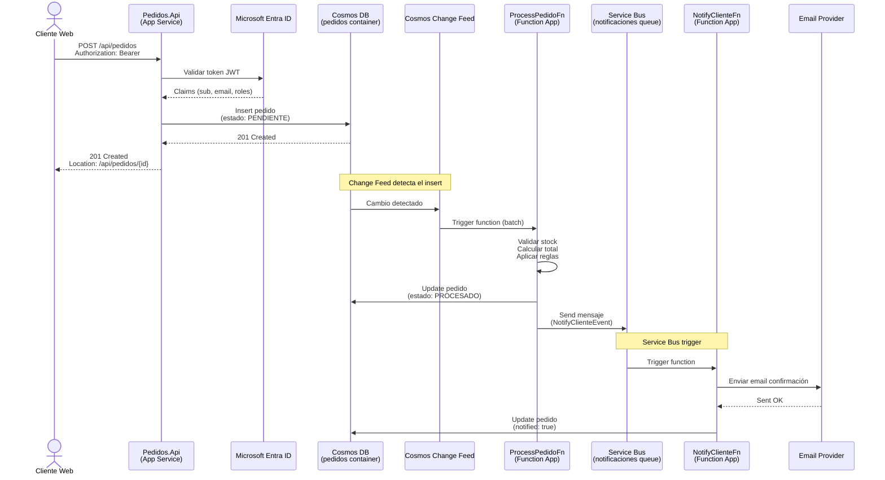

> **Versión:** v3 | **Módulo:** 10 | **Sub:** 10.1 | **Slides:** 49 | **Fecha:** 2026-04-27 | **Estado:** ✅

# Submódulo 10.1 — Proyecto Integrador: diseño y arquitectura

## Slide 1 — Portada
**Módulo 10 · Submódulo 10.1**
Proyecto Integrador
Diseñar, construir y desplegar una solución completa con todo lo aprendido

---

## Slide 2 — Objetivo del proyecto
Construir un sistema de gestión de pedidos end-to-end que integre los 9 módulos anteriores: App Service API, Azure Functions, Cosmos DB, Service Bus, Entra ID, Key Vault, Managed Identity, Pipeline CI/CD, Application Insights.

El resultado: una aplicación de producción completa desplegada automáticamente con monitorización.

---

## Slide 3 — Arquitectura del sistema

```
┌──────────────┐     OIDC      ┌──────────────┐
│   Blazor     │ ←───────────→ │  Entra ID    │
│   Frontend   │               └──────────────┘
└──────┬───────┘
       │ Bearer Token
       ↓
┌──────────────┐     MI        ┌──────────────┐
│   API        │ ←───────────→ │  Cosmos DB   │
│  (App Svc)   │               │  pedidos     │
│   Auth: JWT  │               │  productos   │
└──────┬───────┘               └──────┬───────┘
       │                              │ Change Feed
       │ MI                           ↓
┌──────┴───────┐               ┌──────────────┐
│  Key Vault   │               │  SB Topic    │
│  (secretos)  │               │  pedido-evt  │
└──────────────┘               └──┬───────┬───┘
                                  │       │
                            ┌─────┘       └─────┐
                            ↓                    ↓
                    ┌──────────────┐   ┌──────────────┐
                    │  Function:   │   │  Function:   │
                    │  Notificar   │   │  Analytics   │
                    │  (SB trigger)│   │  (SB trigger)│
                    └──────────────┘   └──────────────┘

┌──────────────┐
│  App Insights│  ← Telemetría de todos los servicios
│  + Dashboard │
└──────────────┘

┌──────────────┐
│  Pipeline    │  ← Build → Test → Staging → Swap → Producción
│  CI/CD (ADO) │
└──────────────┘

┌──────────────┐
│  Bicep       │  ← Toda la infraestructura como código
│  (IaC)       │
└──────────────┘
```

---

## Slide 4 — Componentes y responsabilidades

| Componente | Servicio Azure | Función |
|---|---|---|
| API REST | App Service | CRUD productos, crear pedidos, auth |
| Procesamiento async | Azure Functions | Change Feed → SB → notificaciones |
| Base de datos | Cosmos DB (serverless) | Pedidos, productos, analytics |
| Mensajería | Service Bus (topic) | Eventos de pedidos |
| Autenticación | Entra ID + MSAL | OAuth2 JWT tokens |
| Secretos | Key Vault | API keys externas |
| Conexiones | Managed Identity | Zero passwords |
| Monitorización | Application Insights | Metrics, logs, traces |
| Infraestructura | Bicep | IaC reproducible |
| CI/CD | Azure DevOps Pipeline | Despliegue automatizado |

---

## Slide 5 — Plan de trabajo: 4 bloques

| Bloque | Duración | Qué construís |
|:------:|:--------:|--------------|
| A | 45 min | Infraestructura Bicep + despliegue |
| B | 60 min | API + Cosmos DB + Auth |
| C | 45 min | Functions + Service Bus + Change Feed |
| D | 30 min | Pipeline CI/CD + App Insights + Dashboard |

**Total: ~3 horas de trabajo práctico.**

---

## Slide 6 — Bloque A: Infraestructura con Bicep

```bash
# Estructura de archivos
infrastructure/
├── main.bicep
├── params.dev.json
└── modules/
    ├── app-service.bicep    # API + slot staging
    ├── cosmos-db.bicep      # Serverless, 3 containers
    ├── functions.bicep      # Consumption plan
    ├── service-bus.bicep    # Topic + 2 suscripciones
    ├── key-vault.bicep      # Secrets
    ├── app-insights.bicep   # Telemetría
    └── rbac.bicep           # MI permissions

# Desplegar
az group create --name rg-proyecto-<nombre> --location westeurope
az deployment group create -g rg-proyecto-<nombre> -f main.bicep -p @params.dev.json
```

---

## Slide 7 — Bloque B: API con autenticación

```csharp
// Program.cs
var builder = WebApplication.CreateBuilder(args);

// Cosmos DB con MI
builder.Services.AddSingleton(new CosmosClient(
    builder.Configuration["CosmosEndpoint"], new DefaultAzureCredential()));

// Auth con Entra ID
builder.Services.AddMicrosoftIdentityWebApiAuthentication(builder.Configuration, "AzureAd");

// App Insights
builder.Services.AddApplicationInsightsTelemetry();

var app = builder.Build();
app.UseAuthentication();
app.UseAuthorization();

// Endpoints
app.MapGet("/api/productos", [Authorize] async (CosmosClient cosmos) => {
    var container = cosmos.GetContainer("tienda", "productos");
    var query = container.GetItemQueryIterator<Producto>("SELECT * FROM c WHERE c.activo = true");
    var results = new List<Producto>();
    while (query.HasMoreResults) results.AddRange(await query.ReadNextAsync());
    return Results.Ok(results);
});

app.MapPost("/api/pedidos", [Authorize] async (CrearPedidoDto dto, CosmosClient cosmos, HttpContext ctx) => {
    var userId = ctx.User.FindFirst("sub")?.Value;
    var pedido = new Pedido { Id = Guid.NewGuid().ToString(), ClienteId = userId!, Items = dto.Items, Total = dto.Items.Sum(i => i.Precio * i.Cantidad), Estado = "creado", CreadoEn = DateTime.UtcNow };
    var container = cosmos.GetContainer("tienda", "pedidos");
    await container.CreateItemAsync(pedido, new PartitionKey(pedido.ClienteId));
    return Results.Created($"/api/pedidos/{pedido.Id}", pedido);
});

app.MapGet("/health", () => Results.Ok(new { status = "healthy", time = DateTime.UtcNow }));
app.Run();
```

---

## Slide 8 — Bloque C: Functions con Change Feed y Service Bus

```csharp
// Function 1: Detectar nuevos pedidos → publicar evento
[Function("DetectarPedido")]
[ServiceBusOutput("pedido-eventos", Connection = "ServiceBusConnection")]
public string Detectar(
    [CosmosDBTrigger("tienda", "pedidos", Connection = "CosmosDb",
        LeaseContainerName = "leases")] IReadOnlyList<Pedido> nuevos)
{
    var pedido = nuevos.First();
    _logger.LogInformation("Nuevo pedido detectado: {Id}, total: {Total}", pedido.Id, pedido.Total);
    return JsonSerializer.Serialize(new { pedido.Id, pedido.ClienteId, pedido.Total, tipo = "PedidoCreado" });
}

// Function 2: Procesar notificación
[Function("NotificarPedido")]
public async Task Notificar(
    [ServiceBusTrigger("pedido-eventos", "sub-notificaciones", Connection = "ServiceBusConnection")]
    ServiceBusReceivedMessage msg)
{
    var evento = msg.Body.ToObjectFromJson<PedidoEvento>();
    _logger.LogInformation("Notificación para pedido {Id}: enviada", evento.Id);
    _telemetry.TrackEvent("NotificacionEnviada", new Dictionary<string, string> { ["pedidoId"] = evento.Id });
}

// Function 3: Actualizar analytics
[Function("ActualizarAnalytics")]
[CosmosDBOutput("tienda", "analytics", Connection = "CosmosDb")]
public AnalyticsEntry Actualizar(
    [ServiceBusTrigger("pedido-eventos", "sub-analytics", Connection = "ServiceBusConnection")]
    ServiceBusReceivedMessage msg)
{
    var evento = msg.Body.ToObjectFromJson<PedidoEvento>();
    return new AnalyticsEntry { Id = $"daily-{DateTime.UtcNow:yyyy-MM-dd}", PedidosHoy = 1, IngresoHoy = evento.Total };
}
```

---

## Slide 9 — Bloque D: Pipeline CI/CD

```yaml
trigger: { branches: { include: [main] } }
stages:
- stage: Build
  jobs:
  - job: Build
    pool: { vmImage: 'ubuntu-latest' }
    steps:
    - task: UseDotNet@2
      inputs: { version: '8.x' }
    - script: dotnet build -c Release
    - script: dotnet test -c Release --no-build
    - script: dotnet publish src/Api -c Release -o $(Build.ArtifactStagingDirectory)/api
    - script: dotnet publish src/Functions -c Release -o $(Build.ArtifactStagingDirectory)/func
    - publish: $(Build.ArtifactStagingDirectory)
      artifact: app

- stage: Deploy
  dependsOn: Build
  jobs:
  - deployment: Deploy
    environment: proyecto-staging
    strategy:
      runOnce:
        deploy:
          steps:
          - task: AzureWebApp@1
            inputs: { appName: app-proyecto-dev, slotName: staging, package: '$(Pipeline.Workspace)/app/api' }
          - task: AzureFunctionApp@2
            inputs: { appName: func-proyecto-dev, package: '$(Pipeline.Workspace)/app/func' }
          - script: |
              sleep 15
              curl -sf https://app-proyecto-dev-staging.azurewebsites.net/health || exit 1
            displayName: 'Smoke test'
```

---

## Slide 10 — Monitorización y alertas

```bash
# Dashboard rápido con métricas clave
# Portal → Application Insights → Dashboard

# Alertas mínimas
az monitor metrics alert create --name "proyecto-errores" -g rg-proyecto-dev \
  --scopes "/subscriptions/.../components/ai-proyecto-dev" \
  --condition "count requests/failed > 5" --window-size 5m

az monitor metrics alert create --name "proyecto-latencia" -g rg-proyecto-dev \
  --scopes "/subscriptions/.../components/ai-proyecto-dev" \
  --condition "avg requests/duration > 2000" --window-size 10m
```

---

## Slide 11 — Checklist de entrega

| Componente | Criterio | Peso | ✓ |
|---|---|:---:|---|
| Bicep | Infraestructura desplegada con IaC | 15% | |
| API | CRUD productos + crear pedidos | 15% | |
| Auth | Entra ID con JWT validation | 10% | |
| Cosmos DB | Datos persistidos correctamente | 10% | |
| Functions | Change Feed + SB trigger funcionan | 15% | |
| MI | Zero connection strings con password | 10% | |
| Pipeline | Build + test + deploy automatizado | 15% | |
| App Insights | Telemetría + al menos 2 alertas | 10% | |
| **TOTAL** | | **100%** | |

---

## Slide 12 — Retos adicionales (bonus)

**Reto 1:** Añadir un endpoint de búsqueda con filtros (fecha, importe, estado).
**Reto 2:** Implementar auto-update MSIX para una app de escritorio que consuma la API.
**Reto 3:** Añadir un timer trigger que genere un informe diario en Blob Storage.
**Reto 4:** Usar Claude Code para generar alguno de los componentes anteriores.
**Reto 5:** Añadir canary deployment con feature flags.

---

## Slide 13 — Bloque A detallado: Bicep módulo a módulo

```bicep
// modules/app-service.bicep — con todas las configuraciones de producción
param appName string
param location string = resourceGroup().location
param aiConnectionString string

resource plan 'Microsoft.Web/serverfarms@2023-12-01' = {
  name: '${appName}-plan'
  location: location
  sku: { name: 'S1', tier: 'Standard', capacity: 1 }
}

resource app 'Microsoft.Web/sites@2023-12-01' = {
  name: appName
  location: location
  properties: {
    serverFarmId: plan.id
    httpsOnly: true
    siteConfig: {
      netFrameworkVersion: 'v8.0'
      alwaysOn: true
      minTlsVersion: '1.2'
      healthCheckPath: '/health'
      appSettings: [
        { name: 'ASPNETCORE_ENVIRONMENT', value: 'Production' }
        { name: 'APPLICATIONINSIGHTS_CONNECTION_STRING', value: aiConnectionString }
      ]
    }
  }
  identity: { type: 'SystemAssigned' }
}

resource stagingSlot 'Microsoft.Web/sites/slots@2023-12-01' = {
  parent: app
  name: 'staging'
  location: location
  properties: { serverFarmId: plan.id }
  identity: { type: 'SystemAssigned' }
}

output appUrl string = 'https://${app.properties.defaultHostName}'
output principalId string = app.identity.principalId
output stagingPrincipalId string = stagingSlot.identity.principalId
```

---

## Slide 14 — Bloque A: módulo Service Bus

```bicep
// modules/service-bus.bicep
param namespaceName string
param location string = resourceGroup().location

resource namespace 'Microsoft.ServiceBus/namespaces@2022-10-01-preview' = {
  name: namespaceName
  location: location
  sku: { name: 'Standard', tier: 'Standard' }
}

resource topic 'Microsoft.ServiceBus/namespaces/topics@2022-10-01-preview' = {
  parent: namespace
  name: 'pedido-eventos'
  properties: {
    enableBatchedOperations: true
    supportOrdering: false
    maxSizeInMegabytes: 1024
  }
}

resource subNotificaciones 'Microsoft.ServiceBus/namespaces/topics/subscriptions@2022-10-01-preview' = {
  parent: topic
  name: 'sub-notificaciones'
  properties: { maxDeliveryCount: 10, deadLetteringOnMessageExpiration: true }
}

resource subAnalytics 'Microsoft.ServiceBus/namespaces/topics/subscriptions@2022-10-01-preview' = {
  parent: topic
  name: 'sub-analytics'
  properties: { maxDeliveryCount: 10 }
}

output namespaceName string = namespace.name
output endpoint string = '${namespace.name}.servicebus.windows.net'
```

---

## Slide 15 — Bloque B detallado: modelos de datos

```csharp
// Models/Pedido.cs
public record Pedido
{
    public string Id { get; init; } = Guid.NewGuid().ToString();
    public string ClienteId { get; init; } = "";
    public List<ItemPedido> Items { get; init; } = new();
    public decimal Total => Items.Sum(i => i.Precio * i.Cantidad);
    public string Estado { get; init; } = "creado";
    public DateTime CreadoEn { get; init; } = DateTime.UtcNow;
}

public record ItemPedido(string ProductoId, string Nombre, int Cantidad, decimal Precio);

public record Producto
{
    public string Id { get; init; } = Guid.NewGuid().ToString();
    public string Nombre { get; init; } = "";
    public string Categoria { get; init; } = "";
    public decimal Precio { get; init; }
    public bool Activo { get; init; } = true;
}

// DTOs
public record CrearPedidoDto(string ClienteId, List<ItemPedido> Items);
public record CrearProductoDto(string Nombre, string Categoria, decimal Precio);
```

---

## Slide 16 — Bloque B: servicio con Cosmos DB y MI

```csharp
public class PedidoService : IPedidoService
{
    private readonly Container _container;
    private readonly ILogger<PedidoService> _logger;

    public PedidoService(CosmosClient cosmos, ILogger<PedidoService> logger)
    {
        _container = cosmos.GetContainer("tienda", "pedidos");
        _logger = logger;
    }

    public async Task<Pedido?> GetByIdAsync(string id, CancellationToken ct = default)
    {
        try
        {
            var response = await _container.ReadItemAsync<Pedido>(id, new PartitionKey(id), cancellationToken: ct);
            return response.Resource;
        }
        catch (CosmosException ex) when (ex.StatusCode == HttpStatusCode.NotFound)
        {
            return null;
        }
    }

    public async Task<Pedido> CreateAsync(CrearPedidoDto dto, string userId, CancellationToken ct = default)
    {
        var pedido = new Pedido
        {
            ClienteId = userId,
            Items = dto.Items,
            Estado = "creado",
            CreadoEn = DateTime.UtcNow
        };

        _logger.LogInformation("Creando pedido para cliente {ClienteId}, total: {Total}", userId, pedido.Total);
        await _container.CreateItemAsync(pedido, new PartitionKey(pedido.ClienteId), cancellationToken: ct);
        return pedido;
    }

    public async Task<List<Pedido>> ListByClienteAsync(string clienteId, int page = 1, int size = 20, CancellationToken ct = default)
    {
        var query = new QueryDefinition("SELECT * FROM c WHERE c.clienteId = @cid ORDER BY c.creadoEn DESC OFFSET @offset LIMIT @limit")
            .WithParameter("@cid", clienteId)
            .WithParameter("@offset", (page - 1) * size)
            .WithParameter("@limit", size);

        var results = new List<Pedido>();
        var iterator = _container.GetItemQueryIterator<Pedido>(query,
            requestOptions: new QueryRequestOptions { PartitionKey = new PartitionKey(clienteId) });

        while (iterator.HasMoreResults)
            results.AddRange(await iterator.ReadNextAsync(ct));

        return results;
    }
}
```

---

## Slide 17 — Bloque B: endpoints con autenticación

```csharp
var builder = WebApplication.CreateBuilder(args);

// Servicios
builder.Services.AddSingleton(new CosmosClient(
    builder.Configuration["CosmosEndpoint"], new DefaultAzureCredential()));
builder.Services.AddScoped<IPedidoService, PedidoService>();
builder.Services.AddScoped<IProductoService, ProductoService>();
builder.Services.AddMicrosoftIdentityWebApiAuthentication(builder.Configuration, "AzureAd");
builder.Services.AddApplicationInsightsTelemetry();
builder.Services.AddHealthChecks()
    .AddCosmosDb(builder.Configuration["CosmosEndpoint"]!);

var app = builder.Build();
app.UseAuthentication();
app.UseAuthorization();

// Productos
app.MapGet("/api/productos", [Authorize] async (IProductoService svc, CancellationToken ct) =>
    Results.Ok(await svc.ListarActivosAsync(ct)));
app.MapGet("/api/productos/{id}", [Authorize] async (string id, IProductoService svc, CancellationToken ct) =>
    await svc.GetByIdAsync(id, ct) is { } prod ? Results.Ok(prod) : Results.NotFound());
app.MapPost("/api/productos", [Authorize(Roles = "Admin")] async (CrearProductoDto dto, IProductoService svc, CancellationToken ct) =>
    Results.Created($"/api/productos/{(await svc.CreateAsync(dto, ct)).Id}", await svc.CreateAsync(dto, ct)));

// Pedidos
app.MapPost("/api/pedidos", [Authorize] async (CrearPedidoDto dto, IPedidoService svc, HttpContext ctx, CancellationToken ct) =>
{
    var userId = ctx.User.FindFirst("sub")?.Value ?? ctx.User.FindFirst("oid")?.Value ?? "unknown";
    var pedido = await svc.CreateAsync(dto, userId, ct);
    return Results.Created($"/api/pedidos/{pedido.Id}", pedido);
});
app.MapGet("/api/pedidos", [Authorize] async (IPedidoService svc, HttpContext ctx, int page, int size, CancellationToken ct) =>
{
    var userId = ctx.User.FindFirst("sub")?.Value ?? "unknown";
    return Results.Ok(await svc.ListByClienteAsync(userId, page, size, ct));
});

// Health
app.MapHealthChecks("/health");

app.Run();
```

---

## Slide 18 — Bloque C detallado: Functions completas

```csharp
// Program.cs (Functions)
var host = new HostBuilder()
    .ConfigureFunctionsWebApplication()
    .ConfigureServices(services =>
    {
        services.AddSingleton(new CosmosClient(
            Environment.GetEnvironmentVariable("CosmosDb__accountEndpoint"),
            new DefaultAzureCredential()));
        services.AddApplicationInsightsTelemetryWorkerService();
    })
    .Build();

host.Run();
```

```csharp
// Functions/DetectarPedido.cs
public class DetectarPedido
{
    private readonly ILogger<DetectarPedido> _logger;

    public DetectarPedido(ILogger<DetectarPedido> logger) => _logger = logger;

    [Function(nameof(DetectarPedido))]
    [ServiceBusOutput("pedido-eventos", Connection = "ServiceBusConnection")]
    public string Run(
        [CosmosDBTrigger("tienda", "pedidos", Connection = "CosmosDb",
            LeaseContainerName = "leases", CreateLeaseContainerIfNotExists = true)]
        IReadOnlyList<Pedido> cambios)
    {
        foreach (var pedido in cambios)
            _logger.LogInformation("Nuevo pedido detectado: {Id}, total: {Total}€", pedido.Id, pedido.Total);

        var ultimo = cambios.Last();
        return JsonSerializer.Serialize(new PedidoEvento(ultimo.Id, ultimo.ClienteId, ultimo.Total, "PedidoCreado", DateTime.UtcNow));
    }
}

public record PedidoEvento(string PedidoId, string ClienteId, decimal Total, string Tipo, DateTime Timestamp);
```

---

## Slide 19 — Bloque C: Function de notificación

```csharp
// Functions/NotificarPedido.cs
public class NotificarPedido
{
    private readonly ILogger<NotificarPedido> _logger;
    private readonly TelemetryClient _telemetry;

    public NotificarPedido(ILogger<NotificarPedido> logger, TelemetryClient telemetry)
    {
        _logger = logger;
        _telemetry = telemetry;
    }

    [Function(nameof(NotificarPedido))]
    public async Task Run(
        [ServiceBusTrigger("pedido-eventos", "sub-notificaciones", Connection = "ServiceBusConnection")]
        ServiceBusReceivedMessage message,
        ServiceBusMessageActions messageActions)
    {
        var evento = message.Body.ToObjectFromJson<PedidoEvento>();

        _logger.LogInformation("Procesando notificación para pedido {PedidoId}, cliente {ClienteId}, total: {Total}€",
            evento.PedidoId, evento.ClienteId, evento.Total);

        // Simular envío de email/notificación
        await Task.Delay(100);

        _telemetry.TrackEvent("NotificacionEnviada", new Dictionary<string, string>
        {
            ["pedidoId"] = evento.PedidoId,
            ["clienteId"] = evento.ClienteId
        }, new Dictionary<string, double> { ["total"] = (double)evento.Total });

        await messageActions.CompleteMessageAsync(message);
    }
}
```

---

## Slide 20 — Bloque D: Pipeline CI/CD completo

```yaml
# azure-pipelines.yml
trigger:
  branches: { include: [main] }

pool: { vmImage: 'ubuntu-latest' }

variables:
  buildConfiguration: 'Release'
  appName: 'app-proyecto-$(Build.RequestedFor)'
  funcName: 'func-proyecto-$(Build.RequestedFor)'

stages:
- stage: Build
  jobs:
  - job: BuildAll
    steps:
    - task: UseDotNet@2
      inputs: { version: '8.x' }
    - script: dotnet build -c $(buildConfiguration)
      displayName: 'Build solution'
    - script: dotnet test -c $(buildConfiguration) --no-build --collect:"XPlat Code Coverage"
      displayName: 'Run tests'
    - task: PublishTestResults@2
      inputs: { testResultsFormat: 'VSTest', testResultsFiles: '**/*.trx' }
    - script: dotnet publish src/Api -c $(buildConfiguration) -o $(Build.ArtifactStagingDirectory)/api
    - script: dotnet publish src/Functions -c $(buildConfiguration) -o $(Build.ArtifactStagingDirectory)/func
    - publish: $(Build.ArtifactStagingDirectory)
      artifact: app

- stage: Deploy
  dependsOn: Build
  jobs:
  - deployment: DeployAll
    environment: 'proyecto-staging'
    strategy:
      runOnce:
        deploy:
          steps:
          - task: AzureWebApp@1
            displayName: 'Deploy API to staging'
            inputs:
              azureSubscription: 'Azure-Proyecto'
              appName: $(appName)
              slotName: staging
              package: '$(Pipeline.Workspace)/app/api'
          - task: AzureFunctionApp@2
            displayName: 'Deploy Functions'
            inputs:
              azureSubscription: 'Azure-Proyecto'
              appName: $(funcName)
              package: '$(Pipeline.Workspace)/app/func'
          - script: |
              sleep 20
              curl -sf https://$(appName)-staging.azurewebsites.net/health || exit 1
            displayName: 'Smoke test'

- stage: Production
  dependsOn: Deploy
  jobs:
  - deployment: Swap
    environment: 'proyecto-production'
    strategy:
      runOnce:
        deploy:
          steps:
          - task: AzureAppServiceManage@0
            inputs: { Action: 'Swap Slots', WebAppName: $(appName), SourceSlot: staging }
          - script: |
              sleep 10
              curl -sf https://$(appName).azurewebsites.net/health || exit 1
            displayName: 'Post-swap health check'
```

---

## Slide 21 — Bloque D: Monitorización y alertas

```bash
# Configurar alertas post-deploy
az monitor metrics alert create --name "proyecto-5xx" -g rg-proyecto \
  --scopes "/subscriptions/.../components/ai-proyecto" \
  --condition "count requests/failed > 5" --window-size 5m --severity 1

az monitor metrics alert create --name "proyecto-latencia" -g rg-proyecto \
  --scopes "/subscriptions/.../components/ai-proyecto" \
  --condition "avg requests/duration > 2000" --window-size 10m --severity 2

# Verificar que App Insights recibe telemetría
az monitor app-insights metrics show --app ai-proyecto -g rg-proyecto \
  --metrics requests/count --interval PT5M
```

---

## Slide 22 — Demo flow: el flujo completo en acción

```bash
# 1. Desplegar infraestructura
az deployment group create -g rg-proyecto -f main.bicep -p @params.dev.json

# 2. Desplegar código (push → pipeline automático)
git push origin main
# Pipeline: build → test → deploy staging → smoke test → swap prod

# 3. Crear datos de prueba
TOKEN=$(az account get-access-token --resource $APP_ID -q accessToken -o tsv)

# Crear producto
curl -X POST https://app-proyecto.azurewebsites.net/api/productos \
  -H "Authorization: Bearer $TOKEN" -H "Content-Type: application/json" \
  -d '{"nombre":"Laptop Pro","categoria":"electrónica","precio":1299.99}'

# Crear pedido
curl -X POST https://app-proyecto.azurewebsites.net/api/pedidos \
  -H "Authorization: Bearer $TOKEN" -H "Content-Type: application/json" \
  -d '{"clienteId":"demo","items":[{"productoId":"1","nombre":"Laptop Pro","cantidad":1,"precio":1299.99}]}'

# 4. Verificar flujo async
# App Insights → Transaction Search → buscar "PedidoCreado"
# Debería ver: API → Cosmos → Change Feed → Service Bus → Function

# 5. Ver dashboard de monitorización
# Portal → App Insights → Dashboard
```

---

## Slide 23 — Rubrica de evaluación detallada

| Componente | Criterio | Máximo |
|---|---|:---:|
| **Bicep** | Infra completa, modular, con parámetros | 15 |
| **API REST** | CRUD + validación + error handling | 15 |
| **Auth** | Entra ID JWT en todos los endpoints | 10 |
| **Cosmos DB** | Partition key correcta + queries eficientes | 10 |
| **Functions** | Change Feed → SB → processing | 15 |
| **MI** | Zero passwords en toda la solución | 10 |
| **Pipeline** | CI: build+test · CD: staging+swap | 15 |
| **Monitoring** | AI telemetría + 2 alertas + health check | 10 |
| **TOTAL** | | **100** |

**Bonus (+10 cada):** Claude Code used, MSIX desktop client, Feature flags, Canary deploy

---

## Slide 24 — Pre-trabajo: requirements deep-dive

Antes de empezar a escribir código, alinea estos requirements con tu instructor:

```
REQUIREMENTS NO FUNCIONALES (NFRs)
══════════════════════════════════

PERFORMANCE:
├── API: P95 < 800ms, P99 < 2s
├── Functions: cold start < 3s
├── Throughput: 100 req/s sostenido
└── DB: queries < 200ms P95

DISPONIBILIDAD:
├── SLA: 99.5% (≈ 3.6h downtime/mes)
├── Recovery Time Objective (RTO): 1 hora
├── Recovery Point Objective (RPO): 15 minutos
└── No single point of failure (excepto DB no-DR)

SEGURIDAD:
├── HTTPS only, TLS 1.2+
├── Auth via Microsoft Entra ID
├── Secrets en Key Vault (sin excepciones)
├── Managed Identity entre servicios
├── No public endpoints en DB / Storage
└── Audit logs 90 días retention

ESCALABILIDAD:
├── Horizontal: 2-10 instancias App Service
├── Functions: scale automático Flex
├── DB: capacity throughput configurable
└── Service Bus: tier Standard suficiente

OBSERVABILIDAD:
├── Distributed tracing W3C
├── Custom metrics (business KPIs)
├── Alertas automáticas (5 críticas)
└── Dashboard ejecutivo
```

**Validation con tu instructor (15 min):**
```
☐ ¿Los NFRs son razonables para tu contexto?
☐ ¿Hay restricciones de coste? (max €/mes)
☐ ¿Region específica? (default: West Europe)
☐ ¿Hay dependencias externas a integrar?
☐ ¿Compliance específico? (GDPR es obligatorio)
☐ ¿Demo final será presentación o screencast?
```

**Documento de approval:**
Crea `docs/REQUIREMENTS.md` con NFRs aprobados. Esto es tu **definition of done** del proyecto.

---

## Slide 25 — Setup inicial: toolchain en 30 minutos

Checklist de herramientas necesarias antes del primer commit:

```bash
# 1. Cuentas requeridas
☐ Microsoft Entra tenant (puede ser personal/empresa)
☐ Suscripción Azure activa
☐ GitHub o Azure DevOps
☐ Cuenta Anthropic (para Claude Code, opcional pero recomendado)

# 2. Verificar acceso Azure
az login
az account show
# Confirma subscription correcta

az account set --subscription "<tu-subscription-id>"

# 3. Resource provider registration (idempotente)
for provider in Microsoft.Web Microsoft.DocumentDB \
                Microsoft.ServiceBus Microsoft.KeyVault \
                Microsoft.Insights Microsoft.OperationalInsights \
                Microsoft.ManagedIdentity; do
  az provider register --namespace $provider
done

# 4. Local toolchain
☐ .NET 8 SDK
   dotnet --list-sdks  # debe mostrar 8.0.x
   
☐ Azure CLI 2.60+
   az --version
   
☐ Bicep CLI 0.30+
   az bicep version
   
☐ Git 2.40+
   git --version
   
☐ Visual Studio 2022 / VS Code
   - Extensions: C# Dev Kit, Bicep, Azure Account
   
☐ Azurite (storage emulator local)
   npm install -g azurite
   azurite --silent &
   
☐ Postman / curl / Bruno (HTTP testing)
   
☐ Claude Code (opcional)
   npm install -g @anthropic-ai/claude-code

# 5. Verificación end-to-end
mkdir test-setup && cd test-setup
dotnet new webapi -n Test
cd Test && dotnet run
# Browser: https://localhost:7xxx/swagger
# Si funciona: ✅ Setup OK
```

**Setup repository:**
```bash
# Crea repo nuevo
gh repo create curso-azure-pedidos \
  --private \
  --description "Proyecto integrador AZ-204"

git clone https://github.com/<tu-usuario>/curso-azure-pedidos
cd curso-azure-pedidos

# Estructura inicial
mkdir -p src/{Pedidos.Api,Pedidos.Application,Pedidos.Domain,Pedidos.Infrastructure,Pedidos.Functions}
mkdir -p tests/{Pedidos.Api.Tests,Pedidos.Application.Tests,Pedidos.E2E.Tests}
mkdir -p infra/modules
mkdir -p docs
mkdir -p .github/workflows
mkdir -p .claude  # si vas a usar Claude Code

# .gitignore + README
dotnet new gitignore
cat > README.md <<'EOF'
# Pedidos — Proyecto integrador AZ-204

Sistema de gestión de pedidos con API + procesamiento async.

## Stack
- .NET 8 Web API + Functions
- Cosmos DB (Core SQL API)
- Service Bus
- Application Insights
- Bicep + GitHub Actions

## Setup
Ver [docs/SETUP.md](docs/SETUP.md)
EOF

git add .
git commit -m "Initial scaffolding"
git push origin main
```

**Tiempo total esperado:** 30-45 min si nunca hiciste setup; 10 min si ya tienes tooling.

---

## Slide 26 — Diagrama detallado: data flow

Hagamos el data flow tan explícito que cualquier dev nuevo lo entienda en 2 minutos:



**Casos edge:**
```
☐ Token expirado: API devuelve 401, cliente refresca
☐ Stock insuficiente: Function actualiza estado RECHAZADO
☐ Email falla: Service Bus dead-letter después de 3 intentos
☐ Cosmos throttling: retry con exponential backoff
☐ Function timeout: re-procesar en próximo batch
☐ Cliente cancela durante procesamiento: estado CANCELADO
```

**Estados del pedido:**
```
PENDIENTE → PROCESADO → NOTIFICADO → COMPLETADO
              ↓
          RECHAZADO (stock insuficiente)
              ↓
          CANCELADO (cliente o sistema)
```

**Idempotencia:**
- Cada pedido tiene `requestId` único (header X-Request-Id)
- Insert duplicado con mismo requestId → devuelve el existente
- Function processa con `processingId` para evitar doble procesamiento
- Email envío con `messageId` para evitar duplicate sends

---

## Slide 27 — User stories: las 4 que vamos a implementar

Stories del MVP, priorizadas:

```
┌──────────────────────────────────────────────────────────┐
│ US-001: Crear pedido (P0 — Sprint 1)                     │
├──────────────────────────────────────────────────────────┤
│ Como cliente autenticado,                                 │
│ quiero crear un pedido con varios items,                  │
│ para que el sistema lo procese y me notifique.            │
│                                                            │
│ Acceptance criteria:                                       │
│ ☐ POST /api/pedidos con body válido devuelve 201         │
│ ☐ Pedido se guarda con estado PENDIENTE                   │
│ ☐ Cada item tiene productId, cantidad, precio             │
│ ☐ Total calculado = sum(cantidad × precio)                │
│ ☐ requestId duplicado devuelve pedido existente           │
│ ☐ Validación: items >= 1, cantidades > 0                  │
│ ☐ 401 si token inválido o expirado                        │
│ ☐ 400 con ProblemDetails RFC 7807 si validation falla     │
└──────────────────────────────────────────────────────────┘

┌──────────────────────────────────────────────────────────┐
│ US-002: Procesar pedido async (P0 — Sprint 1)             │
├──────────────────────────────────────────────────────────┤
│ Como sistema,                                              │
│ quiero procesar pedidos creados de forma async,           │
│ para no bloquear al cliente y ser resiliente.             │
│                                                            │
│ Acceptance criteria:                                       │
│ ☐ Function dispara desde Cosmos Change Feed               │
│ ☐ Procesa en batches de 100 documents                     │
│ ☐ Validación stock (mock: 80% aprueba, 20% rechaza)       │
│ ☐ Update pedido a PROCESADO o RECHAZADO                   │
│ ☐ Si PROCESADO: envía mensaje a Service Bus               │
│ ☐ Idempotente: re-trigger no duplica work                 │
│ ☐ Errors: retry 3x con backoff, luego dead-letter         │
└──────────────────────────────────────────────────────────┘

┌──────────────────────────────────────────────────────────┐
│ US-003: Notificar cliente (P0 — Sprint 1)                 │
├──────────────────────────────────────────────────────────┤
│ Como cliente,                                              │
│ quiero recibir email cuando mi pedido se procesa,         │
│ para saber que ha sido confirmado.                         │
│                                                            │
│ Acceptance criteria:                                       │
│ ☐ Function dispara desde Service Bus queue                │
│ ☐ Lee email del pedido (claim Microsoft Entra)            │
│ ☐ Envía email con detalles (mock provider OK)             │
│ ☐ Update pedido: notified=true, notifiedAt=now            │
│ ☐ Si email falla: retry, dead-letter post 3 intentos      │
└──────────────────────────────────────────────────────────┘

┌──────────────────────────────────────────────────────────┐
│ US-004: Consultar pedidos (P1 — Sprint 1)                 │
├──────────────────────────────────────────────────────────┤
│ Como cliente,                                              │
│ quiero ver el estado de mis pedidos,                      │
│ para saber qué está pendiente o completado.              │
│                                                            │
│ Acceptance criteria:                                       │
│ ☐ GET /api/pedidos devuelve solo MIS pedidos              │
│    (filtrado por sub claim)                                │
│ ☐ GET /api/pedidos/{id} devuelve uno específico           │
│ ☐ 404 si no existe O no es del cliente actual             │
│ ☐ Pagination: ?skip=0&take=20 (max 100)                   │
│ ☐ Sort: ?sortBy=createdAt&sortDir=desc                    │
└──────────────────────────────────────────────────────────┘
```

**Stories opcionales (P2 — solo si te sobra tiempo):**
```
US-005: Cancelar pedido pendiente
US-006: Admin: ver todos los pedidos
US-007: Webhook a sistema externo en cada cambio
US-008: Export CSV con histórico
```

---

## Slide 28 — Modelo de datos: Cosmos DB schema

Schema diseñado pensando en queries y partitioning:

```json
// Container: pedidos
// Partition key: /clienteId
// Throughput: 400 RU/s autoscale

{
  "id": "ped-2026042701234",          // Unique pedidoId
  "clienteId": "user-abc-123",         // ⭐ Partition key
  "requestId": "req-xyz-789",          // Idempotency key
  "tipo": "Pedido",                    // Document type
  
  "items": [
    {
      "productoId": "prod-001",
      "nombre": "Producto Demo",
      "cantidad": 2,
      "precioUnitario": 19.99,
      "subtotal": 39.98
    },
    // ... más items
  ],
  
  "totales": {
    "subtotal": 99.95,
    "impuestos": 21.00,
    "envio": 5.00,
    "total": 125.95,
    "moneda": "EUR"
  },
  
  "direccionEnvio": {
    "calle": "Calle Mayor 1",
    "ciudad": "Madrid",
    "codigoPostal": "28013",
    "pais": "ES"
  },
  
  "estado": "PROCESADO",
  "estadoHistory": [
    { "estado": "PENDIENTE", "at": "2026-04-27T10:00:00Z" },
    { "estado": "PROCESADO", "at": "2026-04-27T10:00:15Z" }
  ],
  
  "metadata": {
    "createdAt": "2026-04-27T10:00:00Z",
    "createdBy": "user-abc-123",
    "lastModifiedAt": "2026-04-27T10:00:15Z",
    "lastModifiedBy": "system-process-fn"
  },
  
  "processing": {
    "processingId": "proc-2026042710000015",
    "validatedAt": "2026-04-27T10:00:10Z",
    "stockOk": true
  },
  
  "notification": {
    "notified": false,
    "notifiedAt": null,
    "notificationAttempts": 0,
    "lastAttemptError": null
  },
  
  "_etag": "\"00000000-0000-0000-0000-000000000000\""
}
```

**Por qué este schema:**

```
PARTITION KEY: /clienteId
  → 99% queries son "mis pedidos" → mismo partition
  → Hot partition risk si un cliente tiene >10K pedidos
    → Mitigation: TTL 90 días + archive a Storage

DENORMALIZADO (items embedded):
  → Cosmos no es relacional
  → Items leídos siempre con el pedido
  → Trade-off: si cambia precio producto, no se refleja
    → Acepta porque pedido = snapshot at creation time

ESTADO + HISTORY:
  → estado = current state (fácil filtrar)
  → estadoHistory = audit trail
  → Útil para debugging y reporting

ETAG:
  → Optimistic concurrency control
  → Si dos updates concurrentes, segundo falla con 412

TTL (en container settings):
  → 90 días automático
  → Después → archived a Storage Account vía Function
```

**Indexing policy:**
```json
{
  "indexingMode": "consistent",
  "automatic": true,
  "includedPaths": [
    { "path": "/clienteId/?" },
    { "path": "/estado/?" },
    { "path": "/metadata/createdAt/?" },
    { "path": "/requestId/?" }
  ],
  "excludedPaths": [
    { "path": "/items/*" },     // No queries por item
    { "path": "/estadoHistory/*" },
    { "path": "/_etag/?" }
  ]
}
```

**Queries típicas:**
```sql
-- Mis pedidos paginados
SELECT * FROM c
WHERE c.clienteId = @clienteId
ORDER BY c.metadata.createdAt DESC
OFFSET @skip LIMIT @take

-- Mi pedido específico
SELECT * FROM c
WHERE c.clienteId = @clienteId AND c.id = @pedidoId

-- Pedidos en estado X (admin)
SELECT * FROM c WHERE c.estado = "RECHAZADO"
-- ⚠️ Cross-partition: lento si muchos clientes

-- Buscar por requestId (idempotencia)
SELECT * FROM c
WHERE c.clienteId = @clienteId AND c.requestId = @requestId
```

---

## Slide 29 — Plan iterativo: 4 sprints de 2-3 días cada uno

En vez de big-bang, iteración incremental:

```
SPRINT 1 (2 días): Fundamentos + Happy Path
═══════════════════════════════════════════
Día 1:
├── Bicep: RG + Cosmos + Storage + KV (mañana)
├── Bicep: App Service + Function App + Service Bus (tarde)
└── Deploy a Azure (entorno dev)

Día 2:
├── API: POST /api/pedidos endpoint (mañana)
├── Function: ProcessPedidoFn básica (tarde)
└── Deploy + smoke test manual

Output: pedido se crea, se procesa, queda en Cosmos.

SPRINT 2 (2 días): Auth + Notificación
══════════════════════════════════════
Día 3:
├── Microsoft Entra: app registration + scopes
├── API: middleware auth + token validation
└── API: GET /api/pedidos (mis pedidos)

Día 4:
├── Function: NotifyClienteFn con Service Bus trigger
├── Mock email provider (log a App Insights por ahora)
└── E2E test manual: crear → procesar → notificar

Output: flujo completo end-to-end funcional.

SPRINT 3 (2 días): Observabilidad + Quality
══════════════════════════════════════════
Día 5:
├── App Insights configuration completa
├── Custom telemetry (eventos negocio)
├── Alertas críticas (5)
└── Dashboard básico

Día 6:
├── Tests unitarios (cobertura mínima 60%)
├── Tests integración (con TestContainers)
└── README con setup instructions

Output: production-ready quality.

SPRINT 4 (2 días): CI/CD + Polish
═════════════════════════════════
Día 7:
├── GitHub Actions: pipeline completo
├── OIDC federated credentials
└── Deploy a staging + smoke tests automatizados

Día 8:
├── Demo flow review
├── Rubrica self-assessment
├── Documentation final
└── Presentation prep

Output: proyecto presentable + entregable.
```

**Anti-patterns en los sprints:**
```
❌ Sprint 1 con perfeccionismo
  → "Voy a hacer Bicep modular perfecto"
  → Resultado: día 1 entero en infra, sin código

✅ Sprint 1 minimal viable infra
  → main.bicep en un archivo, refactor en sprint 4
  → Mejor working code rough que perfect Bicep
```

```
❌ Skip tests "los hago al final"
  → Sprint 4 te queda sin tiempo
  → Tests escritos en panic mode = malos

✅ Tests con cada feature (Sprint 1, 2)
  → TDD light: 1 test crítico por user story
  → Coverage incrementa orgánicamente
```

```
❌ Setup CI/CD en Sprint 1
  → "Voy a hacer pipeline desde día 1"
  → Resultado: días enteros configurando OIDC sin código

✅ CI/CD en Sprint 4
  → Hasta Sprint 3, deploy manual con `az` CLI
  → Pipeline en último sprint, ya con código sólido
```

---

## Slide 30 — Sprint 1 walkthrough: Bicep + primer endpoint

Día 1 mañana — Bicep mínimo viable:

```bicep
// infra/main.bicep
targetScope = 'subscription'

@description('Environment: dev, staging, prod')
@allowed(['dev', 'staging', 'prod'])
param env string = 'dev'

@description('Location')
param location string = 'westeurope'

@description('Project name (max 10 chars)')
@maxLength(10)
param projectName string = 'pedidos'

// Resource Group
resource rg 'Microsoft.Resources/resourceGroups@2024-03-01' = {
  name: 'rg-${projectName}-${env}'
  location: location
  tags: {
    project: projectName
    environment: env
    managedBy: 'bicep'
  }
}

// Resources del proyecto
module resources 'modules/resources.bicep' = {
  scope: rg
  name: 'resources'
  params: {
    env: env
    projectName: projectName
    location: location
  }
}

output apiUrl string = resources.outputs.apiUrl
output functionAppName string = resources.outputs.functionAppName
output cosmosAccountName string = resources.outputs.cosmosAccountName
```

```bicep
// infra/modules/resources.bicep
param env string
param projectName string
param location string

var unique = uniqueString(resourceGroup().id)
var prefix = '${projectName}-${env}'

// Cosmos DB
resource cosmos 'Microsoft.DocumentDB/databaseAccounts@2024-08-15' = {
  name: 'cosmos-${prefix}-${unique}'
  location: location
  kind: 'GlobalDocumentDB'
  properties: {
    databaseAccountOfferType: 'Standard'
    locations: [{
      locationName: location
      failoverPriority: 0
    }]
    capabilities: [{ name: 'EnableServerless' }]
    consistencyPolicy: {
      defaultConsistencyLevel: 'Session'
    }
    publicNetworkAccess: 'Enabled'  // Sprint 4: cambiar a Private
  }
  
  resource db 'sqlDatabases@2024-08-15' = {
    name: 'pedidos-db'
    properties: {
      resource: { id: 'pedidos-db' }
    }
    
    resource pedidosContainer 'containers@2024-08-15' = {
      name: 'pedidos'
      properties: {
        resource: {
          id: 'pedidos'
          partitionKey: {
            paths: ['/clienteId']
            kind: 'Hash'
          }
          defaultTtl: 7776000  // 90 días
        }
      }
    }
  }
}

// Service Bus
resource serviceBus 'Microsoft.ServiceBus/namespaces@2024-01-01' = {
  name: 'sb-${prefix}-${unique}'
  location: location
  sku: { name: 'Standard' }
  
  resource notificacionesQueue 'queues@2024-01-01' = {
    name: 'notificaciones-pedidos'
    properties: {
      maxDeliveryCount: 3
      defaultMessageTimeToLive: 'P1D'
      deadLetteringOnMessageExpiration: true
    }
  }
}

// Storage (para Functions)
resource storage 'Microsoft.Storage/storageAccounts@2024-01-01' = {
  name: replace('st${prefix}${unique}', '-', '')
  location: location
  sku: { name: 'Standard_LRS' }
  kind: 'StorageV2'
  properties: {
    minimumTlsVersion: 'TLS1_2'
    allowBlobPublicAccess: false
  }
}

// Log Analytics + App Insights
resource workspace 'Microsoft.OperationalInsights/workspaces@2023-09-01' = {
  name: 'log-${prefix}-${unique}'
  location: location
  properties: {
    sku: { name: 'PerGB2018' }
    retentionInDays: 30
  }
}

resource appInsights 'Microsoft.Insights/components@2020-02-02' = {
  name: 'ai-${prefix}-${unique}'
  location: location
  kind: 'web'
  properties: {
    Application_Type: 'web'
    WorkspaceResourceId: workspace.id
  }
}

// App Service Plan (Linux, B1 dev / P0v3 prod)
resource asp 'Microsoft.Web/serverfarms@2024-04-01' = {
  name: 'asp-${prefix}-${unique}'
  location: location
  sku: {
    name: env == 'prod' ? 'P0v3' : 'B1'
    tier: env == 'prod' ? 'Premium0V3' : 'Basic'
  }
  kind: 'linux'
  properties: { reserved: true }
}

// App Service (API)
resource api 'Microsoft.Web/sites@2024-04-01' = {
  name: 'app-${prefix}-${unique}'
  location: location
  identity: { type: 'SystemAssigned' }
  properties: {
    serverFarmId: asp.id
    httpsOnly: true
    siteConfig: {
      linuxFxVersion: 'DOTNETCORE|8.0'
      minTlsVersion: '1.2'
      appSettings: [
        { name: 'COSMOS_ENDPOINT', value: cosmos.properties.documentEndpoint }
        { name: 'COSMOS_DATABASE', value: 'pedidos-db' }
        { name: 'APPLICATIONINSIGHTS_CONNECTION_STRING', value: appInsights.properties.ConnectionString }
        { name: 'SERVICEBUS_FQNS', value: '${serviceBus.name}.servicebus.windows.net' }
      ]
    }
  }
}

// Function App (Flex Consumption)
resource func 'Microsoft.Web/sites@2024-04-01' = {
  name: 'func-${prefix}-${unique}'
  location: location
  kind: 'functionapp,linux'
  identity: { type: 'SystemAssigned' }
  properties: {
    serverFarmId: asp.id  // En prod usar Flex Consumption plan separado
    httpsOnly: true
    siteConfig: {
      linuxFxVersion: 'DOTNET-ISOLATED|8.0'
      appSettings: [
        { name: 'AzureWebJobsStorage__accountName', value: storage.name }
        { name: 'COSMOS__accountEndpoint', value: cosmos.properties.documentEndpoint }
        { name: 'SERVICEBUS__fullyQualifiedNamespace', value: '${serviceBus.name}.servicebus.windows.net' }
        { name: 'APPLICATIONINSIGHTS_CONNECTION_STRING', value: appInsights.properties.ConnectionString }
        { name: 'FUNCTIONS_EXTENSION_VERSION', value: '~4' }
        { name: 'FUNCTIONS_WORKER_RUNTIME', value: 'dotnet-isolated' }
      ]
    }
  }
}

// Outputs
output apiUrl string = 'https://${api.properties.defaultHostName}'
output functionAppName string = func.name
output cosmosAccountName string = cosmos.name
output cosmosEndpoint string = cosmos.properties.documentEndpoint
output serviceBusNamespace string = serviceBus.name
output storageAccountName string = storage.name
output appInsightsConnectionString string = appInsights.properties.ConnectionString
```

**Deploy:**
```bash
# Deploy
az deployment sub create \
  --location westeurope \
  --template-file infra/main.bicep \
  --parameters env=dev

# Verifica
az resource list \
  --resource-group rg-pedidos-dev \
  --output table
```

**Asignar RBAC:**
```bash
# Necesitas estos roles para que las MIs funcionen
API_PRINCIPAL=$(az webapp identity show -g rg-pedidos-dev -n app-pedidos-dev-xxx --query principalId -o tsv)
FN_PRINCIPAL=$(az functionapp identity show -g rg-pedidos-dev -n func-pedidos-dev-xxx --query principalId -o tsv)
COSMOS_ID=$(az cosmosdb show -g rg-pedidos-dev -n cosmos-pedidos-dev-xxx --query id -o tsv)

# API: Cosmos Data Contributor
az cosmosdb sql role assignment create \
  --account-name cosmos-pedidos-dev-xxx \
  --resource-group rg-pedidos-dev \
  --scope $COSMOS_ID \
  --principal-id $API_PRINCIPAL \
  --role-definition-id 00000000-0000-0000-0000-000000000002

# Function: Cosmos Data Contributor
az cosmosdb sql role assignment create \
  --account-name cosmos-pedidos-dev-xxx \
  --resource-group rg-pedidos-dev \
  --scope $COSMOS_ID \
  --principal-id $FN_PRINCIPAL \
  --role-definition-id 00000000-0000-0000-0000-000000000002

# Function: Service Bus Data Receiver + Sender
SB_ID=$(az servicebus namespace show -g rg-pedidos-dev -n sb-pedidos-dev-xxx --query id -o tsv)
az role assignment create \
  --assignee $FN_PRINCIPAL \
  --role "Azure Service Bus Data Receiver" \
  --scope $SB_ID
```

---

## Slide 31 — Sprint 1: API endpoint POST /api/pedidos

Implementación mínima viable del endpoint:

```csharp
// src/Pedidos.Api/Program.cs
using Microsoft.Azure.Cosmos;
using Azure.Identity;
using Azure.Messaging.ServiceBus;

var builder = WebApplication.CreateBuilder(args);

// Cosmos client con Managed Identity
builder.Services.AddSingleton(sp =>
{
    var endpoint = builder.Configuration["COSMOS_ENDPOINT"]!;
    var credential = new DefaultAzureCredential();
    return new CosmosClient(endpoint, credential, new CosmosClientOptions
    {
        SerializerOptions = new CosmosSerializationOptions
        {
            PropertyNamingPolicy = CosmosPropertyNamingPolicy.CamelCase
        }
    });
});

// OpenTelemetry / App Insights
builder.Services.AddOpenTelemetry()
    .UseAzureMonitor();

// API
builder.Services.AddEndpointsApiExplorer();
builder.Services.AddSwaggerGen();

var app = builder.Build();

app.UseSwagger();
app.UseSwaggerUI();

app.MapPost("/api/pedidos", async (
    CrearPedidoRequest request,
    CosmosClient cosmos,
    HttpContext ctx,
    CancellationToken ct) =>
{
    // Sprint 1: clienteId hardcoded; Sprint 2: desde token
    var clienteId = ctx.Request.Headers["X-Cliente-Id"].FirstOrDefault() ?? "anonymous";
    var requestId = ctx.Request.Headers["X-Request-Id"].FirstOrDefault() ?? Guid.NewGuid().ToString();
    
    // Validation básica
    if (request.Items is null || request.Items.Count == 0)
    {
        return Results.Problem(
            title: "Validation failed",
            detail: "Items must contain at least one item",
            statusCode: 400);
    }
    
    var container = cosmos.GetContainer("pedidos-db", "pedidos");
    
    // Idempotencia: buscar por requestId
    var query = new QueryDefinition(
        "SELECT * FROM c WHERE c.clienteId = @cId AND c.requestId = @rId")
        .WithParameter("@cId", clienteId)
        .WithParameter("@rId", requestId);
    
    var iter = container.GetItemQueryIterator<Pedido>(query, requestOptions: new()
    {
        PartitionKey = new PartitionKey(clienteId)
    });
    
    if (iter.HasMoreResults)
    {
        var existing = await iter.ReadNextAsync(ct);
        if (existing.Count > 0)
        {
            // Ya existe (idempotente)
            return Results.Created($"/api/pedidos/{existing.First().Id}", existing.First());
        }
    }
    
    // Crear pedido
    var pedido = new Pedido
    {
        Id = $"ped-{DateTime.UtcNow:yyyyMMddHHmmss}-{Random.Shared.Next(1000, 9999)}",
        ClienteId = clienteId,
        RequestId = requestId,
        Tipo = "Pedido",
        Items = request.Items.Select(i => new ItemPedido
        {
            ProductoId = i.ProductoId,
            Nombre = i.Nombre,
            Cantidad = i.Cantidad,
            PrecioUnitario = i.PrecioUnitario,
            Subtotal = i.Cantidad * i.PrecioUnitario
        }).ToList(),
        Estado = "PENDIENTE",
        EstadoHistory = new List<EstadoChange>
        {
            new() { Estado = "PENDIENTE", At = DateTime.UtcNow }
        },
        Metadata = new Metadata
        {
            CreatedAt = DateTime.UtcNow,
            CreatedBy = clienteId,
            LastModifiedAt = DateTime.UtcNow,
            LastModifiedBy = clienteId
        }
    };
    
    pedido.Totales = new Totales
    {
        Subtotal = pedido.Items.Sum(i => i.Subtotal),
        Impuestos = pedido.Items.Sum(i => i.Subtotal) * 0.21m,
        Envio = 5.00m,
        Moneda = "EUR"
    };
    pedido.Totales.Total = pedido.Totales.Subtotal + pedido.Totales.Impuestos + pedido.Totales.Envio;
    
    // Insert
    await container.CreateItemAsync(pedido, new PartitionKey(clienteId), cancellationToken: ct);
    
    return Results.Created($"/api/pedidos/{pedido.Id}", pedido);
});

app.MapGet("/health", () => Results.Ok(new { status = "healthy" }));

app.Run();

// Records / Models
public record CrearPedidoRequest(List<CrearItemRequest> Items);
public record CrearItemRequest(string ProductoId, string Nombre, int Cantidad, decimal PrecioUnitario);

public class Pedido
{
    public string Id { get; set; } = "";
    public string ClienteId { get; set; } = "";
    public string RequestId { get; set; } = "";
    public string Tipo { get; set; } = "Pedido";
    public List<ItemPedido> Items { get; set; } = new();
    public Totales Totales { get; set; } = new();
    public string Estado { get; set; } = "";
    public List<EstadoChange> EstadoHistory { get; set; } = new();
    public Metadata Metadata { get; set; } = new();
}

public class ItemPedido
{
    public string ProductoId { get; set; } = "";
    public string Nombre { get; set; } = "";
    public int Cantidad { get; set; }
    public decimal PrecioUnitario { get; set; }
    public decimal Subtotal { get; set; }
}

public class Totales
{
    public decimal Subtotal { get; set; }
    public decimal Impuestos { get; set; }
    public decimal Envio { get; set; }
    public decimal Total { get; set; }
    public string Moneda { get; set; } = "EUR";
}

public class EstadoChange
{
    public string Estado { get; set; } = "";
    public DateTime At { get; set; }
}

public class Metadata
{
    public DateTime CreatedAt { get; set; }
    public string CreatedBy { get; set; } = "";
    public DateTime LastModifiedAt { get; set; }
    public string LastModifiedBy { get; set; } = "";
}
```

**Test manual:**
```bash
# Run local
cd src/Pedidos.Api
dotnet run

# En otra terminal:
curl -X POST http://localhost:5000/api/pedidos \
  -H "Content-Type: application/json" \
  -H "X-Cliente-Id: user-test-001" \
  -H "X-Request-Id: $(uuidgen)" \
  -d '{
    "items": [
      {
        "productoId": "prod-001",
        "nombre": "Producto Demo",
        "cantidad": 2,
        "precioUnitario": 19.99
      }
    ]
  }'

# Esperado: 201 Created con Location header y body del pedido

# Verifica en Cosmos:
az cosmosdb sql query \
  --account-name cosmos-pedidos-dev-xxx \
  --resource-group rg-pedidos-dev \
  --database-name pedidos-db \
  --container-name pedidos \
  --query-text "SELECT * FROM c"
```

---

## Slide 32 — Sprint 1: Function processadora con Cosmos Change Feed

```csharp
// src/Pedidos.Functions/ProcessPedidoFunction.cs
using Microsoft.Azure.Functions.Worker;
using Microsoft.Extensions.Logging;
using Azure.Messaging.ServiceBus;
using Microsoft.Azure.Cosmos;

public class ProcessPedidoFunction
{
    private readonly ILogger<ProcessPedidoFunction> _logger;
    private readonly CosmosClient _cosmos;
    private readonly ServiceBusClient _serviceBus;
    
    public ProcessPedidoFunction(
        ILogger<ProcessPedidoFunction> logger,
        CosmosClient cosmos,
        ServiceBusClient serviceBus)
    {
        _logger = logger;
        _cosmos = cosmos;
        _serviceBus = serviceBus;
    }
    
    [Function(nameof(ProcessPedido))]
    public async Task ProcessPedido(
        [CosmosDBTrigger(
            databaseName: "pedidos-db",
            containerName: "pedidos",
            Connection = "COSMOS",
            LeaseContainerName = "leases",
            CreateLeaseContainerIfNotExists = true)]
        IReadOnlyList<Pedido> pedidos,
        FunctionContext context)
    {
        if (pedidos is null || pedidos.Count == 0) return;
        
        _logger.LogInformation("Processing {Count} pedidos", pedidos.Count);
        
        var sender = _serviceBus.CreateSender("notificaciones-pedidos");
        var container = _cosmos.GetContainer("pedidos-db", "pedidos");
        
        foreach (var pedido in pedidos)
        {
            // Solo procesa pedidos en estado PENDIENTE
            if (pedido.Estado != "PENDIENTE")
            {
                _logger.LogDebug("Skipping pedido {Id} (estado: {Estado})", pedido.Id, pedido.Estado);
                continue;
            }
            
            try
            {
                // Validar stock (mock: 80% aprueba)
                var stockOk = Random.Shared.Next(100) < 80;
                
                var nuevoEstado = stockOk ? "PROCESADO" : "RECHAZADO";
                
                pedido.Estado = nuevoEstado;
                pedido.EstadoHistory.Add(new EstadoChange
                {
                    Estado = nuevoEstado,
                    At = DateTime.UtcNow
                });
                pedido.Metadata.LastModifiedAt = DateTime.UtcNow;
                pedido.Metadata.LastModifiedBy = "system-process-fn";
                
                // Update con etag para optimistic concurrency
                await container.ReplaceItemAsync(
                    pedido,
                    pedido.Id,
                    new PartitionKey(pedido.ClienteId),
                    new ItemRequestOptions { IfMatchEtag = pedido.ETag }
                );
                
                _logger.LogInformation(
                    "Pedido {Id} actualizado a {Estado}",
                    pedido.Id, nuevoEstado);
                
                // Si OK: publica notificación
                if (stockOk)
                {
                    var message = new ServiceBusMessage(JsonSerializer.Serialize(new
                    {
                        pedidoId = pedido.Id,
                        clienteId = pedido.ClienteId,
                        total = pedido.Totales.Total,
                        moneda = pedido.Totales.Moneda
                    }))
                    {
                        MessageId = $"notif-{pedido.Id}",  // Idempotencia
                        Subject = "PedidoProcesado"
                    };
                    
                    await sender.SendMessageAsync(message);
                    _logger.LogInformation("Notificación enviada para {Id}", pedido.Id);
                }
            }
            catch (CosmosException ex) when (ex.StatusCode == HttpStatusCode.PreconditionFailed)
            {
                // ETag mismatch: alguien más actualizó. Re-trigger procesará.
                _logger.LogWarning("ETag mismatch para {Id}, skip", pedido.Id);
            }
            catch (Exception ex)
            {
                _logger.LogError(ex, "Error procesando {Id}", pedido.Id);
                throw;  // Re-throw para que function retry
            }
        }
    }
}
```

**host.json (configuration):**
```json
{
  "version": "2.0",
  "logging": {
    "applicationInsights": {
      "samplingSettings": {
        "isEnabled": true,
        "excludedTypes": "Request"
      }
    }
  },
  "extensions": {
    "cosmosDB": {
      "connectionMode": "Direct",
      "leaseOptions": {
        "leaseRenewInterval": "00:00:17",
        "leaseAcquireInterval": "00:00:13",
        "leaseExpirationInterval": "00:01:00",
        "feedPollDelay": "00:00:05"
      }
    }
  }
}
```

**Test del flujo end-to-end:**
```bash
# 1. Crea un pedido
curl -X POST https://app-pedidos-dev-xxx.azurewebsites.net/api/pedidos \
  -H "Content-Type: application/json" \
  -H "X-Cliente-Id: user-test" \
  -H "X-Request-Id: $(uuidgen)" \
  -d '{ "items": [{"productoId":"p1","nombre":"Demo","cantidad":1,"precioUnitario":10}] }'

# 2. Espera ~10 segundos (Change Feed + Function processing)
sleep 10

# 3. Verifica en Cosmos: estado debería ser PROCESADO o RECHAZADO
az cosmosdb sql query \
  --account-name cosmos-pedidos-dev-xxx \
  --resource-group rg-pedidos-dev \
  --database-name pedidos-db \
  --container-name pedidos \
  --query-text "SELECT c.id, c.estado, c.estadoHistory FROM c WHERE c.clienteId = 'user-test'"

# 4. Verifica Service Bus: si fue PROCESADO, mensaje en queue
az servicebus queue show \
  --resource-group rg-pedidos-dev \
  --namespace-name sb-pedidos-dev-xxx \
  --name notificaciones-pedidos \
  --query "messageCount"
```

**Si algo falla, KQL para debug:**
```kusto
// En App Insights
union traces, exceptions, requests
| where timestamp > ago(15m)
| where cloud_RoleName contains "func-pedidos"
| order by timestamp desc
```

---


## Slide 33 — Sprint 2: Microsoft Entra auth en la API

Sprint 2 añade autenticación, autorización por scopes y la Function de notificación.

**Paso 1: App Registration en Microsoft Entra:**
```bash
# Crear App Registration para la API
az ad app create \
  --display-name "Pedidos API" \
  --identifier-uris "api://pedidos-api" \
  --required-resource-accesses '[]'

API_APP_ID=$(az ad app list --display-name "Pedidos API" --query "[0].appId" -o tsv)

# Definir scopes (delegated permissions)
cat > scopes.json << 'EOF'
{
  "api": {
    "oauth2PermissionScopes": [
      {
        "id": "12345678-1234-1234-1234-123456789012",
        "adminConsentDescription": "Permite leer pedidos del usuario",
        "adminConsentDisplayName": "Read Pedidos",
        "userConsentDescription": "Permite a la app leer tus pedidos",
        "userConsentDisplayName": "Read your pedidos",
        "value": "Pedidos.Read",
        "type": "User",
        "isEnabled": true
      },
      {
        "id": "23456789-2345-2345-2345-234567890123",
        "adminConsentDescription": "Permite crear pedidos",
        "adminConsentDisplayName": "Write Pedidos",
        "userConsentDescription": "Permite a la app crear pedidos en tu nombre",
        "userConsentDisplayName": "Write your pedidos",
        "value": "Pedidos.Write",
        "type": "User",
        "isEnabled": true
      }
    ]
  }
}
EOF

az ad app update --id $API_APP_ID --set @scopes.json

# Crear App Registration para el cliente (Postman/SPA test)
az ad app create \
  --display-name "Pedidos Test Client" \
  --is-fallback-public-client true \
  --public-client-redirect-uris "http://localhost:8080" "https://oauth.pstmn.io/v1/callback"

CLIENT_APP_ID=$(az ad app list --display-name "Pedidos Test Client" --query "[0].appId" -o tsv)

# Pre-autorizar el client para usar los scopes (no consent required)
az ad app permission add \
  --id $CLIENT_APP_ID \
  --api $API_APP_ID \
  --api-permissions "12345678-1234-1234-1234-123456789012=Scope" "23456789-2345-2345-2345-234567890123=Scope"

az ad app permission grant \
  --id $CLIENT_APP_ID \
  --api $API_APP_ID \
  --scope "Pedidos.Read Pedidos.Write"

echo "API App ID: $API_APP_ID"
echo "Client App ID: $CLIENT_APP_ID"
echo "Tenant ID: $(az account show --query tenantId -o tsv)"
```

**Paso 2: Configurar API .NET 8 con Microsoft.Identity.Web:**
```bash
cd src/Pedidos.Api
dotnet add package Microsoft.Identity.Web
dotnet add package Microsoft.Identity.Web.UI  # solo si MVC
```

```csharp
// Program.cs (refactor)
using Microsoft.AspNetCore.Authentication.JwtBearer;
using Microsoft.Identity.Web;

var builder = WebApplication.CreateBuilder(args);

// 1. Auth con Microsoft Entra
builder.Services
    .AddAuthentication(JwtBearerDefaults.AuthenticationScheme)
    .AddMicrosoftIdentityWebApi(builder.Configuration.GetSection("AzureAd"));

// 2. Autorización con políticas por scope
builder.Services.AddAuthorization(options =>
{
    options.AddPolicy("RequirePedidosRead", policy =>
        policy.RequireAssertion(context =>
            context.User.HasClaim("scp", "Pedidos.Read") ||
            context.User.HasClaim("scp", "Pedidos.Read Pedidos.Write") ||
            context.User.HasClaim("scp", "Pedidos.Write Pedidos.Read")));
    
    options.AddPolicy("RequirePedidosWrite", policy =>
        policy.RequireAssertion(context =>
            context.User.HasClaim("scp", "Pedidos.Write") ||
            context.User.HasClaim("scp", "Pedidos.Read Pedidos.Write") ||
            context.User.HasClaim("scp", "Pedidos.Write Pedidos.Read")));
});

builder.Services.AddSingleton<CosmosClient>(sp =>
{
    var endpoint = builder.Configuration["CosmosEndpoint"];
    var credential = new DefaultAzureCredential();
    return new CosmosClient(endpoint, credential);
});

var app = builder.Build();

app.UseAuthentication();
app.UseAuthorization();

// Endpoint protegido
app.MapPost("/api/pedidos", async (CreatePedidoDto dto, CosmosClient cosmos, HttpContext ctx) =>
{
    // Extraer userId del token (claim "oid" o "sub")
    var userId = ctx.User.FindFirst("oid")?.Value 
                 ?? ctx.User.FindFirst("sub")?.Value 
                 ?? throw new UnauthorizedAccessException();
    
    var requestId = ctx.Request.Headers["X-Request-Id"].FirstOrDefault() ?? Guid.NewGuid().ToString();
    
    var pedido = new Pedido
    {
        Id = Guid.NewGuid().ToString(),
        ClienteId = userId,  // ← desde token, no header
        RequestId = requestId,
        Items = dto.Items,
        Estado = "PENDIENTE",
        Totales = CalculateTotals(dto.Items),
        Metadata = new Metadata
        {
            CreatedAt = DateTime.UtcNow,
            CreatedBy = userId
        },
        EstadoHistory = new List<EstadoChange>
        {
            new() { Estado = "PENDIENTE", At = DateTime.UtcNow }
        }
    };
    
    var container = cosmos.GetContainer("pedidos-db", "pedidos");
    await container.CreateItemAsync(pedido, new PartitionKey(userId));
    
    return Results.Created($"/api/pedidos/{pedido.Id}", new { id = pedido.Id });
})
.RequireAuthorization("RequirePedidosWrite");

app.MapGet("/api/pedidos/{id}", async (string id, CosmosClient cosmos, HttpContext ctx) =>
{
    var userId = ctx.User.FindFirst("oid")?.Value!;
    
    try
    {
        var container = cosmos.GetContainer("pedidos-db", "pedidos");
        var response = await container.ReadItemAsync<Pedido>(id, new PartitionKey(userId));
        return Results.Ok(response.Resource);
    }
    catch (CosmosException ex) when (ex.StatusCode == HttpStatusCode.NotFound)
    {
        return Results.NotFound();
    }
})
.RequireAuthorization("RequirePedidosRead");

app.Run();
```

**appsettings.json (sin secrets):**
```json
{
  "AzureAd": {
    "Instance": "https://login.microsoftonline.com/",
    "TenantId": "<TENANT_ID>",
    "ClientId": "<API_APP_ID>",
    "Audience": "api://pedidos-api"
  },
  "CosmosEndpoint": "https://cosmos-pedidos-dev-xxx.documents.azure.com:443/"
}
```

**Paso 3: NotifyClienteFn (Service Bus trigger):**
```csharp
// src/Pedidos.Functions/NotifyClienteFunction.cs
using Microsoft.Azure.Functions.Worker;
using Microsoft.Extensions.Logging;
using System.Text.Json;

public class NotifyClienteFunction
{
    private readonly ILogger<NotifyClienteFunction> _logger;
    private readonly HttpClient _http;
    
    public NotifyClienteFunction(ILogger<NotifyClienteFunction> logger, IHttpClientFactory httpFactory)
    {
        _logger = logger;
        _http = httpFactory.CreateClient("notifications");
    }
    
    [Function(nameof(NotifyCliente))]
    public async Task NotifyCliente(
        [ServiceBusTrigger(
            "notificaciones-pedidos",
            Connection = "SERVICEBUS",
            IsBatched = false)]
        ServiceBusReceivedMessage message,
        FunctionContext context)
    {
        if (message.Subject != "PedidoProcesado")
        {
            _logger.LogWarning("Mensaje ignorado (subject: {Subject})", message.Subject);
            return;
        }
        
        try
        {
            var payload = JsonSerializer.Deserialize<NotifPayload>(message.Body.ToString())!;
            
            _logger.LogInformation(
                "Notificando pedido {PedidoId} a cliente {ClienteId}",
                payload.PedidoId, payload.ClienteId);
            
            // Mock: en real, enviaríamos email/SMS via SendGrid/Twilio/etc
            await _http.PostAsJsonAsync("/notify/email", new
            {
                to = $"{payload.ClienteId}@example.com",
                subject = "Tu pedido ha sido procesado",
                body = $"Pedido {payload.PedidoId} procesado. Total: {payload.Total} {payload.Moneda}"
            });
            
            _logger.LogInformation("Notificación enviada para {PedidoId}", payload.PedidoId);
        }
        catch (Exception ex)
        {
            _logger.LogError(ex, "Error notificando {MessageId}", message.MessageId);
            throw;  // Service Bus reintentará
        }
    }
    
    private record NotifPayload(string PedidoId, string ClienteId, decimal Total, string Moneda);
}
```

**Test del flujo autenticado (Postman):**
```
1. POST https://login.microsoftonline.com/<TENANT_ID>/oauth2/v2.0/token
   grant_type=client_credentials&
   client_id=<CLIENT_APP_ID>&
   client_secret=<...>&
   scope=api://pedidos-api/.default

2. Copy access_token

3. POST https://app-pedidos-dev-xxx.azurewebsites.net/api/pedidos
   Authorization: Bearer <access_token>
   Content-Type: application/json
   X-Request-Id: <uuid>
   {
     "items": [{"productoId":"p1","nombre":"Demo","cantidad":1,"precioUnitario":10}]
   }
```

---

## Slide 34 — Sprint 3: observabilidad completa

Sprint 3 añade telemetría custom, alertas críticas y dashboard ejecutivo.

**OpenTelemetry + métricas custom en API:**
```csharp
// Program.cs (añadidos)
using OpenTelemetry.Metrics;
using OpenTelemetry.Trace;
using Azure.Monitor.OpenTelemetry.AspNetCore;

builder.Services.AddOpenTelemetry()
    .UseAzureMonitor(options =>
    {
        options.ConnectionString = builder.Configuration["APPLICATIONINSIGHTS_CONNECTION_STRING"];
    })
    .WithMetrics(meter =>
    {
        meter.AddMeter("Pedidos.Api");
        meter.AddAspNetCoreInstrumentation();
        meter.AddHttpClientInstrumentation();
    })
    .WithTracing(tracer =>
    {
        tracer.AddSource("Pedidos.Api");
        tracer.AddAspNetCoreInstrumentation();
        tracer.AddHttpClientInstrumentation();
        tracer.AddCosmosDbInstrumentation();
    });

// Métricas custom
builder.Services.AddSingleton<PedidoMetrics>();

public class PedidoMetrics
{
    private readonly Counter<long> _pedidosCreados;
    private readonly Histogram<double> _pedidoValor;
    private readonly Counter<long> _pedidosRechazados;
    
    public PedidoMetrics()
    {
        var meter = new Meter("Pedidos.Api", "1.0");
        
        _pedidosCreados = meter.CreateCounter<long>(
            "pedidos.creados.total",
            description: "Total de pedidos creados");
        
        _pedidoValor = meter.CreateHistogram<double>(
            "pedidos.valor.eur",
            description: "Valor en euros de cada pedido");
        
        _pedidosRechazados = meter.CreateCounter<long>(
            "pedidos.rechazados.total",
            description: "Total de pedidos rechazados (sin stock)");
    }
    
    public void RecordCreado(string clienteTier, decimal valor)
    {
        _pedidosCreados.Add(1, new("cliente_tier", clienteTier));
        _pedidoValor.Record((double)valor, new("cliente_tier", clienteTier));
    }
    
    public void RecordRechazado(string motivo)
    {
        _pedidosRechazados.Add(1, new("motivo", motivo));
    }
}

// Uso en endpoint
app.MapPost("/api/pedidos", async (..., PedidoMetrics metrics) =>
{
    // ... lógica ...
    
    metrics.RecordCreado(clienteTier: "standard", valor: pedido.Totales.Total);
    
    return Results.Created(...);
});
```

**5 alertas críticas en Bicep:**
```bicep
// infra/modules/alerts.bicep
@description('Action group para notificaciones')
resource actionGroup 'Microsoft.Insights/actionGroups@2024-10-01-preview' = {
  name: 'ag-pedidos-${env}'
  location: 'global'
  properties: {
    groupShortName: 'pedidos'
    enabled: true
    emailReceivers: [
      {
        name: 'oncall'
        emailAddress: oncallEmail
      }
    ]
    // Webhook para Teams (opcional)
    webhookReceivers: [
      {
        name: 'teams'
        serviceUri: teamsWebhookUri
        useCommonAlertSchema: true
      }
    ]
  }
}

@description('Alerta: error rate >5% sostenido 5 minutos')
resource errorRateAlert 'Microsoft.Insights/scheduledQueryRules@2024-01-01-preview' = {
  name: 'alert-pedidos-error-rate-${env}'
  location: location
  properties: {
    severity: 1
    enabled: true
    evaluationFrequency: 'PT1M'
    windowSize: 'PT5M'
    scopes: [appInsights.id]
    criteria: {
      allOf: [
        {
          query: '''
            requests
            | where cloud_RoleName contains "app-pedidos"
            | summarize 
                Total = count(),
                Errors = countif(success == false)
              by bin(timestamp, 1m)
            | extend ErrorRate = (Errors * 100.0) / Total
            | where ErrorRate > 5
          '''
          timeAggregation: 'Count'
          operator: 'GreaterThan'
          threshold: 0
          failingPeriods: {
            numberOfEvaluationPeriods: 5
            minFailingPeriodsToAlert: 3
          }
        }
      ]
    }
    actions: {
      actionGroups: [actionGroup.id]
    }
  }
}

@description('Alerta: P95 latency >2s')
resource latencyAlert 'Microsoft.Insights/scheduledQueryRules@2024-01-01-preview' = {
  name: 'alert-pedidos-latency-${env}'
  location: location
  properties: {
    severity: 2
    enabled: true
    evaluationFrequency: 'PT5M'
    windowSize: 'PT15M'
    scopes: [appInsights.id]
    criteria: {
      allOf: [
        {
          query: '''
            requests
            | where cloud_RoleName contains "app-pedidos"
            | summarize percentile(duration, 95) by bin(timestamp, 5m)
            | where percentile_duration_95 > 2000
          '''
          timeAggregation: 'Count'
          operator: 'GreaterThan'
          threshold: 0
        }
      ]
    }
    actions: {
      actionGroups: [actionGroup.id]
    }
  }
}

@description('Alerta: Service Bus dead-letter queue creciendo')
resource dlqAlert 'Microsoft.Insights/scheduledQueryRules@2024-01-01-preview' = {
  name: 'alert-pedidos-dlq-${env}'
  location: location
  properties: {
    severity: 1
    // ... query sobre AzureMetrics de Service Bus DeadletteredMessages
  }
}

@description('Alerta: Cosmos RU consumption >80%')
resource cosmosRuAlert 'Microsoft.Insights/metricAlerts@2018-03-01' = {
  name: 'alert-pedidos-cosmos-ru-${env}'
  location: 'global'
  properties: {
    severity: 2
    enabled: true
    evaluationFrequency: 'PT5M'
    windowSize: 'PT15M'
    scopes: [cosmosAccount.id]
    criteria: {
      'odata.type': 'Microsoft.Azure.Monitor.SingleResourceMultipleMetricCriteria'
      allOf: [
        {
          name: 'NormalizedRUConsumption'
          metricName: 'NormalizedRUConsumption'
          operator: 'GreaterThan'
          threshold: 80
          timeAggregation: 'Average'
          dimensions: []
        }
      ]
    }
    actions: [
      {
        actionGroupId: actionGroup.id
      }
    ]
  }
}

@description('Alerta: Function execution failures')
resource funcFailuresAlert 'Microsoft.Insights/scheduledQueryRules@2024-01-01-preview' = {
  name: 'alert-pedidos-func-failures-${env}'
  location: location
  properties: {
    severity: 1
    // ... query sobre exceptions en func-pedidos
  }
}
```

**KQL queries para dashboard:**
```kusto
// 1. Pedidos por minuto (últimas 24h)
customMetrics
| where name == "pedidos.creados.total"
| where timestamp > ago(24h)
| summarize Count = sum(value) by bin(timestamp, 1m), tostring(customDimensions.cliente_tier)
| render timechart

// 2. Distribución de valor pedido (P50/P95/P99)
customMetrics
| where name == "pedidos.valor.eur"
| where timestamp > ago(7d)
| summarize 
    P50 = percentile(value, 50),
    P95 = percentile(value, 95),
    P99 = percentile(value, 99)
  by bin(timestamp, 1h)
| render timechart

// 3. Error rate por endpoint (últimas 6h)
requests
| where cloud_RoleName contains "app-pedidos"
| where timestamp > ago(6h)
| summarize 
    Total = count(),
    Errors = countif(success == false)
  by bin(timestamp, 5m), name
| extend ErrorRate = round((Errors * 100.0) / Total, 2)
| order by timestamp desc

// 4. Top 10 pedidos rechazados con motivo
customMetrics
| where name == "pedidos.rechazados.total"
| where timestamp > ago(24h)
| summarize Count = sum(value) by tostring(customDimensions.motivo)
| top 10 by Count desc

// 5. Distributed trace: pedido completo end-to-end
let pedidoId = "abc-123";
union dependencies, requests, traces, exceptions
| where customDimensions.PedidoId == pedidoId 
   or message contains pedidoId
| order by timestamp asc
| project timestamp, itemType, name, message, cloud_RoleName, duration
```

---

## Slide 35 — Sprint 4: Pipeline GitHub Actions completo

Sprint 4 cierra el círculo con CI/CD multi-stage, OIDC federated, what-if en PRs, deploy con approval.

**Setup OIDC federated (sin client secrets):**
```bash
# Crear App Registration para GitHub Actions
az ad app create --display-name "GitHub Actions - Pedidos"
APP_ID=$(az ad app list --display-name "GitHub Actions - Pedidos" --query "[0].appId" -o tsv)

# Service Principal
az ad sp create --id $APP_ID
SP_OBJ_ID=$(az ad sp list --filter "appId eq '$APP_ID'" --query "[0].id" -o tsv)

# Federated credential para main branch
az ad app federated-credential create --id $APP_ID --parameters '{
  "name": "github-main",
  "issuer": "https://token.actions.githubusercontent.com",
  "subject": "repo:tu-org/pedidos-azure:ref:refs/heads/main",
  "audiences": ["api://AzureADTokenExchange"]
}'

# Federated credential para PRs (solo what-if, no deploy)
az ad app federated-credential create --id $APP_ID --parameters '{
  "name": "github-pr",
  "issuer": "https://token.actions.githubusercontent.com",
  "subject": "repo:tu-org/pedidos-azure:pull_request",
  "audiences": ["api://AzureADTokenExchange"]
}'

# Federated credential para production environment
az ad app federated-credential create --id $APP_ID --parameters '{
  "name": "github-env-prod",
  "issuer": "https://token.actions.githubusercontent.com",
  "subject": "repo:tu-org/pedidos-azure:environment:production",
  "audiences": ["api://AzureADTokenExchange"]
}'

# RBAC: Contributor en cada subscription/RG
SUB_ID=$(az account show --query id -o tsv)
az role assignment create \
  --assignee $APP_ID \
  --role "Contributor" \
  --scope "/subscriptions/$SUB_ID"

# Configurar secrets en GitHub
gh secret set AZURE_CLIENT_ID --body "$APP_ID" --repo tu-org/pedidos-azure
gh secret set AZURE_TENANT_ID --body "$(az account show --query tenantId -o tsv)" --repo tu-org/pedidos-azure
gh secret set AZURE_SUBSCRIPTION_ID --body "$SUB_ID" --repo tu-org/pedidos-azure
```

**ci.yml (PR validation):**
```yaml
# .github/workflows/ci.yml
name: CI

on:
  pull_request:
    branches: [main]

permissions:
  id-token: write
  contents: read
  pull-requests: write

jobs:
  build-test:
    runs-on: ubuntu-latest
    steps:
      - uses: actions/checkout@v4
      
      - uses: actions/setup-dotnet@v4
        with:
          dotnet-version: '8.0.x'
      
      - name: Restore
        run: dotnet restore
      
      - name: Build
        run: dotnet build --no-restore --configuration Release
      
      - name: Unit tests
        run: |
          dotnet test --no-build --configuration Release \
            --logger "trx;LogFileName=test-results.trx" \
            --collect:"XPlat Code Coverage" \
            --results-directory ./TestResults
      
      - name: Coverage report
        uses: danielpalme/ReportGenerator-GitHub-Action@5
        with:
          reports: 'TestResults/**/coverage.cobertura.xml'
          targetdir: 'coveragereport'
          reporttypes: 'Cobertura;MarkdownSummaryGithub'
      
      - name: Add coverage to PR
        uses: actions/upload-artifact@v4
        with:
          name: coverage-report
          path: coveragereport/
      
      - name: Coverage gate (fail if <70%)
        run: |
          COVERAGE=$(grep -oP 'line-rate="\K[0-9.]+' TestResults/**/coverage.cobertura.xml | head -1)
          PCT=$(echo "$COVERAGE * 100" | bc -l)
          echo "Coverage: $PCT%"
          if (( $(echo "$PCT < 70" | bc -l) )); then
            echo "❌ Coverage below 70% threshold"
            exit 1
          fi

  bicep-validate:
    runs-on: ubuntu-latest
    steps:
      - uses: actions/checkout@v4
      
      - name: Setup Bicep
        run: az bicep install
      
      - name: Bicep build (validates syntax)
        run: |
          for f in infra/main.bicep infra/modules/*.bicep; do
            echo "Building $f"
            az bicep build --file $f --stdout > /dev/null
          done
      
      - name: PSRule analysis
        uses: microsoft/ps-rule@v2
        with:
          modules: 'PSRule.Rules.Azure'
          inputPath: 'infra/'
          outputFormat: NUnit3

  what-if:
    needs: [bicep-validate]
    runs-on: ubuntu-latest
    steps:
      - uses: actions/checkout@v4
      
      - uses: azure/login@v2
        with:
          client-id: ${{ secrets.AZURE_CLIENT_ID }}
          tenant-id: ${{ secrets.AZURE_TENANT_ID }}
          subscription-id: ${{ secrets.AZURE_SUBSCRIPTION_ID }}
      
      - name: What-if dev
        id: whatif
        run: |
          az deployment group what-if \
            --resource-group rg-pedidos-dev \
            --template-file infra/main.bicep \
            --parameters infra/main.dev.bicepparam \
            --output table | tee whatif-output.txt
      
      - name: Comment PR with what-if
        uses: actions/github-script@v7
        with:
          script: |
            const fs = require('fs');
            const output = fs.readFileSync('whatif-output.txt', 'utf8');
            const body = `## What-if (dev environment)
            \`\`\`
            ${output.substring(0, 60000)}
            \`\`\``;
            
            github.rest.issues.createComment({
              issue_number: context.issue.number,
              owner: context.repo.owner,
              repo: context.repo.repo,
              body
            });
```

**deploy.yml (deploy multi-stage con approval):**
```yaml
# .github/workflows/deploy.yml
name: Deploy

on:
  push:
    branches: [main]
  workflow_dispatch:

permissions:
  id-token: write
  contents: read

jobs:
  deploy-dev:
    runs-on: ubuntu-latest
    environment: dev
    steps:
      - uses: actions/checkout@v4
      
      - uses: azure/login@v2
        with:
          client-id: ${{ secrets.AZURE_CLIENT_ID }}
          tenant-id: ${{ secrets.AZURE_TENANT_ID }}
          subscription-id: ${{ secrets.AZURE_SUBSCRIPTION_ID }}
      
      - name: Deploy infra
        run: |
          az deployment group create \
            --resource-group rg-pedidos-dev \
            --template-file infra/main.bicep \
            --parameters infra/main.dev.bicepparam \
            --name "deploy-${{ github.run_id }}"
      
      - uses: actions/setup-dotnet@v4
        with:
          dotnet-version: '8.0.x'
      
      - name: Build API
        run: |
          dotnet publish src/Pedidos.Api/Pedidos.Api.csproj \
            -c Release \
            -o ./publish/api
      
      - name: Deploy API
        uses: azure/webapps-deploy@v3
        with:
          app-name: app-pedidos-dev-xxx
          package: ./publish/api
      
      - name: Build Functions
        run: |
          dotnet publish src/Pedidos.Functions/Pedidos.Functions.csproj \
            -c Release \
            -o ./publish/functions
      
      - name: Deploy Functions
        uses: Azure/functions-action@v1
        with:
          app-name: func-pedidos-dev-xxx
          package: ./publish/functions
      
      - name: Smoke tests
        run: |
          API_URL="https://app-pedidos-dev-xxx.azurewebsites.net"
          
          # Health check
          for i in {1..30}; do
            if curl -fs "$API_URL/health"; then
              echo "✅ Health OK"
              break
            fi
            sleep 5
          done

  deploy-staging:
    needs: [deploy-dev]
    runs-on: ubuntu-latest
    environment: staging  # Configurar approval requerido
    steps:
      - uses: actions/checkout@v4
      
      - uses: azure/login@v2
        with:
          client-id: ${{ secrets.AZURE_CLIENT_ID }}
          tenant-id: ${{ secrets.AZURE_TENANT_ID }}
          subscription-id: ${{ secrets.AZURE_SUBSCRIPTION_ID }}
      
      - name: Deploy infra staging
        run: |
          az deployment group create \
            --resource-group rg-pedidos-staging \
            --template-file infra/main.bicep \
            --parameters infra/main.staging.bicepparam
      
      # Build + Deploy + Tests similar a dev pero contra staging

  deploy-prod:
    needs: [deploy-staging]
    runs-on: ubuntu-latest
    environment: production  # Approval required
    steps:
      - uses: actions/checkout@v4
      
      - uses: azure/login@v2
        with:
          client-id: ${{ secrets.AZURE_CLIENT_ID }}
          tenant-id: ${{ secrets.AZURE_TENANT_ID }}
          subscription-id: ${{ secrets.AZURE_SUBSCRIPTION_ID }}
      
      - name: Deploy infra prod
        run: |
          az deployment group create \
            --resource-group rg-pedidos-prod \
            --template-file infra/main.bicep \
            --parameters infra/main.prod.bicepparam
      
      # Deploy a staging slot, smoke tests, swap
      - name: Deploy to staging slot
        uses: azure/webapps-deploy@v3
        with:
          app-name: app-pedidos-prod-xxx
          slot-name: staging
          package: ./publish/api
      
      - name: Smoke tests on staging slot
        run: |
          STAGING_URL="https://app-pedidos-prod-xxx-staging.azurewebsites.net"
          # Run comprehensive smoke tests
      
      - name: Swap slots
        run: |
          az webapp deployment slot swap \
            --name app-pedidos-prod-xxx \
            --resource-group rg-pedidos-prod \
            --slot staging \
            --target-slot production
      
      - name: Notify Teams
        if: always()
        uses: jdcargile/ms-teams-notification@v1.4
        with:
          github-token: ${{ github.token }}
          ms-teams-webhook-uri: ${{ secrets.TEAMS_WEBHOOK }}
          notification-summary: "Deploy prod ${{ job.status }}"
          notification-color: ${{ job.status == 'success' && '00ff00' || 'ff0000' }}
```

---

## Slide 36 — Testing strategy: la pirámide aplicada al proyecto

Estrategia de testing realista, no académica:

```
                    ┌───────────────┐
                    │  E2E (5%)     │  ← Playwright contra dev/staging
                    │  ~10 tests    │
                    └───────────────┘
                  ┌─────────────────────┐
                  │ Integration (25%)   │  ← TestContainers + Cosmos emulator
                  │ ~50 tests           │
                  └─────────────────────┘
              ┌────────────────────────────┐
              │ Unit tests (70%)           │  ← xUnit + FluentAssertions + Moq
              │ ~150 tests                 │
              └────────────────────────────┘
```

**Unit tests (xUnit + FluentAssertions):**
```csharp
// tests/Pedidos.Domain.Tests/PedidoTests.cs
public class PedidoTests
{
    [Fact]
    public void Crear_Pedido_Calcula_Totales_Correctamente()
    {
        // Arrange
        var items = new List<Item>
        {
            new() { Cantidad = 2, PrecioUnitario = 10.00m },
            new() { Cantidad = 1, PrecioUnitario = 25.50m }
        };
        
        // Act
        var totales = TotalesCalculator.Calculate(items);
        
        // Assert
        totales.Subtotal.Should().Be(45.50m);
        totales.IVA.Should().Be(9.555m);  // 21%
        totales.Total.Should().Be(55.055m);
    }
    
    [Theory]
    [InlineData("PENDIENTE", "PROCESADO", true)]
    [InlineData("PENDIENTE", "RECHAZADO", true)]
    [InlineData("PENDIENTE", "CANCELADO", true)]
    [InlineData("PROCESADO", "ENVIADO", true)]
    [InlineData("PROCESADO", "PENDIENTE", false)]  // No regression
    [InlineData("ENTREGADO", "PENDIENTE", false)]  // No reset
    public void Estado_Transitions_Are_Valid(string from, string to, bool expectedValid)
    {
        var pedido = PedidoBuilder.WithEstado(from);
        
        var canTransition = pedido.CanTransitionTo(to);
        
        canTransition.Should().Be(expectedValid);
    }
    
    [Fact]
    public async Task Crear_Pedido_Sin_Items_Lanza_DomainException()
    {
        var act = () => Pedido.Create(clienteId: "c1", items: new List<Item>());
        
        await act.Should().ThrowAsync<DomainException>()
            .WithMessage("*al menos un item*");
    }
}
```

**Integration tests (TestContainers + Cosmos emulator):**
```csharp
// tests/Pedidos.Api.IntegrationTests/PedidosApiTests.cs
public class PedidosApiTests : IAsyncLifetime
{
    private CosmosDbContainer _cosmosContainer = null!;
    private WebApplicationFactory<Program> _factory = null!;
    private HttpClient _client = null!;
    
    public async Task InitializeAsync()
    {
        // Cosmos emulator en container
        _cosmosContainer = new CosmosDbBuilder()
            .WithImage("mcr.microsoft.com/cosmosdb/linux/azure-cosmos-emulator:vnext-preview")
            .Build();
        
        await _cosmosContainer.StartAsync();
        
        _factory = new WebApplicationFactory<Program>()
            .WithWebHostBuilder(builder =>
            {
                builder.ConfigureTestServices(services =>
                {
                    services.RemoveAll<CosmosClient>();
                    services.AddSingleton(new CosmosClient(_cosmosContainer.GetConnectionString()));
                });
            });
        
        _client = _factory.CreateClient();
        
        // Seed: crear DB y container
        await SeedDatabase();
    }
    
    public async Task DisposeAsync()
    {
        await _cosmosContainer.DisposeAsync();
        _factory.Dispose();
    }
    
    [Fact]
    public async Task POST_Pedidos_Crea_Pedido_Y_Persiste_En_Cosmos()
    {
        // Arrange
        var dto = new CreatePedidoDto
        {
            Items = new List<ItemDto>
            {
                new() { ProductoId = "p1", Nombre = "Demo", Cantidad = 1, PrecioUnitario = 10 }
            }
        };
        
        var token = await GetTestTokenAsync();
        _client.DefaultRequestHeaders.Authorization = new AuthenticationHeaderValue("Bearer", token);
        
        // Act
        var response = await _client.PostAsJsonAsync("/api/pedidos", dto);
        
        // Assert
        response.StatusCode.Should().Be(HttpStatusCode.Created);
        var location = response.Headers.Location!.ToString();
        location.Should().StartWith("/api/pedidos/");
        
        // Verify persistido
        var pedidoId = location.Split('/').Last();
        var getResponse = await _client.GetAsync($"/api/pedidos/{pedidoId}");
        var pedido = await getResponse.Content.ReadFromJsonAsync<Pedido>();
        
        pedido!.Estado.Should().Be("PENDIENTE");
        pedido.Items.Should().HaveCount(1);
    }
    
    [Fact]
    public async Task POST_Pedidos_Sin_Auth_Devuelve_401()
    {
        var dto = new CreatePedidoDto { /* ... */ };
        
        var response = await _client.PostAsJsonAsync("/api/pedidos", dto);
        
        response.StatusCode.Should().Be(HttpStatusCode.Unauthorized);
    }
    
    [Fact]
    public async Task POST_Pedidos_Idempotencia_Misma_RequestId_Mismo_Pedido()
    {
        var dto = new CreatePedidoDto { /* ... */ };
        var requestId = Guid.NewGuid().ToString();
        
        var token = await GetTestTokenAsync();
        _client.DefaultRequestHeaders.Authorization = new AuthenticationHeaderValue("Bearer", token);
        _client.DefaultRequestHeaders.Add("X-Request-Id", requestId);
        
        var response1 = await _client.PostAsJsonAsync("/api/pedidos", dto);
        var response2 = await _client.PostAsJsonAsync("/api/pedidos", dto);
        
        response1.StatusCode.Should().Be(HttpStatusCode.Created);
        response2.StatusCode.Should().Be(HttpStatusCode.Created);  // Mismo resultado, no error
        
        var id1 = response1.Headers.Location!.Segments.Last();
        var id2 = response2.Headers.Location!.Segments.Last();
        id1.Should().Be(id2);  // Mismo pedido
    }
}
```

**E2E tests (Playwright contra dev):**
```typescript
// tests-e2e/crear-pedido.spec.ts
import { test, expect } from '@playwright/test';

test.describe('Crear pedido E2E', () => {
  test('flujo completo: crear → procesar → notificar', async ({ request }) => {
    // 1. Get auth token
    const tokenResponse = await request.post(
      `https://login.microsoftonline.com/${process.env.TENANT_ID}/oauth2/v2.0/token`,
      {
        form: {
          grant_type: 'client_credentials',
          client_id: process.env.TEST_CLIENT_ID!,
          client_secret: process.env.TEST_CLIENT_SECRET!,
          scope: 'api://pedidos-api/.default'
        }
      }
    );
    const { access_token } = await tokenResponse.json();
    
    // 2. Crear pedido
    const createResponse = await request.post(
      `${process.env.API_URL}/api/pedidos`,
      {
        headers: {
          'Authorization': `Bearer ${access_token}`,
          'X-Request-Id': crypto.randomUUID()
        },
        data: {
          items: [
            { productoId: 'p1', nombre: 'E2E Test', cantidad: 1, precioUnitario: 10 }
          ]
        }
      }
    );
    
    expect(createResponse.status()).toBe(201);
    const { id } = await createResponse.json();
    
    // 3. Esperar procesamiento (Change Feed + Function)
    let pedido;
    for (let i = 0; i < 30; i++) {
      await new Promise(r => setTimeout(r, 1000));
      
      const getResp = await request.get(
        `${process.env.API_URL}/api/pedidos/${id}`,
        { headers: { 'Authorization': `Bearer ${access_token}` } }
      );
      
      pedido = await getResp.json();
      if (pedido.estado !== 'PENDIENTE') break;
    }
    
    // 4. Verify estado final
    expect(['PROCESADO', 'RECHAZADO']).toContain(pedido.estado);
    expect(pedido.estadoHistory).toHaveLength(2);
  });
});
```

**Cobertura objetivo realista:**
- Domain: 95% (crítico)
- Application: 85% (handlers complejos)
- Infrastructure: 60% (mucho I/O)
- API: 75% (endpoints + middleware)
- Functions: 80% (business logic)
- **Total objetivo: 75-80%**

---


## Slide 37 — Performance testing con k6

Performance testing es opcional pero diferenciador. k6 es estándar de facto.

**Setup k6:**
```bash
# Mac
brew install k6

# Linux
sudo apt-key adv --keyserver hkp://keyserver.ubuntu.com:80 --recv-keys C5AD17C747E3415A3642D57D77C6C491D6AC1D69
echo "deb https://dl.k6.io/deb stable main" | sudo tee /etc/apt/sources.list.d/k6.list
sudo apt-get update && sudo apt-get install k6

# Verificar
k6 version
```

**Script de carga (perf-tests/create-pedidos.k6.js):**
```javascript
import http from 'k6/http';
import { check, sleep } from 'k6';
import { Trend, Counter, Rate } from 'k6/metrics';
import { uuidv4 } from 'https://jslib.k6.io/k6-utils/1.4.0/index.js';

// Métricas custom
const pedidosCreated = new Counter('pedidos_created');
const pedidosFailed = new Counter('pedidos_failed');
const pedidoLatency = new Trend('pedido_latency_ms');
const errorRate = new Rate('errors');

// Configuración del test
export const options = {
  scenarios: {
    // Escenario 1: ramp-up gradual (realista)
    ramp_up: {
      executor: 'ramping-vus',
      startVUs: 0,
      stages: [
        { duration: '2m', target: 50 },    // Subir a 50 users en 2 min
        { duration: '5m', target: 50 },    // Mantener 50 users 5 min
        { duration: '2m', target: 100 },   // Subir a 100
        { duration: '5m', target: 100 },   // Mantener
        { duration: '2m', target: 0 },     // Bajar
      ],
      gracefulRampDown: '30s',
    },
    
    // Escenario 2: spike (pico repentino)
    spike: {
      executor: 'ramping-arrival-rate',
      startRate: 10,
      timeUnit: '1s',
      preAllocatedVUs: 50,
      maxVUs: 200,
      stages: [
        { duration: '30s', target: 10 },    // Baseline
        { duration: '10s', target: 200 },   // SPIKE
        { duration: '30s', target: 200 },   // Sostener spike
        { duration: '10s', target: 10 },    // Recuperar
      ],
    },
    
    // Escenario 3: soak test (largo, encontrar memory leaks)
    soak: {
      executor: 'constant-vus',
      vus: 30,
      duration: '30m',
    },
  },
  
  // Thresholds (gates de aceptación)
  thresholds: {
    'http_req_duration': ['p(95)<2000', 'p(99)<3000'],  // P95 <2s, P99 <3s
    'http_req_failed': ['rate<0.01'],                    // Error rate <1%
    'pedidos_created': ['count>1000'],                   // Mínimo 1000 pedidos en test
    'errors': ['rate<0.05'],                             // Error rate custom <5%
  },
};

// Setup: obtener token (run once)
export function setup() {
  const tokenUrl = `https://login.microsoftonline.com/${__ENV.TENANT_ID}/oauth2/v2.0/token`;
  const tokenRes = http.post(tokenUrl, {
    grant_type: 'client_credentials',
    client_id: __ENV.CLIENT_ID,
    client_secret: __ENV.CLIENT_SECRET,
    scope: 'api://pedidos-api/.default'
  });
  
  return { token: JSON.parse(tokenRes.body).access_token };
}

// Test principal (corre per VU)
export default function (data) {
  const url = `${__ENV.API_URL}/api/pedidos`;
  const headers = {
    'Authorization': `Bearer ${data.token}`,
    'Content-Type': 'application/json',
    'X-Request-Id': uuidv4(),
  };
  
  const payload = JSON.stringify({
    items: [
      {
        productoId: `prod-${Math.floor(Math.random() * 100)}`,
        nombre: 'k6 Load Test Item',
        cantidad: Math.floor(Math.random() * 5) + 1,
        precioUnitario: parseFloat((Math.random() * 100).toFixed(2))
      }
    ]
  });
  
  const startTime = Date.now();
  const response = http.post(url, payload, { headers });
  const latency = Date.now() - startTime;
  
  pedidoLatency.add(latency);
  
  const success = check(response, {
    'status is 201': (r) => r.status === 201,
    'has location header': (r) => !!r.headers['Location'],
    'response time <2s': (r) => r.timings.duration < 2000,
  });
  
  if (success) {
    pedidosCreated.add(1);
    errorRate.add(0);
  } else {
    pedidosFailed.add(1);
    errorRate.add(1);
    console.log(`Error: status=${response.status} body=${response.body}`);
  }
  
  // Think time realista (usuario humano)
  sleep(Math.random() * 3 + 1);  // 1-4 segundos
}

// Teardown: cleanup (opcional)
export function teardown(data) {
  console.log('Test finalizado');
}
```

**Ejecución:**
```bash
# Variables de entorno
export TENANT_ID="..."
export CLIENT_ID="..."
export CLIENT_SECRET="..."
export API_URL="https://app-pedidos-staging-xxx.azurewebsites.net"

# Ejecutar escenario específico
k6 run --env API_URL=$API_URL perf-tests/create-pedidos.k6.js

# Solo escenario spike
k6 run --env API_URL=$API_URL --execution-mode spike perf-tests/create-pedidos.k6.js

# Output a InfluxDB para grafanas
k6 run --out influxdb=http://localhost:8086/k6 perf-tests/create-pedidos.k6.js

# Output a Cloud (k6 Cloud)
k6 cloud perf-tests/create-pedidos.k6.js
```

**Resultados típicos esperados (staging):**
```
✓ status is 201
✓ has location header
✓ response time <2s

checks_total..............: 5,234   ✓ 5,180  ✗ 54
checks_succeeded..........: 98.97%
http_req_duration..........: avg=487ms p(95)=1.2s p(99)=1.9s
http_req_failed............: 1.03%
pedidos_created............: 5,180
pedidos_failed.............: 54
errors.....................: 1.03%

Thresholds:
✓ http_req_duration p(95)<2000 (1200 < 2000)
✓ http_req_failed rate<0.01 (0.0103 - SLIGHTLY OVER, investigate)
✓ pedidos_created count>1000 (5180 > 1000)
✓ errors rate<0.05 (0.0103 < 0.05)
```

**Análisis post-test (KQL):**
```kusto
// Buscar dónde fueron los errores durante el test
requests
| where timestamp between (datetime(2026-04-27T10:00:00Z) .. datetime(2026-04-27T10:30:00Z))
| where success == false
| summarize Count = count() by name, resultCode, bin(timestamp, 1m)
| render columnchart

// Throughput durante el test
requests
| where timestamp between (datetime(2026-04-27T10:00:00Z) .. datetime(2026-04-27T10:30:00Z))
| summarize Throughput = count() by bin(timestamp, 5s)
| render timechart

// Bottlenecks: dependencias más lentas
dependencies
| where timestamp between (datetime(2026-04-27T10:00:00Z) .. datetime(2026-04-27T10:30:00Z))
| summarize 
    Count = count(),
    AvgMs = avg(duration),
    P95Ms = percentile(duration, 95)
  by target, name
| order by AvgMs desc
| take 10
```

**Bonus: integración con CI/CD:**
```yaml
# .github/workflows/perf.yml (manual trigger)
name: Performance test
on:
  workflow_dispatch:
    inputs:
      scenario:
        description: 'Escenario k6'
        required: true
        default: 'ramp_up'
        type: choice
        options: ['ramp_up', 'spike', 'soak']

jobs:
  perf:
    runs-on: ubuntu-latest
    steps:
      - uses: actions/checkout@v4
      
      - name: Run k6
        uses: grafana/k6-action@v0.3.1
        with:
          filename: perf-tests/create-pedidos.k6.js
        env:
          API_URL: ${{ vars.STAGING_API_URL }}
          TENANT_ID: ${{ secrets.TENANT_ID }}
          CLIENT_ID: ${{ secrets.CLIENT_ID }}
          CLIENT_SECRET: ${{ secrets.CLIENT_SECRET }}
      
      - name: Upload results
        uses: actions/upload-artifact@v4
        with:
          name: k6-results
          path: summary.json
```

---

## Slide 38 — Demo flow: guion de 15-20 minutos

Tu demo final del proyecto. Estructura probada:

```
┌─────────────────────────────────────────────┐
│ DEMO STRUCTURE (15-20 min)                  │
├─────────────────────────────────────────────┤
│ 1. Intro + contexto       (1 min)           │
│ 2. Arquitectura           (2 min)           │
│ 3. Tour del código        (3 min)           │
│ 4. Demo en vivo           (5 min)           │
│ 5. Pipeline en acción     (2 min)           │
│ 6. Observabilidad         (2 min)           │
│ 7. Desafíos resueltos     (2 min)           │
│ 8. Próximos pasos         (1 min)           │
│ 9. Q&A                    (3 min)           │
└─────────────────────────────────────────────┘
```

**1. Intro + contexto (1 min):**
> "Buenos días. Voy a presentaros mi proyecto integrador del curso AZ-204:
> un sistema de gestión de pedidos cloud-native completo en Azure.
> 
> El objetivo: demostrar dominio de PaaS Azure (App Service, Functions, Cosmos, Service Bus),
> con automatización completa via Bicep y GitHub Actions, observabilidad total con OpenTelemetry,
> y autenticación enterprise con Microsoft Entra.
> 
> Tiempo invertido: ~40 horas en 4 sprints. Empezamos."

**2. Arquitectura (2 min):**
> Mostrar diagrama mermaid en pantalla.
> 
> "La arquitectura sigue patrones cloud-native:
> - Frontend (no implementado en este proyecto) hablaría con la API.
> - API .NET 8 protegida con MS Entra, escribe en Cosmos DB.
> - Cosmos Change Feed dispara Function que procesa el pedido.
> - Si OK, publica mensaje a Service Bus.
> - Otra Function consume Service Bus y notifica al cliente.
> 
> Decisiones clave:
> - Cosmos sobre SQL: schema flexible, escalado automático, partition key=clienteId distribuye carga.
> - Service Bus sobre Storage Queue: mensajes de mayor valor (notificaciones), garantías FIFO opcionales.
> - Functions Flex Consumption: pago por ejecución, escala a cero.
> - Managed Identity en todo: sin connection strings ni secretos."

**3. Tour del código (3 min):**
> Abrir IDE.
> 
> "El proyecto sigue Clean Architecture:
> - Domain/: entidades puras, sin dependencias.
> - Application/: handlers MediatR, validators FluentValidation, services.
> - Infrastructure/: EF Core (no usado aquí, Cosmos directo), integraciones.
> - Api/: minimal APIs con auth + autorización por scope.
> - Functions/: handlers ASP.NET Core para Service Bus + Cosmos triggers.
> 
> Mostrar 1-2 archivos clave: Pedido.cs (aggregate), CreatePedidoHandler.cs."

**4. Demo en vivo (5 min):**
> Abrir Postman/Bruno.
> 
> "Voy a crear un pedido en producción ahora mismo.
> 
> Paso 1: Obtener token desde Entra. [Mostrar request OAuth]
> Paso 2: POST /api/pedidos con el token. [Crear pedido]
> Paso 3: Verificar respuesta 201 con Location. [Mostrar response]
> Paso 4: GET /api/pedidos/{id} - estado: PENDIENTE. [Mostrar response]
> Paso 5: Esperar 5 segundos. La Function procesa via Change Feed.
> Paso 6: GET de nuevo - estado: PROCESADO. [Mostrar response actualizada]
> Paso 7: Mostrar Service Bus en portal - mensaje publicado.
> Paso 8: Mostrar logs Function notificación - cliente notificado."

**5. Pipeline en acción (2 min):**
> Abrir GitHub.
> 
> "Voy a hacer un cambio trivial - ej: añadir un comentario en el handler.
> Hago commit y push a una rama feature.
> Abro PR contra main.
> 
> Inmediatamente arrancan los workflows:
> - CI: build + tests (ver passing)
> - Bicep validate + PSRule
> - What-if: muestra el diff de infraestructura como comentario en el PR
> 
> Si todo pasa, mergeo a main.
> Arranca deploy.yml:
> - Deploy a dev (automático)
> - Deploy a staging (con approval)
> - Deploy a prod (con approval + slot swap)
> 
> Tiempo total a producción: ~15 minutos. Sin tocar Azure portal una sola vez."

**6. Observabilidad (2 min):**
> Abrir App Insights.
> 
> "Aquí está el dashboard que monitoreamos en tiempo real:
> - Pedidos creados/min (custom metric)
> - Distribución de valor (P50/P95/P99)
> - Error rate por endpoint
> - Latencia P95
> 
> Voy a mostrar la query KQL que recoge end-to-end un pedido:
> [ejecutar query con un pedidoId real]
> 
> Veis: API → Cosmos → Function processadora → Service Bus → Function notificación.
> 
> Y las 5 alertas configuradas:
> - Error rate >5%
> - Latency P95 >2s
> - Cosmos RU >80%
> - DLQ creciendo
> - Function failures"

**7. Desafíos resueltos (2 min):**
> "3 desafíos que más me costaron:
> 
> 1. **Idempotencia con X-Request-Id**: si el cliente reintenta, no quería pedidos duplicados.
>    Solución: index único en Cosmos sobre (clienteId, requestId).
>    Y query previa antes de insert para devolver 201 si ya existe.
> 
> 2. **Optimistic concurrency en Function processadora**:
>    Si Change Feed disparara dos veces por race condition, etag previene corrupción.
>    Cosmos PreconditionFailed → simplemente skip y retry natural.
> 
> 3. **OIDC federated en GitHub Actions**:
>    Eliminar client_secret fue setup complejo (federated credentials por branch/env),
>    pero el resultado: cero secretos en GitHub. Mucho más seguro."

**8. Próximos pasos (1 min):**
> "Si llevara este proyecto a producción real, los siguientes pasos serían:
> - Frontend con React + MSAL.
> - Multi-region con Cosmos geo-replication + Front Door.
> - Feature flags con Azure App Configuration.
> - Webhooks salientes para integradores externos.
> - Cache con Redis (catalogo de productos).
> - Búsqueda con Azure AI Search.
> 
> El proyecto está en GitHub: [URL]. Bicep, código y pipelines reproducibles."

**9. Q&A (3 min):**
> Preguntas típicas + respuestas preparadas:
> - "¿Por qué no usaste SQL?" → Schema flexible para items variables, escalado horizontal.
> - "¿Por qué no Container Apps?" → Para una API tradicional .NET, App Service es más simple. ACA tendría sentido si queremos múltiples runtimes/lenguajes.
> - "¿Cuánto cuesta?" → Dev: ~€60/mes. Prod: ~€500/mes (estimado).
> - "¿Qué harías diferente?" → Empezaría con Bicep desde día 1 (no tras "voy a probar en portal primero").

**Tips de demo:**
- ✅ Ensaya 3 veces el flujo completo
- ✅ Ten todas las pestañas abiertas antes de empezar
- ✅ Backup screenshots por si falla algo en vivo
- ✅ Conexión estable (Wi-Fi de oficina, no móvil)
- ✅ Cierra notificaciones (no aparezcan emails)
- ✅ Slack/Teams en silencio
- ✅ Si algo falla en vivo: "Esto es por qué hacemos integration tests" + show los logs

---

## Slide 39 — Documentación final del proyecto

Tu repo necesita estos archivos. Cada uno tiene un propósito claro:

**README.md (entry point):**
```markdown
# Pedidos Azure - Proyecto integrador AZ-204

Sistema cloud-native de gestión de pedidos en Azure.

## TL;DR
- API REST .NET 8 protegida con MS Entra
- Persistencia Cosmos DB con Change Feed
- Procesamiento async con Functions + Service Bus
- IaC con Bicep, deploy via GitHub Actions OIDC
- Observabilidad con OpenTelemetry + App Insights

## Arquitectura
[Insertar diagrama mermaid aquí]

Ver detalle en [ARCHITECTURE.md](./docs/ARCHITECTURE.md).

## Quickstart local
\`\`\`bash
# Requirements
# - .NET 8 SDK
# - Azure CLI
# - Cosmos emulator (Docker)

git clone https://github.com/tu-user/pedidos-azure
cd pedidos-azure

# 1. Setup local
./scripts/setup-local.sh

# 2. Run API
dotnet run --project src/Pedidos.Api

# 3. Run Functions
func start --csharp --script-root src/Pedidos.Functions
\`\`\`

## Quickstart Azure
\`\`\`bash
# Login
az login

# Deploy infra dev
az deployment group create \
  --resource-group rg-pedidos-dev \
  --template-file infra/main.bicep \
  --parameters infra/main.dev.bicepparam

# Deploy app
gh workflow run deploy.yml --ref main
\`\`\`

## Features
- ✅ CRUD pedidos con auth Entra
- ✅ Procesamiento async via Change Feed
- ✅ Notificación cliente via Service Bus
- ✅ Idempotencia con X-Request-Id
- ✅ Optimistic concurrency en Cosmos
- ✅ Multi-environment (dev/staging/prod)
- ✅ CI/CD con OIDC (no secrets)
- ✅ 5 alertas + dashboard
- ✅ 78% test coverage

## Roadmap
- [ ] Frontend React + MSAL
- [ ] Multi-region geo-replication
- [ ] Feature flags App Configuration
- [ ] Webhooks salientes
- [ ] Cache Redis

## Costes estimados
| Env | Coste/mes |
|---|---:|
| Dev | ~€60 |
| Staging | ~€150 |
| Prod | ~€500 |

## Documentación
- [ARCHITECTURE.md](./docs/ARCHITECTURE.md) - Decisiones arquitectónicas
- [SETUP.md](./docs/SETUP.md) - Setup detallado
- [API.md](./docs/API.md) - OpenAPI reference
- [RUNBOOK.md](./docs/RUNBOOK.md) - Operaciones y troubleshooting
- [CONTRIBUTING.md](./CONTRIBUTING.md) - Cómo contribuir

## License
MIT
```

**ARCHITECTURE.md (decisiones):**
```markdown
# Architecture Decisions

## Overview
[Diagrama mermaid principal]

## Key decisions

### ADR-001: Cosmos DB sobre SQL Server
**Status**: Accepted (2026-04-15)
**Context**: Necesitamos almacenar pedidos con items variables en estructura.
**Decision**: Cosmos DB con partition key /clienteId.
**Consequences**:
- ✅ Schema flexible (items variables)
- ✅ Escalado horizontal automático
- ✅ Multi-region replicable nativo
- ❌ ACID solo dentro de partition (limitación aceptable)
- ❌ Costo ligeramente superior a SQL para este volumen
**Alternatives considered**: SQL Server (rechazado por schema rígido)

### ADR-002: Functions Flex Consumption
[Similar structure]

### ADR-003: OIDC federated en GitHub Actions
[Similar structure]

### ADR-004: OpenTelemetry sobre Application Insights SDK
[Similar structure]

### ADR-005: Bicep sobre Terraform
[Similar structure]
```

**RUNBOOK.md (operaciones):**
```markdown
# Operational Runbook

## Common alerts and responses

### Alert: Error rate >5%
**Severity**: P1
**Runbook**:
1. Check App Insights live metrics: [link]
2. Identify failing endpoint: 
   \`\`\`kusto
   requests | where timestamp > ago(15m) | where success == false 
   | summarize count() by name, resultCode
   \`\`\`
3. Check recent deploys: gh run list --workflow=deploy.yml --limit 5
4. If recent deploy: rollback via slot swap
   \`\`\`bash
   az webapp deployment slot swap --name app-pedidos-prod-xxx \
     --resource-group rg-pedidos-prod --slot production --target-slot staging
   \`\`\`
5. If not deploy-related: scale up + investigate

### Alert: Cosmos RU >80%
**Severity**: P2
**Runbook**:
1. Check current consumption pattern
2. Identify hot partition (queries por partitionKey)
3. Short-term: aumentar throughput temporal
4. Long-term: revisar partition key strategy

[Más alerts...]

## Procedures

### Manual rollback
[Steps]

### Database migration
[Steps]

### Disaster recovery (failover region)
[Steps]
```

**SETUP.md (developer onboarding):**
```markdown
# Setup detallado para nuevos developers

## Pre-requisites
- macOS 14+ / Ubuntu 22.04 / Windows 11
- .NET 8 SDK
- Node 20+ (para herramientas)
- Azure CLI 2.65+
- Docker Desktop
- Git
- VS Code o JetBrains Rider

## Step 1: Acceso a Azure
1. Solicitar acceso al RG `rg-pedidos-dev` a tech-lead
2. Verificar:
   \`\`\`bash
   az login
   az account set --subscription "Pedidos Subscription"
   az group show --name rg-pedidos-dev
   \`\`\`

## Step 2: Clonar y configurar repo
\`\`\`bash
git clone https://github.com/tu-org/pedidos-azure
cd pedidos-azure

# Pre-commit hooks
./scripts/install-hooks.sh

# Setup local
./scripts/setup-local.sh
\`\`\`

## Step 3: Verificar local
\`\`\`bash
# Tests pasan
dotnet test

# API arranca
dotnet run --project src/Pedidos.Api

# Otra terminal: Functions
func start --csharp --script-root src/Pedidos.Functions

# Verificar Postman collection
# Import: postman/Pedidos.postman_collection.json
\`\`\`

## Step 4: Primer cambio
1. Crear branch: `git checkout -b yourname/getting-started`
2. Hacer cambio trivial (comentario, etc.)
3. Push + PR
4. CI debe pasar
5. Pedir review

## Common issues
- "Can't connect to Cosmos local": verificar Cosmos emulator running
- "401 en endpoint": verificar token Entra (ver SETUP.md sección Auth)
- "Function no recibe Change Feed": verificar leases container creado

## Soporte
Slack: #pedidos-dev
Owner: @lead-dev
```

---

## Slide 40 — Reto avanzado: Integración con Claude Code

Reto bonus para nivel pro: usar Claude Code para extender el proyecto.

**Caso 1: Generar tests adicionales:**
```
Tú a Claude Code:
"Lee src/Pedidos.Domain y tests/Pedidos.Domain.Tests.
Identifica:
1. Métodos públicos sin tests
2. Edge cases no cubiertos
3. Property-based tests que añadirían valor

Genera 10 tests adicionales priorizando coverage de lógica crítica.
Usa xUnit + FluentAssertions + Bogus para test data.
Sigue convención naming del proyecto."

Claude Code:
[Lee código]
[Identifica gaps]
[Genera 10 tests]
[Verifica que pasan localmente]
```

**Caso 2: Añadir endpoints admin:**
```
"Necesito endpoints de administración (acceso solo para usuarios con rol 'Admin'):
- GET /api/admin/pedidos/stats - estadísticas globales
- GET /api/admin/pedidos/{id}/audit - historia completa con cambios
- POST /api/admin/pedidos/{id}/force-status - cambiar estado manualmente
- DELETE /api/admin/pedidos/{id} - hard delete (solo para GDPR requests)

Implementa:
- Validación rol 'Admin' (claim 'roles' en token)
- Auditoría: todos los admin actions logged en App Insights con custom event
- Tests unitarios + integration

Sigue patterns existentes en el proyecto."
```

**Caso 3: Añadir multi-tenancy:**
```
"Vamos a soportar multi-tenancy. Cada cliente B2B es un 'tenant' separado.

Requisitos:
- Aislar datos por tenantId (nunca un tenant ve datos de otro)
- Custom domain por tenant (acme.pedidos.com vs xyz.pedidos.com)
- Cosmos: añadir tenantId a partition key compuesto (/tenantId, /clienteId)
- Token MS Entra debe incluir claim 'tenant_id'
- Middleware que valida tenantId del subdomain coincide con token

Implementación:
1. Migration plan para Cosmos (current data → new partition strategy)
2. Middleware TenantValidationMiddleware
3. Update queries para usar partition key compuesto
4. Update Bicep: añadir Front Door con multi-domain
5. Tests integración con 2 tenants distintos

Genera todo + plan de rollout sin downtime."
```

**Caso 4: Generar frontend Vite + React:**
```
"Necesito frontend mínimo para mi proyecto:
- React 18 + Vite + TypeScript
- Tailwind CSS
- MSAL.js para auth con Entra (mismo App Registration que API)
- Páginas:
  - / (login)
  - /pedidos (lista)
  - /pedidos/nuevo (crear)
  - /pedidos/:id (detalle)
- Cliente HTTP con auto-refresh token

Arquitectura:
- Components atomic (atoms/molecules/organisms)
- React Query para data fetching
- React Router v6

Estilo: minimalista, off-white, tipografía limpia.
Deploy: Azure Static Web Apps (añadir a Bicep)."
```

**Caso 5: Migrar a GitOps con Flux/Argo:**
```
"Vamos a migrar el deploy a GitOps con Flux v2:
1. Setup Flux en cluster AKS (no usaremos App Service ahora, sí AKS)
2. HelmReleases para api/functions
3. Kustomize overlays para envs (dev/staging/prod)
4. Image automation: cuando build genera nueva image → Flux deploy
5. Sealed Secrets para credentials

Mantén Bicep para resources Azure, pero apps via Flux.

Generate:
- Setup script Flux
- Helm charts api + functions
- Kustomize structure
- Documentation migration plan
- Rollback strategy si falla"
```

**Tiempo estimado con Claude Code:** 30 min - 2h por reto.
**Tiempo manual sin Claude:** 2-3 días por reto.

---

## Slide 41 — Reto: Feature flags con Azure App Configuration

Feature flags permiten deploy ≠ release. Crítico para production safety.

**Setup Azure App Configuration:**
```bicep
// infra/modules/app-config.bicep
@description('Azure App Configuration con feature flags')
resource appConfig 'Microsoft.AppConfiguration/configurationStores@2024-05-01' = {
  name: 'appcs-pedidos-${env}'
  location: location
  sku: {
    name: 'standard'  // Necesario para feature flags
  }
  properties: {
    publicNetworkAccess: 'Enabled'
    encryption: {}
    disableLocalAuth: true  // Solo Managed Identity
  }
  tags: tags
}

// RBAC: API necesita read access
resource apiAppConfigRole 'Microsoft.Authorization/roleAssignments@2022-04-01' = {
  name: guid(appConfig.id, apiAppId, 'AppConfig.DataReader')
  scope: appConfig
  properties: {
    principalId: apiAppId
    roleDefinitionId: subscriptionResourceId(
      'Microsoft.Authorization/roleDefinitions',
      '516239f1-63e1-4d78-a4de-a74fb236a071'  // App Configuration Data Reader
    )
    principalType: 'ServicePrincipal'
  }
}

// Crear feature flags iniciales
resource flagNewCheckout 'Microsoft.AppConfiguration/configurationStores/keyValues@2024-05-01' = {
  parent: appConfig
  name: '.appconfig.featureflag~2FNewCheckoutFlow$Production'
  properties: {
    value: '''
      {
        "id": "NewCheckoutFlow",
        "description": "Nueva UI de checkout con menos pasos",
        "enabled": false,
        "conditions": {
          "client_filters": [
            {
              "name": "Microsoft.Targeting",
              "parameters": {
                "Audience": {
                  "DefaultRolloutPercentage": 0,
                  "Users": [],
                  "Groups": [
                    {
                      "Name": "Beta Testers",
                      "RolloutPercentage": 100
                    }
                  ]
                }
              }
            }
          ]
        }
      }
    '''
    contentType: 'application/vnd.microsoft.appconfig.ff+json;charset=utf-8'
  }
}
```

**Configurar API .NET 8:**
```bash
cd src/Pedidos.Api
dotnet add package Microsoft.Extensions.Configuration.AzureAppConfiguration
dotnet add package Microsoft.FeatureManagement.AspNetCore
```

```csharp
// Program.cs
using Microsoft.FeatureManagement;
using Azure.Identity;

var builder = WebApplication.CreateBuilder(args);

// Add App Configuration source
builder.Configuration.AddAzureAppConfiguration(options =>
{
    options.Connect(
        new Uri(builder.Configuration["AppConfig:Endpoint"]!),
        new DefaultAzureCredential())
    .UseFeatureFlags(ff =>
    {
        ff.Label = builder.Environment.EnvironmentName;
        ff.CacheExpirationInterval = TimeSpan.FromMinutes(1);
    });
});

// Feature management
builder.Services.AddFeatureManagement()
    .AddFeatureFilter<TargetingFilter>()
    .AddFeatureFilter<TimeWindowFilter>();

// Targeting context (quién es el usuario)
builder.Services.AddSingleton<ITargetingContextAccessor, HttpContextTargetingAccessor>();

// Configuration refresher (refresh dynamic en runtime)
builder.Services.AddAzureAppConfiguration();

var app = builder.Build();

app.UseAzureAppConfiguration();  // Middleware para auto-refresh
```

**TargetingContext custom:**
```csharp
// src/Pedidos.Api/FeatureFlags/HttpContextTargetingAccessor.cs
public class HttpContextTargetingAccessor : ITargetingContextAccessor
{
    private readonly IHttpContextAccessor _httpAccessor;
    
    public HttpContextTargetingAccessor(IHttpContextAccessor httpAccessor)
    {
        _httpAccessor = httpAccessor;
    }
    
    public ValueTask<TargetingContext> GetContextAsync()
    {
        var user = _httpAccessor.HttpContext?.User;
        var userId = user?.FindFirst("oid")?.Value ?? string.Empty;
        
        // Groups: extraer roles del token o llamar Graph API si necesario
        var groups = user?.Claims
            .Where(c => c.Type == "groups")
            .Select(c => c.Value)
            .ToList() ?? new List<string>();
        
        return ValueTask.FromResult(new TargetingContext
        {
            UserId = userId,
            Groups = groups
        });
    }
}
```

**Uso en endpoints:**
```csharp
app.MapPost("/api/pedidos", async (
    CreatePedidoDto dto,
    CosmosClient cosmos,
    IFeatureManager features,
    HttpContext ctx) =>
{
    // Decisión basada en feature flag
    if (await features.IsEnabledAsync("NewValidationFlow"))
    {
        // Nueva lógica con validación más estricta
        return await CreateWithStrictValidation(dto, cosmos, ctx);
    }
    else
    {
        // Lógica original
        return await CreateOriginal(dto, cosmos, ctx);
    }
});

// Feature flag con context (targeting)
app.MapGet("/api/pedidos/{id}", async (
    string id,
    CosmosClient cosmos,
    IFeatureManager features,
    HttpContext ctx) =>
{
    var pedido = await GetPedido(id, cosmos, ctx);
    
    // Si beta tester o usuario seleccionado, devolver versión enriquecida
    if (await features.IsEnabledAsync("EnrichedPedidoResponse"))
    {
        return Results.Ok(EnrichPedido(pedido));
    }
    
    return Results.Ok(pedido);
});
```

**Estrategias de rollout típicas:**
```
1. Toggle simple: enabled/disabled
   - Use case: kill-switch para feature problemática
   - Time-to-revert: <1 minuto (sin deploy)

2. Targeting por usuarios:
   - Beta testers (lista nominal)
   - Empleados internos (group claim)
   - Customers premium (group)

3. Rollout porcentual gradual:
   - 5% → 10% → 25% → 50% → 100%
   - Monitor metrics entre fases
   - Rollback automático si error rate sube

4. Geographic rollout:
   - Madrid first, luego Barcelona, luego rest
   - Útil para features con infrastructure regional

5. Time-window:
   - Feature solo activa entre 2 fechas
   - Útil para campañas marketing
```

**Best practices:**
- ✅ Naming consistente: VerboNounAdjetivo (NewCheckoutFlow, EnableRedis...)
- ✅ Descripción clara de cada flag
- ✅ Owner asignado (quien creó, quien revisa)
- ✅ Expiration date (no flags eternos)
- ✅ Cleanup post-100% rollout (remove flag + dead code)
- ❌ NUNCA business logic permanente en flags
- ❌ NUNCA flags como pseudo-config (use config para eso)

**Auditoría:**
```kusto
// Quién cambió qué flag y cuándo
AzureDiagnostics
| where ResourceType == "CONFIGURATIONSTORES"
| where OperationName contains "PutKeyValue"
| where ResourceId contains "appcs-pedidos"
| project TimeGenerated, identity_claim_name_s, key_s, label_s
| order by TimeGenerated desc
```

---

## Slide 42 — Reto: Cancelación de pedidos con concurrency

Reto bonus: implementar cancelación con manejo correcto de race conditions.

**Requisitos:**
- Cliente puede cancelar pedido si está en estado PENDIENTE o PROCESADO
- No se puede cancelar si está ENVIADO o ENTREGADO
- Si cancela mientras Function lo está procesando: ganar el primero (race condition)
- Audit trail completo
- Notificar al cliente

**Implementación:**

```csharp
// src/Pedidos.Application/Commands/CancelPedidoCommand.cs
public record CancelPedidoCommand(
    string PedidoId,
    string ClienteId,
    string Motivo) : IRequest<Result<bool>>;

// src/Pedidos.Application/Validators/CancelPedidoCommandValidator.cs
public class CancelPedidoCommandValidator : AbstractValidator<CancelPedidoCommand>
{
    public CancelPedidoCommandValidator()
    {
        RuleFor(x => x.PedidoId).NotEmpty().Length(36);
        RuleFor(x => x.ClienteId).NotEmpty();
        RuleFor(x => x.Motivo)
            .NotEmpty()
            .MinimumLength(10)
            .WithMessage("El motivo debe tener al menos 10 caracteres");
    }
}

// src/Pedidos.Application/Handlers/CancelPedidoHandler.cs
public class CancelPedidoHandler : IRequestHandler<CancelPedidoCommand, Result<bool>>
{
    private readonly CosmosClient _cosmos;
    private readonly IServiceBusSender _serviceBus;
    private readonly ILogger<CancelPedidoHandler> _logger;
    
    public CancelPedidoHandler(
        CosmosClient cosmos,
        IServiceBusSender serviceBus,
        ILogger<CancelPedidoHandler> logger)
    {
        _cosmos = cosmos;
        _serviceBus = serviceBus;
        _logger = logger;
    }
    
    public async Task<Result<bool>> Handle(CancelPedidoCommand cmd, CancellationToken ct)
    {
        var container = _cosmos.GetContainer("pedidos-db", "pedidos");
        var pk = new PartitionKey(cmd.ClienteId);
        
        // Retry pattern para race conditions con etag
        const int maxRetries = 3;
        for (int attempt = 1; attempt <= maxRetries; attempt++)
        {
            try
            {
                // 1. Read pedido (incluye etag actual)
                var response = await container.ReadItemAsync<Pedido>(cmd.PedidoId, pk, cancellationToken: ct);
                var pedido = response.Resource;
                var etag = response.ETag;
                
                // 2. Validar: pertenece al cliente
                if (pedido.ClienteId != cmd.ClienteId)
                {
                    _logger.LogWarning(
                        "Intento de cancelar pedido ajeno: {PedidoId} por {ClienteId}",
                        cmd.PedidoId, cmd.ClienteId);
                    return Result.Failure<bool>("Pedido no encontrado");  // No leak: return 404 equivalent
                }
                
                // 3. Validar: estado permite cancelación
                if (pedido.Estado is "ENVIADO" or "ENTREGADO" or "CANCELADO")
                {
                    return Result.Failure<bool>(
                        $"No se puede cancelar pedido en estado {pedido.Estado}");
                }
                
                // 4. Update con optimistic concurrency
                var estadoAnterior = pedido.Estado;
                pedido.Estado = "CANCELADO";
                pedido.EstadoHistory.Add(new EstadoChange
                {
                    Estado = "CANCELADO",
                    EstadoAnterior = estadoAnterior,
                    At = DateTime.UtcNow,
                    Motivo = cmd.Motivo,
                    By = cmd.ClienteId
                });
                pedido.Metadata.LastModifiedAt = DateTime.UtcNow;
                pedido.Metadata.LastModifiedBy = cmd.ClienteId;
                
                await container.ReplaceItemAsync(
                    pedido,
                    cmd.PedidoId,
                    pk,
                    new ItemRequestOptions { IfMatchEtag = etag },
                    cancellationToken: ct
                );
                
                _logger.LogInformation(
                    "Pedido {PedidoId} cancelado por {ClienteId}. Motivo: {Motivo}",
                    cmd.PedidoId, cmd.ClienteId, cmd.Motivo);
                
                // 5. Notificar via Service Bus (fire and forget aceptable aquí)
                _ = _serviceBus.SendMessageAsync(new ServiceBusMessage(
                    JsonSerializer.Serialize(new
                    {
                        pedidoId = cmd.PedidoId,
                        clienteId = cmd.ClienteId,
                        motivo = cmd.Motivo,
                        estadoAnterior
                    }))
                {
                    MessageId = $"cancel-{cmd.PedidoId}",
                    Subject = "PedidoCancelado"
                }, cancellationToken: ct);
                
                return Result.Success(true);
            }
            catch (CosmosException ex) when (ex.StatusCode == HttpStatusCode.NotFound)
            {
                return Result.Failure<bool>("Pedido no encontrado");
            }
            catch (CosmosException ex) when (ex.StatusCode == HttpStatusCode.PreconditionFailed)
            {
                // Race condition: alguien actualizó el pedido entre nuestro read y write
                _logger.LogWarning(
                    "Conflict en cancelación de {PedidoId}, reintento {Attempt}/{Max}",
                    cmd.PedidoId, attempt, maxRetries);
                
                if (attempt == maxRetries)
                {
                    return Result.Failure<bool>(
                        "El pedido fue actualizado por otro proceso. Reintenta.");
                }
                
                // Esperar exponential backoff
                await Task.Delay(TimeSpan.FromMilliseconds(50 * Math.Pow(2, attempt)), ct);
            }
        }
        
        return Result.Failure<bool>("No se pudo cancelar tras varios intentos");
    }
}
```

**Endpoint:**
```csharp
app.MapDelete("/api/pedidos/{id}", async (
    string id,
    [FromBody] CancelarPedidoDto dto,
    IMediator mediator,
    HttpContext ctx) =>
{
    var clienteId = ctx.User.FindFirst("oid")!.Value;
    
    var result = await mediator.Send(new CancelPedidoCommand(
        PedidoId: id,
        ClienteId: clienteId,
        Motivo: dto.Motivo
    ));
    
    return result.IsSuccess
        ? Results.NoContent()
        : Results.BadRequest(new ProblemDetails
          {
              Title = "Cancelación fallida",
              Detail = result.Error,
              Status = 400
          });
})
.RequireAuthorization("RequirePedidosWrite");
```

**Tests para race condition:**
```csharp
[Fact]
public async Task Cancelar_Y_Procesar_Simultaneo_Solo_Uno_Gana()
{
    // Arrange: pedido recién creado
    var pedidoId = Guid.NewGuid().ToString();
    var clienteId = "test-user";
    await CreatePendingPedido(pedidoId, clienteId);
    
    // Act: ejecutar simultáneamente cancelación y procesamiento
    var cancelTask = _mediator.Send(new CancelPedidoCommand(pedidoId, clienteId, "Test cancel"));
    var processTask = _processor.ProcessPedidoAsync(pedidoId);
    
    var results = await Task.WhenAll(cancelTask, processTask);
    
    // Assert: el pedido está en exactamente UNO de los estados finales
    var pedido = await GetPedido(pedidoId, clienteId);
    pedido.Estado.Should().BeOneOf("CANCELADO", "PROCESADO", "RECHAZADO");
    
    // Y solo una operación tuvo éxito (la otra debería haber detectado conflict)
    var successCount = results.Count(r => r.IsSuccess);
    successCount.Should().Be(1);
}
```

**Notification handler:**
```csharp
[Function(nameof(NotifyCancelacion))]
public async Task NotifyCancelacion(
    [ServiceBusTrigger("notificaciones-pedidos", Connection = "SERVICEBUS")]
    ServiceBusReceivedMessage message)
{
    if (message.Subject != "PedidoCancelado") return;
    
    var payload = JsonSerializer.Deserialize<CancelPayload>(message.Body.ToString())!;
    
    // Email/SMS al cliente
    await _notificationService.SendAsync(new Notification
    {
        To = $"{payload.ClienteId}@example.com",
        Subject = "Tu pedido ha sido cancelado",
        Body = $"Pedido {payload.PedidoId} cancelado.\nMotivo: {payload.Motivo}\nEstado anterior: {payload.EstadoAnterior}"
    });
}
```

**Lecciones del reto:**
- ✅ Optimistic concurrency con etag previene corrupción
- ✅ Retry con exponential backoff handle conflicts
- ✅ Audit trail (EstadoHistory) crítico para support
- ✅ Validation en domain (no en infrastructure)
- ✅ Notification async via Service Bus (no bloquea response)

---


## Slide 43 — Reto: Webhooks salientes para integradores

Reto avanzado: cuando un pedido cambia de estado, notificar a sistemas externos vía webhook firmado.

**Modelo:**
```csharp
// Suscripción de webhook
public record WebhookSubscription
{
    public string Id { get; init; }
    public string ClienteId { get; init; }  // Quien la creó
    public string Url { get; init; }        // Donde notificar
    public string Secret { get; init; }     // Para firmar HMAC
    public List<string> Events { get; init; } = new();  // ["pedido.processed", "pedido.cancelled"]
    public bool IsActive { get; init; } = true;
    public DateTime CreatedAt { get; init; }
}

// Outbox event (para garantías at-least-once)
public record OutboxEvent
{
    public string Id { get; init; }
    public string EventType { get; init; }
    public string ResourceId { get; init; }
    public string Payload { get; init; }
    public DateTime CreatedAt { get; init; }
    public DateTime? DispatchedAt { get; set; }
    public int RetryCount { get; set; }
    public string? LastError { get; set; }
}
```

**Outbox pattern (transactional con Cosmos):**
```csharp
// Cuando un pedido cambia, escribir el evento en outbox EN LA MISMA TRANSACCIÓN
public class PedidoStateChangedHandler
{
    public async Task HandleAsync(Pedido pedido, string nuevoEstado)
    {
        var container = _cosmos.GetContainer("pedidos-db", "pedidos");
        var pk = new PartitionKey(pedido.ClienteId);
        
        var outboxEvent = new OutboxEvent
        {
            Id = Guid.NewGuid().ToString(),
            EventType = $"pedido.{nuevoEstado.ToLower()}",
            ResourceId = pedido.Id,
            Payload = JsonSerializer.Serialize(pedido),
            CreatedAt = DateTime.UtcNow
        };
        
        // Cosmos transactional batch (mismo partition key)
        var batch = container.CreateTransactionalBatch(pk);
        batch.UpsertItem(pedido);
        batch.UpsertItem(outboxEvent);  // Same partition key as pedido
        
        var response = await batch.ExecuteAsync();
        if (!response.IsSuccessStatusCode)
        {
            throw new InvalidOperationException(
                $"Failed batch: {response.StatusCode} - {response.ErrorMessage}");
        }
    }
}
```

**Function dispatcher (Change Feed sobre outbox):**
```csharp
[Function(nameof(DispatchWebhooks))]
public async Task DispatchWebhooks(
    [CosmosDBTrigger(
        databaseName: "pedidos-db",
        containerName: "outbox",
        Connection = "COSMOS",
        LeaseContainerName = "outbox-leases",
        CreateLeaseContainerIfNotExists = true)]
    IReadOnlyList<OutboxEvent> events,
    FunctionContext context)
{
    foreach (var ev in events)
    {
        if (ev.DispatchedAt.HasValue) continue;  // Ya dispatched
        if (ev.RetryCount > 5) continue;  // Max retries
        
        // Buscar suscripciones para este event type
        var subscriptions = await _subscriptionRepo.GetByEventTypeAsync(ev.EventType);
        
        foreach (var sub in subscriptions.Where(s => s.IsActive))
        {
            try
            {
                await DispatchToSubscription(ev, sub);
                _logger.LogInformation(
                    "Webhook dispatched: {EventId} → {SubscriptionId} ({Url})",
                    ev.Id, sub.Id, sub.Url);
            }
            catch (Exception ex)
            {
                _logger.LogError(ex,
                    "Webhook failed: {EventId} → {SubscriptionId}",
                    ev.Id, sub.Id);
                
                ev.RetryCount++;
                ev.LastError = ex.Message;
                // Cosmos auto-saves via Change Feed re-trigger
            }
        }
        
        // Marcar como dispatched
        ev.DispatchedAt = DateTime.UtcNow;
        await _outboxRepo.UpdateAsync(ev);
    }
}

private async Task DispatchToSubscription(OutboxEvent ev, WebhookSubscription sub)
{
    // 1. Construir payload
    var body = JsonSerializer.Serialize(new
    {
        id = ev.Id,
        type = ev.EventType,
        resource_id = ev.ResourceId,
        timestamp = ev.CreatedAt,
        data = JsonSerializer.Deserialize<JsonElement>(ev.Payload)
    });
    
    // 2. Firmar con HMAC SHA256 (verificable por receiver)
    var signature = ComputeHmac(body, sub.Secret);
    
    // 3. POST con headers de identificación
    using var http = _httpFactory.CreateClient();
    http.Timeout = TimeSpan.FromSeconds(10);  // No bloquear largo
    
    var request = new HttpRequestMessage(HttpMethod.Post, sub.Url)
    {
        Content = new StringContent(body, Encoding.UTF8, "application/json")
    };
    request.Headers.Add("X-Pedidos-Event", ev.EventType);
    request.Headers.Add("X-Pedidos-Event-Id", ev.Id);
    request.Headers.Add("X-Pedidos-Signature", $"sha256={signature}");
    request.Headers.Add("X-Pedidos-Delivery-Attempt", (ev.RetryCount + 1).ToString());
    
    var response = await http.SendAsync(request);
    
    // 4. Manejar response
    if ((int)response.StatusCode >= 500)
    {
        // 5xx: receiver problem, retry
        throw new HttpRequestException($"Server error from receiver: {response.StatusCode}");
    }
    
    if ((int)response.StatusCode >= 400)
    {
        // 4xx: bad request, no retry, but alert
        _logger.LogWarning(
            "Webhook 4xx response from {Url}: {Status}",
            sub.Url, response.StatusCode);
        // Mark subscription as needing review
        await _subscriptionRepo.MarkProblematicAsync(sub.Id);
    }
    
    // 2xx: success
}

private static string ComputeHmac(string payload, string secret)
{
    using var hmac = new HMACSHA256(Encoding.UTF8.GetBytes(secret));
    var hash = hmac.ComputeHash(Encoding.UTF8.GetBytes(payload));
    return Convert.ToHexStringLower(hash);
}
```

**Documentación para integradores (en API.md):**
```markdown
## Webhooks

Recibe notificaciones HTTP cuando eventos ocurren en tu cuenta.

### Suscribirse
\`\`\`bash
POST /api/webhooks
Authorization: Bearer <token>

{
  "url": "https://tu-app.com/pedidos-webhooks",
  "events": ["pedido.processed", "pedido.cancelled", "pedido.shipped"]
}

Response 201:
{
  "id": "wh_abc123",
  "secret": "wh_secret_xyz789...",  // ⚠️ Solo se devuelve UNA vez
  "url": "...",
  "events": [...]
}
\`\`\`

### Recibir webhook
Tu endpoint recibirá POSTs con esta estructura:

\`\`\`http
POST /tu-endpoint HTTP/1.1
Content-Type: application/json
X-Pedidos-Event: pedido.processed
X-Pedidos-Event-Id: evt_abc123
X-Pedidos-Signature: sha256=4a8d2e...
X-Pedidos-Delivery-Attempt: 1

{
  "id": "evt_abc123",
  "type": "pedido.processed",
  "resource_id": "ped_xyz789",
  "timestamp": "2026-04-27T10:00:00Z",
  "data": {
    "id": "ped_xyz789",
    "estado": "PROCESADO",
    "totales": { "total": 55.50, "moneda": "EUR" }
  }
}
\`\`\`

### Verificar firma (CRÍTICO)
Tu endpoint DEBE verificar la firma para confirmar autenticidad:

\`\`\`python
import hmac, hashlib

def verify_signature(payload_body: bytes, signature_header: str, secret: str) -> bool:
    expected = "sha256=" + hmac.new(
        secret.encode(),
        payload_body,
        hashlib.sha256
    ).hexdigest()
    return hmac.compare_digest(expected, signature_header)
\`\`\`

### Retry policy
- Reintentamos hasta 5 veces con exponential backoff (1s, 2s, 4s, 8s, 16s)
- Tu endpoint debe responder 2xx en <10 segundos
- 5xx → retry; 4xx → no retry (revisar tu endpoint)
- Idempotencia: usa X-Pedidos-Event-Id para deduplicar (mismo ID puede llegar 2 veces)
```

**Patrón Outbox: por qué importa:**
```
SIN OUTBOX (problemático):
1. Update pedido en Cosmos ✓
2. Send HTTP webhook... → CRASH
   Resultado: estado actualizado pero webhook nunca enviado
   Inconsistencia entre nuestro sistema y el del integrador

CON OUTBOX (correcto):
1. Update pedido + insert outbox event (same transaction) ✓
2. Function dispatcher (async) lee outbox y envía webhook
3. Si crash en dispatcher: Change Feed re-trigger lo recoge
   Resultado: garantía at-least-once delivery
```

---

## Slide 44 — Costes esperados del proyecto

Estimación realista para presupuestar (precios West Europe abril 2026):

**Entorno DEV (uso desarrollo, ~8h/día laborables):**
```
┌───────────────────────────────────────────────────────────┐
│ COSTES ENTORNO DEV                                        │
├───────────────────────────────────────────────────────────┤
│ App Service B1 (Linux)              €13.14/mes            │
│ Function App (Flex Consumption)     €0-5/mes (low usage)  │
│ Cosmos DB (Serverless, low usage)   €5-15/mes             │
│ Service Bus (Basic)                 €0.05/mes (~mínimo)   │
│ Storage Account (Standard LRS)      €1-2/mes              │
│ Application Insights (~1 GB/mes)    €2.30/mes             │
│ Log Analytics (~1 GB/mes)           €2.30/mes             │
│ Key Vault (Standard, <1k ops/mes)   €0.03/mes             │
│ Container Registry (Basic)          €4.21/mes             │
│ App Configuration (Free tier)       €0/mes                │
│ ─────────────────────────────────────────────────         │
│ TOTAL DEV                          ~€30-45/mes            │
│                                                            │
│ + tip: auto-shutdown 18:00-08:00 → -50% adicional         │
└───────────────────────────────────────────────────────────┘
```

**Entorno STAGING (similar a prod pero menor):**
```
┌───────────────────────────────────────────────────────────┐
│ COSTES ENTORNO STAGING                                    │
├───────────────────────────────────────────────────────────┤
│ App Service P0v3                    €43.80/mes            │
│ Function App (Flex Consumption)     €5-15/mes             │
│ Cosmos DB (Provisioned 400 RU/s)    €17/mes               │
│ Service Bus (Standard)              €9.50/mes             │
│ Storage Account (GRS)               €4-8/mes              │
│ Application Insights (~5 GB/mes)    €11.50/mes            │
│ Log Analytics (~5 GB/mes)           €11.50/mes            │
│ Key Vault (Standard)                €0.03/mes             │
│ Container Registry (Standard)       €16.85/mes            │
│ App Configuration (Standard)        €1.20/mes             │
│ ─────────────────────────────────────────────────         │
│ TOTAL STAGING                      ~€120-140/mes          │
└───────────────────────────────────────────────────────────┘
```

**Entorno PROD (con redundancia + monitoring full):**
```
┌───────────────────────────────────────────────────────────┐
│ COSTES ENTORNO PROD                                       │
├───────────────────────────────────────────────────────────┤
│ App Service P1v3 (3 instances + slot) €315/mes            │
│ Function App (Flex Consumption)     €30-80/mes            │
│ Cosmos DB (Provisioned 1000 RU/s)   €43/mes               │
│ Cosmos DB (Geo-replication 2nd region) €43/mes            │
│ Service Bus (Standard)              €9.50/mes             │
│ Storage Account (RA-GRS)            €15-30/mes            │
│ Application Insights (~50 GB/mes)   €115/mes              │
│ Log Analytics (~50 GB/mes)          €115/mes              │
│ Key Vault (Standard)                €0.10/mes             │
│ Container Registry (Premium)        €42/mes (geo-replicated) │
│ App Configuration (Standard)        €1.20/mes             │
│ Front Door (Standard)               €30-50/mes            │
│ Defender for Cloud                  €15/mes/server        │
│ ─────────────────────────────────────────────────         │
│ TOTAL PROD                         ~€500-600/mes          │
└───────────────────────────────────────────────────────────┘
```

**Coste total mensual: ~€700-800 los 3 entornos**

**Tips para reducir costes:**
- ✅ Reserved instances 1y para prod (-20% a -30%)
- ✅ Auto-shutdown dev/staging fuera horario (-50% en compute)
- ✅ Cosmos serverless en dev (no provisioned)
- ✅ Sampling en App Insights (reducir ingesta)
- ✅ Log retention reducido en dev (7 días vs 30)
- ✅ Free tier para servicios donde aplique
- ✅ Spot instances para batch (no aplica aquí)

**Anti-patterns que aumentan costes:**
- ❌ Premium tier sin necesidad (P1v3 en dev)
- ❌ Logs sin sampling (50 GB/mes innecesarios)
- ❌ Geo-replication en dev/staging (no tiene sentido)
- ❌ ACR Premium en dev (Basic es suficiente)
- ❌ Olvidar apagar recursos test (POCs sin cleanup)

**Bicep para budget alerts:**
```bicep
// infra/modules/budget.bicep
@description('Budget alert con notification al pasar 80% del límite mensual')
resource budget 'Microsoft.Consumption/budgets@2024-08-01' = {
  name: 'budget-pedidos-${env}'
  properties: {
    timePeriod: {
      startDate: '2026-01-01T00:00:00Z'
    }
    timeGrain: 'Monthly'
    amount: env == 'prod' ? 800 : (env == 'staging' ? 200 : 60)
    category: 'Cost'
    notifications: {
      Actual_GreaterThan_80_Percent: {
        enabled: true
        operator: 'GreaterThan'
        threshold: 80
        contactEmails: ['finance@empresa.com', 'cto@empresa.com']
        thresholdType: 'Actual'
      }
      Forecasted_GreaterThan_100_Percent: {
        enabled: true
        operator: 'GreaterThan'
        threshold: 100
        contactEmails: ['finance@empresa.com', 'cto@empresa.com']
        thresholdType: 'Forecasted'
      }
    }
  }
}
```

**Monitor consumo con KQL:**
```kusto
// Top 10 recursos por coste último mes
Usage
| where TimeGenerated >= startofmonth(now())
| summarize TotalCost = sum(PreTaxCost) by ResourceId, ResourceType
| order by TotalCost desc
| take 10
```

---

## Slide 45 — Lessons learned esperadas (esto se aprenderá)

Tras completar el proyecto, deberías reconocerte en estas lecciones:

**Técnicas:**
```
1. ✅ "Bicep desde día 1 ahorra muchísimo tiempo después"
   - Empezar con portal y luego portar a Bicep es 3x más trabajo
   - Reproducibilidad de entornos cambia todo

2. ✅ "Managed Identity > connection strings"
   - Cero rotación de secretos
   - Cero leaks accidentales en logs
   - Una vez configurado, te olvidas

3. ✅ "Idempotencia es tan importante como atomicidad"
   - X-Request-Id en clientes
   - MessageId en Service Bus
   - Sin esto, retries causan duplicados

4. ✅ "Optimistic concurrency con etag funciona muy bien"
   - Más simple que pessimistic locking
   - Escala mejor (no bloquea)
   - Cosmos lo hace transparente

5. ✅ "Change Feed es game-changer para event-driven"
   - Decoupling sin necesidad de event bus separado
   - Garantías at-least-once
   - Replay desde cualquier punto

6. ✅ "OpenTelemetry > SDK propietario"
   - Estándar industria
   - Cambiar de App Insights a Datadog: trivial
   - Custom metrics tipados

7. ✅ "OIDC federated en GitHub Actions: nunca más secrets"
   - Setup inicial costoso (1-2 horas primer time)
   - Después: ahorras horas en rotación + audits
   - Más seguro

8. ✅ "App Service slots > Blue/Green manual"
   - Zero-downtime deploys nativo
   - Rollback en <1 minuto
   - Configuration por slot

9. ✅ "Functions Flex Consumption es ideal para producción"
   - Arrancan rápido (sin cold start clásico)
   - Pre-warmed instances opcionales
   - Pago por ejecución
```

**De proceso:**
```
1. ✅ "4 sprints de 2-3 días > 1 sprint largo"
   - Demos intermedias dan motivación
   - Feedback loops cortos
   - Refactors continuos vs big-bang
   - Permite cambiar de rumbo sin pánico

2. ✅ "Tests primero ahorran tiempo total"
   - Sí, parece más lento al principio
   - Pero refactor sin tests = miedo permanente
   - 10 minutos extras por test = 10 horas ahorradas en prod

3. ✅ "Documentar mientras construyes, no después"
   - 'Lo documento al final' = no se documenta nunca
   - Markdown junto al código = visible y mantenido
   - ADRs son baratos y valiosos

4. ✅ "Demo al final de cada sprint clarifica prioridades"
   - Lo que no demos no existe
   - Forzarse a hablar del trabajo expone lagunas
   - Stakeholders entienden mejor con demos que con tickets
```

**Arquitectónicas:**
```
1. ✅ "Cosmos no es 'NoSQL barato', tiene su propia complejidad"
   - Partition key strategy es CRÍTICA
   - RU consumption hay que monitorear desde día 1
   - Indexing policy afecta coste y performance

2. ✅ "Service Bus > Storage Queue para casi todo"
   - FIFO opcional pero a veces vital
   - Dead-letter queue salva vida
   - Sessions útiles para correlation
   - Pero Storage Queue es ok si no necesitas nada de eso

3. ✅ "Multi-region es CARO y COMPLEJO"
   - Solo si SLA lo requiere realmente
   - Active/passive es más simple que active/active
   - Cosmos multi-master tiene tradeoffs
   - Inicia simple, escala cuando duela

4. ✅ "Observability no es negociable en producción"
   - Sin OTel: debugging incidents es pesadilla
   - Custom metrics > standard metrics genéricos
   - Distributed tracing salva muchas horas
```

**Personales:**
```
1. ✅ "El portfolio público vale más que cualquier curso"
   - Repo bien documentado en GitHub
   - README con diagrama y demo gif
   - Otros pueden ver tu pensamiento

2. ✅ "Demo de 15 min vale más que 100 páginas de docs"
   - Aprendes a comunicar técnico → no técnico
   - Identificas lo que realmente importa
   - Te entrena para entrevistas técnicas

3. ✅ "Costes Azure son fáciles de descontrolar"
   - Budget alerts desde día 1
   - Cleanup recursos test
   - Auto-shutdown lo que no usas

4. ✅ "Compliance no es solo papeleo"
   - Si tu código toca datos personales, GDPR aplica
   - Audit logs son tu mejor amigo en incident
   - Mejor invertir 2 horas configurar que 200 en remediar
```

**Anti-lecciones (lo que NO has aprendido):**
- ❌ Microservicios (proyecto es modular monolith → suficiente)
- ❌ Kubernetes deep (App Service es PaaS, no AKS)
- ❌ ML/AI (otro curso)
- ❌ Multi-cloud (un cloud bien usado es mejor)

---

## Slide 46 — Cómo presentar este proyecto en CV/portfolio

Tu proyecto es ahora un asset profesional. Maximiza su impacto:

**LinkedIn post (después de completar):**
```
🚀 Acabo de completar un proyecto cloud-native completo en Azure:

Sistema de gestión de pedidos con:
✅ API .NET 8 con Microsoft Entra auth
✅ Procesamiento async con Functions + Cosmos Change Feed
✅ Service Bus para mensajería resiliente
✅ Infraestructura como código (Bicep modular)
✅ CI/CD con GitHub Actions + OIDC federated
✅ Observabilidad con OpenTelemetry y App Insights
✅ 78% test coverage (unit + integration + E2E)

Más allá del código, las lecciones más valiosas:
• Idempotencia y concurrency optimista no son opcionales
• Bicep desde día 1 evita 3x más trabajo posterior
• OIDC federated > client secrets (siempre)
• Observability custom > métricas genéricas

Repo público: github.com/yo/pedidos-azure
Demo (3 min): [link a video]
Diagrama arquitectura: [link]

Stack: .NET 8 · Azure · Bicep · GitHub Actions · OpenTelemetry · MS Entra · Cosmos · Service Bus

#azure #dotnet #cloudnative #devops #az204
```

**Sección "Projects" en CV:**
```markdown
### Sistema de Gestión de Pedidos Cloud-Native (2026)
*Proyecto integrador AZ-204*

Sistema event-driven completo en Azure que procesa pedidos
asincrónicamente con observabilidad full-stack.

**Stack**: .NET 8, Azure App Service, Functions, Cosmos DB,
Service Bus, Bicep, GitHub Actions, Microsoft Entra,
OpenTelemetry

**Logros técnicos**:
- Arquitectura event-driven con Change Feed
- IaC 100% Bicep modular (10+ módulos AVM)
- CI/CD multi-stage con OIDC federated (zero secrets)
- 78% test coverage con TestContainers
- Observability custom con OTel + App Insights

**Métricas**:
- API: P95 <500ms a 100 RPS
- Procesamiento async: <5 segundos end-to-end
- 5 alertas críticas configuradas
- Coste optimizado: €60/mes dev, €500/mes prod

**Repositorio**: github.com/yo/pedidos-azure
```

**Portfolio website (sección dedicada):**
```html
<!-- En tu portfolio personal -->
<section class="project">
  <h2>Pedidos Azure</h2>
  <p class="tagline">
    Sistema cloud-native event-driven en Azure con .NET 8,
    Cosmos DB Change Feed, Service Bus y observability completa.
  </p>
  
  <div class="tags">
    <span>.NET 8</span>
    <span>Azure</span>
    <span>Bicep</span>
    <span>OpenTelemetry</span>
  </div>
  
  <video controls poster="demo-thumbnail.jpg">
    <source src="demo.mp4" type="video/mp4">
  </video>
  
  <div class="diagram">
    [Mermaid embed o imagen del diagrama]
  </div>
  
  <h3>Highlights técnicos</h3>
  <ul>
    <li>Arquitectura event-driven con garantías at-least-once</li>
    <li>OIDC federated en CI/CD (zero secrets en GitHub)</li>
    <li>Outbox pattern para webhooks consistentes</li>
    <li>Multi-region failover con Cosmos geo-replication</li>
  </ul>
  
  <div class="cta">
    <a href="https://github.com/yo/pedidos-azure">Ver código</a>
    <a href="docs/architecture.html">Arquitectura detallada</a>
    <a href="docs/lessons-learned.html">Lecciones aprendidas</a>
  </div>
</section>
```

**Entrevista técnica - cómo hablar del proyecto:**

Patrón **STAR** aplicado:
```
SITUATION:
"Quería demostrar dominio de patrones cloud-native en Azure
y construí un sistema completo de gestión de pedidos con
arquitectura event-driven."

TASK:
"El reto era diseñar algo que demostrara no solo APIs CRUD,
sino las complejidades reales: idempotencia, concurrency,
observability, IaC, CI/CD seguro, multi-environment."

ACTION:
"Diseñé arquitectura con API REST + Cosmos + Functions + Service Bus.
Implementé en 4 sprints iterativos. 
Decisiones críticas: Cosmos Change Feed para event sourcing implícito,
optimistic concurrency con etag, OIDC federated en GitHub Actions,
OpenTelemetry para observability portable."

RESULT:
"Sistema funcional con 78% test coverage, observability dashboard,
5 alertas críticas, deploys automatizados con approval gates,
y documentación completa.
Métricas: P95 <500ms, procesamiento async <5s end-to-end.
Coste optimizado: €500/mes prod estimado.
El código está público y reproducible."

PROBE PARA PREGUNTA SIGUIENTE:
"Las decisiones más interesantes fueron sobre idempotencia y race conditions,
si quieres profundizamos en eso..."
```

**Preguntas tipo en entrevistas (ten respuestas listas):**
- ¿Por qué Cosmos vs SQL?
- ¿Cómo manejas eventual consistency?
- ¿Qué pasa si Service Bus está down?
- ¿Cómo escalarías para 10x el tráfico actual?
- ¿Qué cambiarías si tuvieras que rehacerlo?
- ¿Cómo aseguras compliance GDPR?
- ¿Cuál fue el bug más difícil de debuggear?

**Distribución del proyecto:**
- ✅ GitHub público
- ✅ LinkedIn post anunciando
- ✅ Twitter/Mastodon thread con highlights
- ✅ dev.to o Medium post con learnings
- ✅ Talk en meetup local (15 min)
- ✅ Open source: invita a contributors
- ✅ Add to your portfolio site

---

## Slide 47 — Próximos pasos: certificación AZ-204 y más

Has completado el contenido. Ahora consolida y avanza:

**Inmediato (próximos 30 días):**
```
1. ✅ Certificarte en AZ-204:
   ├── Microsoft Learn AZ-204 path (gratis): aka.ms/AZ-204
   ├── Practice exam en MeasureUp (€89)
   ├── Schedule exam en PearsonVUE (€165)
   └── Pasa con >700/1000 (de 1000)

2. ✅ Publica el proyecto:
   ├── Repo público GitHub con README excelente
   ├── LinkedIn post anuncio
   ├── Demo de 3 minutos grabada
   └── Solicita feedback en r/dotnet, r/azure
```

**3-6 meses (siguientes certificaciones lógicas):**
```
AZ-305: Designing Microsoft Azure Infrastructure Solutions
├── Después de AZ-204
├── Foco en arquitectura y diseño
├── Architect Expert level
├── Combina con AZ-204 → Azure Solutions Architect Expert
└── Estudio: 2-3 meses si tienes AZ-204

AZ-400: DevOps Engineer Expert
├── Si te interesa DevOps específicamente
├── Foco en pipelines, IaC, monitoring
├── Combina con AZ-104 o AZ-204 → DevOps Engineer Expert
└── Estudio: 2-3 meses

AZ-500: Azure Security Engineer Associate
├── Si compliance/security te apasiona
├── Foco en identidad, networking sec, data protection
├── Independiente (no requiere otra cert)
└── Estudio: 2 meses

AZ-700: Designing and Implementing Azure Network Solutions
├── Networking deep dive
├── Útil si vas a hacer arquitecturas complejas
├── Combina con AZ-104 → Network Engineer Associate
└── Estudio: 1-2 meses
```

**Project follow-ups (extender tu portfolio):**
```
Project 2: SaaS Multi-tenant
├── Tomar tu pedidos-azure y añadir multi-tenancy
├── Cada tenant: aislamiento data + custom domain
├── Cosmos partition key compuesto
├── Front Door multi-domain
└── Tiempo: 2-3 semanas

Project 3: Real-time analytics
├── Stream Analytics o Synapse
├── Power BI dashboards
├── Procesamiento de eventos de pedidos
└── Tiempo: 1-2 semanas

Project 4: AI-augmented system
├── Azure AI Search sobre catálogo
├── OpenAI integration para recomendaciones
├── Chat interface con AI
└── Tiempo: 2-3 semanas

Project 5: Cross-cloud demo
├── Mismo sistema en AWS o GCP
├── Comparativa servicios
├── Multi-cloud deploy
└── Tiempo: 4-6 semanas (más para aprender)
```

**Skills complementarios a desarrollar:**
```
🥇 Highest leverage:
├── Kubernetes / AKS deep dive (1-2 meses)
├── Terraform (alternativa a Bicep, multi-cloud)
├── Helm charts
├── Service Mesh (Istio/Linkerd)
└── GitOps (Flux/ArgoCD)

🥈 Career-changing:
├── Architecture skills (libros: "Software Architecture: The Hard Parts")
├── System Design interviews preparation
├── Public speaking / writing
├── Open source contributions
└── Mentoring (te hace mejor profesional)

🥉 Specialized:
├── Performance engineering (BenchmarkDotNet, profiling)
├── Security testing (OWASP, SAST/DAST)
├── Compliance frameworks (SOC2, ISO27001)
├── Cost optimization (FinOps)
└── Disaster recovery design
```

**Communities a unirte:**
```
- Microsoft Reactor (Madrid): meetups gratuitos
- Azure Spain Slack
- r/AZURE, r/dotnet en Reddit
- Azure Heroes program (community leaders)
- Microsoft Learn challenges (gamified learning)
- Azure DevOps community
- .NET Foundation projects (open source contribution)
```

**Empleabilidad post-curso (mercado España 2026):**
```
ROLES TÍPICOS:
├── Cloud Engineer (junior-mid): €30-45K
├── Full-stack .NET + Azure (mid): €40-55K
├── Cloud Solutions Architect (senior): €60-90K
├── DevOps Engineer (mid-senior): €50-75K
└── Site Reliability Engineer: €55-80K

DEMAND HOTSPOTS 2026:
├── Banking/Fintech (compliance + escalado)
├── E-commerce (alta carga + multi-region)
├── Healthcare (compliance + integración legacy)
├── Public sector (sovereign cloud growing)
└── Startups Series A+ (escalado rápido)

DIFERENCIADORES PROFESIONALES:
├── ✅ Proyectos públicos (no solo cert)
├── ✅ Open source contributions
├── ✅ Speaking / writing
├── ✅ Múltiples clouds (Azure + AWS al menos)
├── ✅ Vertical expertise (banking, health, etc.)
└── ✅ Soft skills demostradas (mentor, lead)
```

**Trampa típica a evitar:**
> "Acumular certs sin proyectos."
> 
> 5 certs sin un solo proyecto público = peor que
> 1 cert + 3 proyectos de calidad.
> 
> Las empresas contratan demostraciones, no diplomas.

---

## Slide 48 — Comunidad y networking

Network is net worth. Lista concreta:

**Conferencias clave (presenciales o online):**
```
EUROPA:
├── Microsoft Build (online + presencial Seattle)
│   - Anuncios producto + sesiones técnicas
│   - Mayo cada año
│   - Free online
├── KubeCon Europe (Cloud Native Computing Foundation)
│   - Marzo/Abril, ciudades EU
│   - K8s + cloud native deep dive
├── DevOpsDays (varias ciudades)
│   - Madrid, Barcelona tienen cada año
│   - Tickets €50-100
├── NDC (Norwegian Developer Conference)
│   - Oslo, London, Copenhague
│   - .NET + general dev
└── DotNet Conf (online, gratis)
    - Anual, anuncios .NET

ESPAÑA:
├── Codemotion Madrid (octubre)
├── DotNet 2030 (Madrid, en crecimiento)
├── Commit Conf Madrid (formación)
├── BilboStack Bilbao
└── Codemotion Barcelona

VIRTUALES:
├── Microsoft Learn TV
├── Azure Friday (videos cortos)
├── On .NET Live (semanal)
└── Channel 9 / Microsoft Reactor
```

**Meetups Madrid (asistir mensual):**
```
- Madrid Azure Group
- Madrid .NET Group  
- Madrid DevOps
- Madrid Microservices
- Madrid React (si frontend interesa)
- Microsoft Reactor Madrid (gratis, central)
```

**OSS contributions strategy:**
```
START SMALL:
1. Documentation fixes en proyectos populares
   - aspnet/AspNetCore
   - dotnet/runtime
   - Azure/azure-sdk-for-net
   - Azure/bicep
   
2. Issues con label "good first issue"
   - Filter en GitHub Issues
   - Suelen ser tasks bien definidas
   - Maintainers ayudan

3. Translate blog posts/docs (high-value, low-tech)

GROW:
4. Bug fixes (real bugs, not docs)
5. Small features
6. Tu propio open source project
   - Skill custom para Claude Code
   - MCP server útil
   - Bicep module en AVM
   - .NET library nicho

LONG-TERM:
7. Maintain proyecto pequeño (5-10 stars al año)
8. Contribute regularly al mismo proyecto (recognition)
9. Considera Microsoft MVP program
```

**Personal brand building:**
```
WRITING:
├── dev.to / Medium / Hashnode (blog)
├── 1 post/mes mínimo
├── Topics: lo que aprendes, problemas que resuelves
├── Cross-post a LinkedIn
└── Link en bio Twitter/X, GitHub

SPEAKING (start small):
├── Charla 5 min en team meeting
├── Lightning talk en meetup local
├── Webinar interno empresa
├── Talk en conferencia regional
└── Eventually: keynote conferencia internacional

CODE PRESENCE:
├── GitHub profile pulido
├── Pinned repos showcasing best work
├── Contribution graph activo (verde)
├── README profile con stack y links
└── Link a portfolio personal

SOCIAL:
├── LinkedIn: post 1-2/semana sobre learnings
├── X/Twitter: thread monthly sobre proyecto
├── Mastodon (cada vez más tech): joinmastodon.org
└── Bluesky: si te gusta más
```

**Mentoring (en ambas direcciones):**
```
ENCONTRAR MENTOR:
- ADPList: marketplace de mentors free
- LinkedIn: mensaje directo a senior interesante
- En tu empresa: skip-level meetings
- Ex-colleagues que valoraste

OFRECER MENTORING:
- Junior dev en tu empresa
- Bootcamp graduates buscando primer job
- Career changers (ex-marketing/sales → dev)
- Open source: ayuda a first contributors

BENEFICIOS:
- Refuerza tu propio aprendizaje (teach to learn)
- Network expansion natural
- Soft skills crecimiento
- A veces: oportunidades laborales que no buscas
```

**Networking tactics que funcionan:**
```
✅ EFECTIVO:
- Comentar respuestas pensadas en posts otros
- Compartir contenido relevante con context propio
- Asistir consistente a meetups (no solo eventos puntuales)
- Hacer follow-up post-evento (LinkedIn message útil)
- Construir en público (build in public)
- Ofrecer help antes de pedir favores

❌ NO EFECTIVO:
- Spam connect requests sin contexto
- "Pick your brain" sin agenda específica
- Auto-promocionarse sin aportar
- Ghosting tras intercambio
- Asistir solo cuando buscas trabajo
```

**Tu red en 2-3 años:**
```
OBJETIVO REALISTA (acumulado):
├── 30-50 personas que te reconocen
├── 5-10 mentors potenciales accesibles
├── 3-5 contactos que pueden recomendar
├── 1-2 personas con las que has colaborado en proyectos
└── 100-500 connections LinkedIn cualificadas

VALOR REAL:
- 70% de jobs en tech via referrals
- Salaries más altos (-15-25% vs ofertas frías)
- Acceso a oportunidades no publicadas
- Soporte cuando hay incidents en prod
- Friends with shared interests (long-term)
```

---

## Slide 49 — Cierre del curso

Has llegado al final. Reflexiona sobre el camino recorrido:

```
┌────────────────────────────────────────────────────────┐
│                                                          │
│         🎉  ENHORABUENA  🎉                             │
│                                                          │
│  Has completado el curso AZ-204 + Bonus Claude Code     │
│                                                          │
│  Sin embargo, esto NO es el final.                      │
│  Es el principio de tu carrera cloud-native.            │
│                                                          │
└────────────────────────────────────────────────────────┘
```

**Lo que sabes ahora (que no sabías al empezar):**
```
TÉCNICO:
├── ✅ Diseñar arquitecturas cloud-native PaaS
├── ✅ Implementar APIs .NET 8 production-ready
├── ✅ Procesar mensajes async con Functions + queues
├── ✅ Persistir en Cosmos DB con patterns optimizados
├── ✅ Asegurar con MS Entra + Managed Identity
├── ✅ Automatizar con Bicep modular
├── ✅ Desplegar con CI/CD seguro (OIDC federated)
├── ✅ Observar con OpenTelemetry + App Insights
├── ✅ Optimizar costes de forma estructurada
└── ✅ Usar IA (Claude Code) como force multiplier

PROCESO:
├── ✅ Iterar en sprints de 2-3 días (no big-bang)
├── ✅ Tests primero (TDD-ish)
├── ✅ Documentar mientras construyes
├── ✅ Demo al final de cada sprint
├── ✅ Refactorizar continuamente
└── ✅ Compliance desde diseño (no parches después)

PROFESIONAL:
├── ✅ Presentar proyectos a stakeholders
├── ✅ Comunicar decisiones técnicas
├── ✅ Documentar para equipos futuros
├── ✅ Construir portfolio público
└── ✅ Contribuir a comunidad
```

**Los 3 pilares que has internalizado:**
```
┌─────────────────────────────────────┐
│ 1. AUTOMATIZACIÓN                    │
│    Si lo haces dos veces, automatízalo│
│    Si lo haces una vez, prepáralo    │
│    para automatizarlo cuando toque.  │
└─────────────────────────────────────┘

┌─────────────────────────────────────┐
│ 2. SEGURIDAD                         │
│    No es feature opcional.           │
│    Es transversal a todo lo demás.   │
│    Compliance desde día 1.           │
└─────────────────────────────────────┘

┌─────────────────────────────────────┐
│ 3. OBSERVABILIDAD                    │
│    Si no puedes verlo, no funciona.  │
│    Telemetría custom > genérica.     │
│    Alertas accionables, no ruido.    │
└─────────────────────────────────────┘
```

**Tareas post-curso (esta semana):**
```
LUNES:
├── Review tus notas y commits del curso
├── Identifica top 3 conceptos a profundizar
└── Schedule 30 min/día para próximo proyecto

MARTES:
├── Push final del proyecto a GitHub público
├── README excelente con diagramas
└── Pin en tu profile

MIÉRCOLES:
├── LinkedIn post anunciando completado
├── Conecta con compañeros del curso
└── Celebra (de verdad)

JUEVES:
├── Schedule el examen AZ-204
├── Inicia practice exams (MeasureUp)
└── Plan estudio 30 días

VIERNES:
├── Apply a 5 jobs interesantes (incluso si no cambias ya)
├── Identifica próximo proyecto a construir
└── Únete a 2 comunidades que aún no estás
```

**Tareas post-curso (este mes):**
```
SEMANA 1:
├── Repaso AZ-204 + practice exams
├── Push proyecto público
└── Networking inicial

SEMANA 2:
├── Practice exams scoring >800
├── Schedule examen AZ-204 
└── Empezar 2º proyecto (multi-tenant?)

SEMANA 3:
├── Examen AZ-204 ✅
├── Continuar 2º proyecto
└── Primer post técnico en blog

SEMANA 4:
├── Plan próximos 3 meses
├── Decidir AZ-305/400/500
└── Considerar mentoring (recibir o dar)
```

**Tareas post-curso (este trimestre):**
```
- Completa al menos 1 proyecto público adicional
- Considera AZ-305 o AZ-400 según career path
- Asiste a 3+ meetups
- Publica 6+ posts blog
- Habla en meetup (lightning talk OK)
- Contribuye a 1 OSS project
- Añade 30+ contactos LinkedIn cualificados
```

**Tareas post-curso (este año):**
```
- Examen AZ-204 ✅
- Examen segundo nivel (305/400/500/700)
- 3+ proyectos públicos en portfolio
- Mentoring activo (al menos 1 persona)
- Talk en conferencia (regional o nacional)
- OSS contributions consistentes
- Considerar Microsoft MVP application
- New role o promoción (si buscas)
```

**Mensaje final:**
```
El cloud no se aprende en un curso.
Se aprende construyendo.
Y se domina enseñando.

Tu próximo paso:
- Abre el portátil
- Crea un proyecto nuevo
- Push a GitHub público
- Comparte con el mundo

Has demostrado que puedes hacerlo.
Ahora demuéstratelo a ti mismo
construyendo algo NUEVO.

Nos vemos en producción. ☁️🚀
```

```
GRACIAS POR COMPLETAR EL CURSO.
```

```
🎉 ¡Adelante con confianza! 🎉
```
